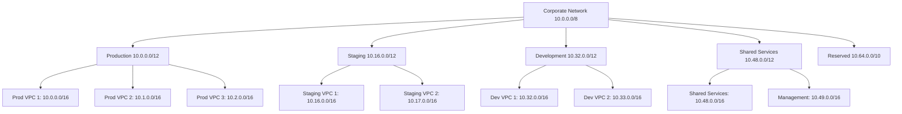
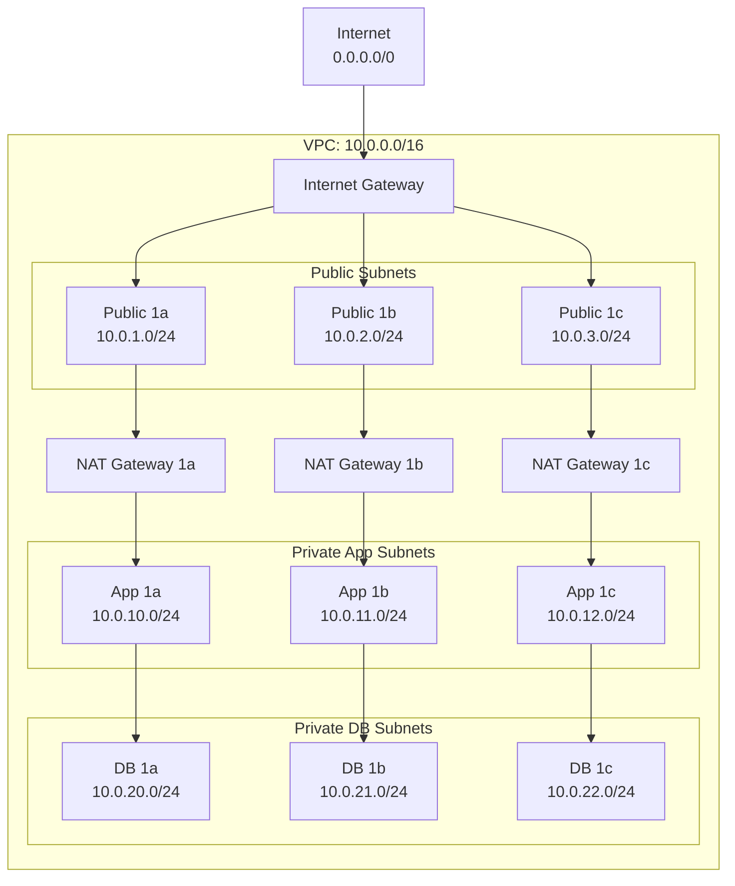
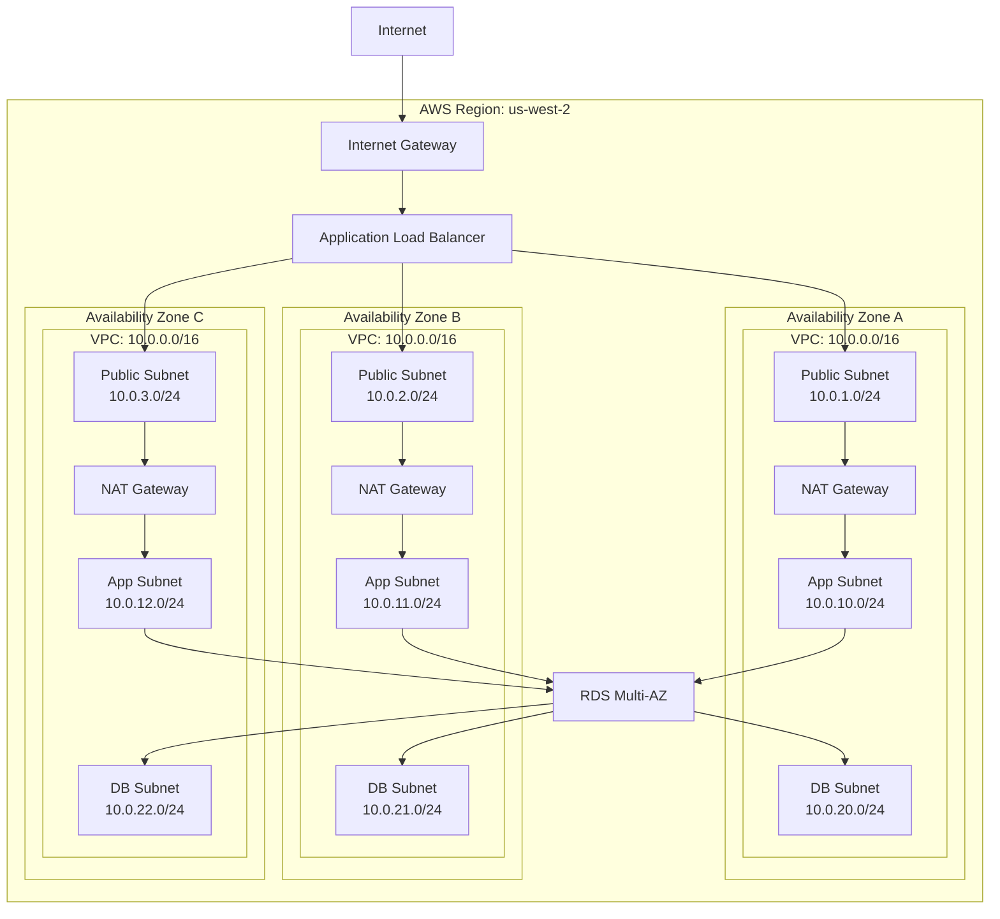
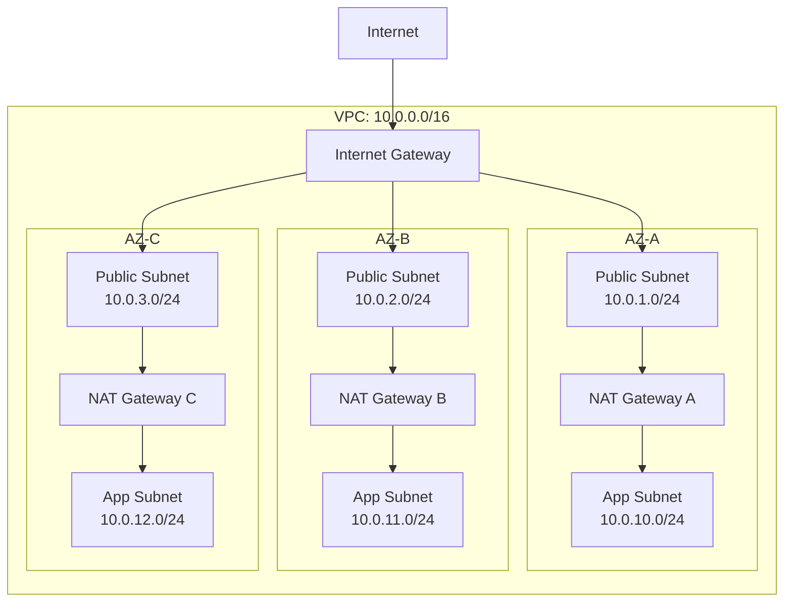
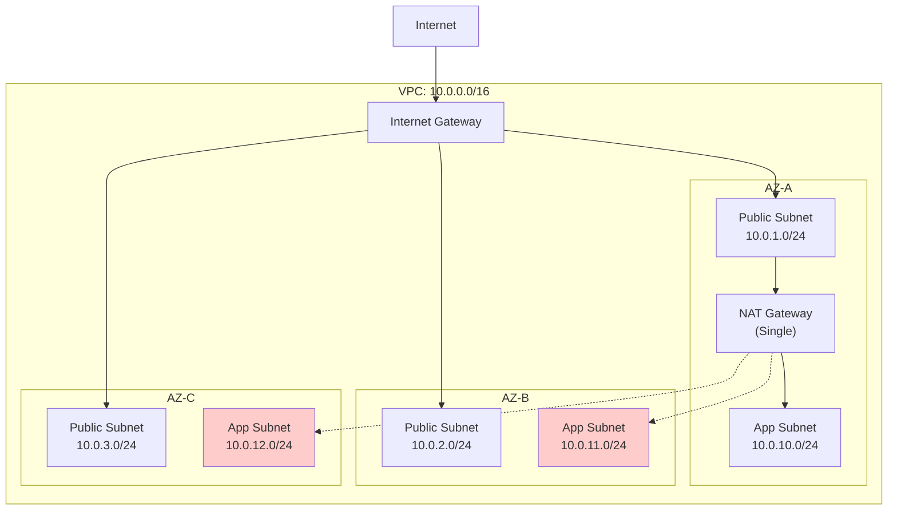
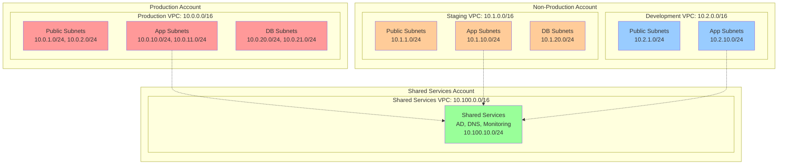
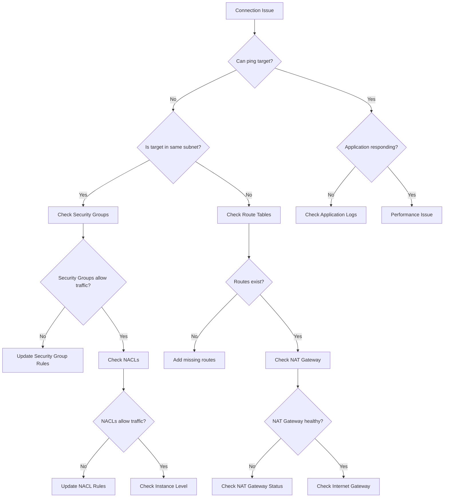
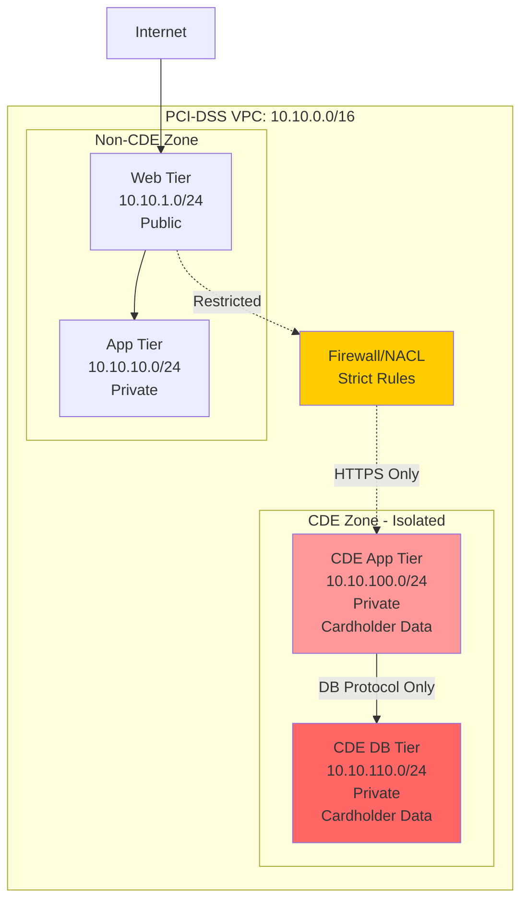
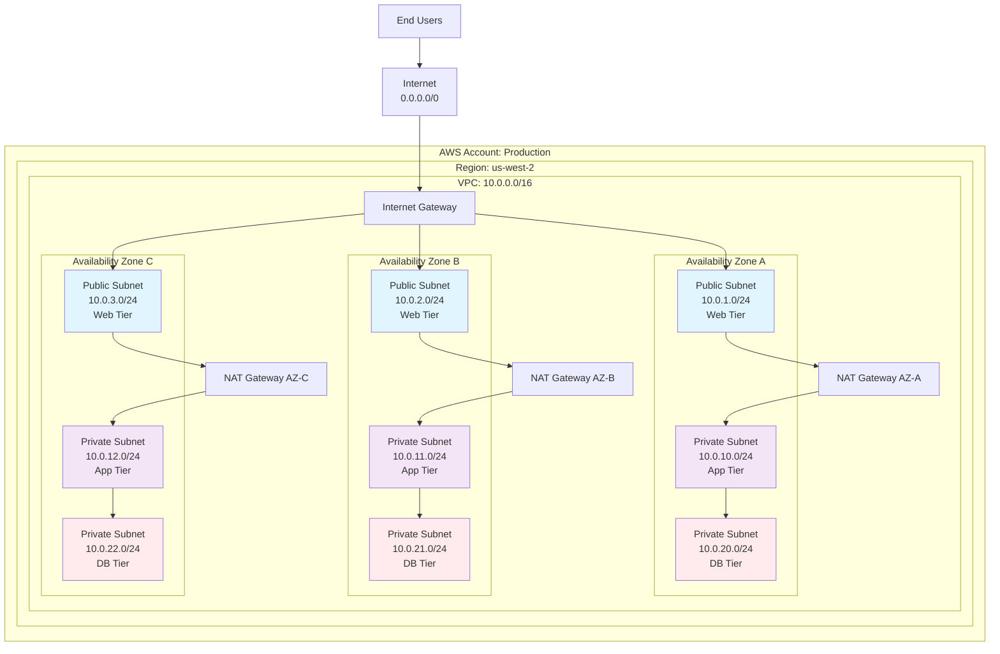
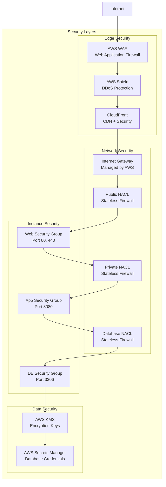

# Production Best Practices for Terraform AWS VPC Module

## Table of Contents

- [Introduction](#introduction)
- [Security Best Practices](#security-best-practices)
  - [Network ACL Configuration](#network-acl-configuration)
  - [Private Subnet Isolation](#private-subnet-isolation)
  - [VPC Flow Logs](#vpc-flow-logs)
  - [IAM Policies for Terraform](#iam-policies-for-terraform)
- [Network Architecture Patterns](#network-architecture-patterns)
  - [CIDR Planning](#cidr-planning)
  - [Multi-AZ Deployment Patterns](#multi-az-deployment-patterns)
  - [NAT Gateway Strategies](#nat-gateway-strategies)
  - [Multi-Environment Patterns](#multi-environment-patterns)
- [Cost Optimization](#cost-optimization)
  - [Subnet Placement Strategies](#subnet-placement-strategies)
  - [NAT Gateway Cost Analysis](#nat-gateway-cost-analysis)
- [Monitoring and Observability](#monitoring-and-observability)
  - [CloudWatch Configuration](#cloudwatch-configuration)
  - [Troubleshooting Guide](#troubleshooting-guide)
- [Operational Considerations](#operational-considerations)
  - [Terraform State Management](#terraform-state-management)
  - [Zero-Downtime Deployment](#zero-downtime-deployment)
  - [Disaster Recovery](#disaster-recovery)
- [Compliance and Governance](#compliance-and-governance)
  - [Resource Naming and Tagging](#resource-naming-and-tagging)
  - [Compliance Frameworks](#compliance-frameworks)
  - [Audit Logging](#audit-logging)
  - [Architecture Documentation Templates](#architecture-documentation-templates)

## Introduction

This document provides comprehensive production best practices for deploying and managing the Terraform AWS VPC module in production environments. It covers security, scalability, cost optimization, monitoring, and operational considerations to help you build robust, secure, and maintainable network infrastructure.

The guidance in this document is based on AWS Well-Architected Framework principles and industry best practices for infrastructure as code. Each section includes practical examples, configuration snippets, and architectural diagrams to help you implement these practices effectively.

### Prerequisites

Before implementing these best practices, ensure you have:
- Basic understanding of AWS VPC concepts
- Familiarity with Terraform and infrastructure as code principles
- Access to AWS account with appropriate permissions
- Understanding of your organization's security and compliance requirements

### How to Use This Guide

This guide is organized by functional areas, allowing you to focus on specific aspects of VPC deployment and management. Each section includes:
- **Overview**: Context and importance of the practice
- **Implementation**: Step-by-step guidance with code examples
- **Considerations**: Trade-offs and decision factors
- **Examples**: Real-world scenarios and configurations

---

## Security Best Practices

Security should be the foundation of any production VPC deployment. This section covers essential security practices including network segmentation, access controls, and monitoring.

### Network ACL Configuration

Network Access Control Lists (NACLs) provide subnet-level security controls that act as a firewall for controlling traffic in and out of subnets. Unlike Security Groups, NACLs are stateless and evaluate both inbound and outbound rules.

#### Overview

NACLs serve as the first line of defense in your network security architecture. They should be configured with restrictive rules that allow only necessary traffic patterns. This approach follows the principle of least privilege and provides defense in depth.

#### Key Principles

1. **Default Deny**: Start with restrictive rules and explicitly allow required traffic
2. **Stateless Nature**: Remember that NACLs are stateless - you need both inbound and outbound rules
3. **Rule Ordering**: Rules are evaluated in numerical order (lowest first)
4. **Subnet Association**: Each subnet must be associated with exactly one NACL

#### Public Subnet NACL Configuration

Public subnets typically host resources that need internet access, such as load balancers, bastion hosts, or web servers.

```hcl
module "vpc" {
  source = "ViktorUJ/vpc/aws"
  
  vpc = {
    name = "production-vpc"
    cidr = "10.0.0.0/16"
  }

  subnets = {
    public = {
      "web-1" = {
        name = "web-subnet-1"
        cidr = "10.0.1.0/24"
        az   = "us-west-2a"
        nacl = {
          # Allow HTTP inbound
          "100" = {
            egress      = "false"
            rule_number = "100"
            rule_action = "allow"
            protocol    = "6"  # TCP
            from_port   = "80"
            to_port     = "80"
            cidr_block  = "0.0.0.0/0"
          }
          # Allow HTTPS inbound
          "110" = {
            egress      = "false"
            rule_number = "110"
            rule_action = "allow"
            protocol    = "6"  # TCP
            from_port   = "443"
            to_port     = "443"
            cidr_block  = "0.0.0.0/0"
          }
          # Allow SSH from management network only
          "120" = {
            egress      = "false"
            rule_number = "120"
            rule_action = "allow"
            protocol    = "6"  # TCP
            from_port   = "22"
            to_port     = "22"
            cidr_block  = "10.0.0.0/16"  # Internal network only
          }
          # Allow ephemeral ports for return traffic
          "130" = {
            egress      = "false"
            rule_number = "130"
            rule_action = "allow"
            protocol    = "6"  # TCP
            from_port   = "1024"
            to_port     = "65535"
            cidr_block  = "0.0.0.0/0"
          }
          # Allow all outbound traffic
          "100" = {
            egress      = "true"
            rule_number = "100"
            rule_action = "allow"
            protocol    = "-1"  # All protocols
            cidr_block  = "0.0.0.0/0"
          }
        }
      }
    }
  }
}
```

#### Private Subnet NACL Configuration

Private subnets host internal resources that should not be directly accessible from the internet.

```hcl
module "vpc" {
  source = "ViktorUJ/vpc/aws"
  
  subnets = {
    private = {
      "app-1" = {
        name = "app-subnet-1"
        cidr = "10.0.10.0/24"
        az   = "us-west-2a"
        nacl = {
          # Allow traffic from public subnets
          "100" = {
            egress      = "false"
            rule_number = "100"
            rule_action = "allow"
            protocol    = "6"  # TCP
            from_port   = "8080"
            to_port     = "8080"
            cidr_block  = "10.0.1.0/24"  # Public subnet CIDR
          }
          # Allow database traffic from app tier
          "110" = {
            egress      = "false"
            rule_number = "110"
            rule_action = "allow"
            protocol    = "6"  # TCP
            from_port   = "3306"
            to_port     = "3306"
            cidr_block  = "10.0.10.0/24"  # Same subnet for DB access
          }
          # Allow SSH from bastion host subnet
          "120" = {
            egress      = "false"
            rule_number = "120"
            rule_action = "allow"
            protocol    = "6"  # TCP
            from_port   = "22"
            to_port     = "22"
            cidr_block  = "10.0.1.0/24"  # Bastion subnet
          }
          # Allow ephemeral ports for return traffic
          "130" = {
            egress      = "false"
            rule_number = "130"
            rule_action = "allow"
            protocol    = "6"  # TCP
            from_port   = "1024"
            to_port     = "65535"
            cidr_block  = "0.0.0.0/0"
          }
          # Allow outbound to internet via NAT
          "100" = {
            egress      = "true"
            rule_number = "100"
            rule_action = "allow"
            protocol    = "-1"  # All protocols
            cidr_block  = "0.0.0.0/0"
          }
        }
      }
    }
  }
}
```

#### Database Subnet NACL Configuration

Database subnets require the most restrictive access controls.

```hcl
module "vpc" {
  source = "ViktorUJ/vpc/aws"
  
  subnets = {
    private = {
      "db-1" = {
        name = "db-subnet-1"
        cidr = "10.0.20.0/24"
        az   = "us-west-2a"
        type = "database"
        nacl = {
          # Allow MySQL/Aurora from app subnets only
          "100" = {
            egress      = "false"
            rule_number = "100"
            rule_action = "allow"
            protocol    = "6"  # TCP
            from_port   = "3306"
            to_port     = "3306"
            cidr_block  = "10.0.10.0/24"  # App subnet CIDR
          }
          # Allow PostgreSQL from app subnets only
          "110" = {
            egress      = "false"
            rule_number = "110"
            rule_action = "allow"
            protocol    = "6"  # TCP
            from_port   = "5432"
            to_port     = "5432"
            cidr_block  = "10.0.10.0/24"  # App subnet CIDR
          }
          # Allow ephemeral ports for return traffic
          "120" = {
            egress      = "false"
            rule_number = "120"
            rule_action = "allow"
            protocol    = "6"  # TCP
            from_port   = "1024"
            to_port     = "65535"
            cidr_block  = "10.0.10.0/24"  # App subnet only
          }
          # Restrict outbound traffic - only to app subnets
          "100" = {
            egress      = "true"
            rule_number = "100"
            rule_action = "allow"
            protocol    = "6"  # TCP
            from_port   = "1024"
            to_port     = "65535"
            cidr_block  = "10.0.10.0/24"  # App subnet only
          }
        }
      }
    }
  }
}
```

#### Defense in Depth Strategy

NACLs work best when combined with Security Groups to provide layered security:

1. **NACLs (Subnet Level)**:
   - Broad traffic filtering
   - Protocol and port-based rules
   - Stateless evaluation
   - First line of defense

2. **Security Groups (Instance Level)**:
   - Fine-grained access control
   - Source/destination-based rules
   - Stateful evaluation
   - Second line of defense

#### Best Practices

1. **Use Descriptive Rule Numbers**: Leave gaps (100, 110, 120) for future insertions
2. **Document Rules**: Include comments explaining the purpose of each rule
3. **Regular Audits**: Periodically review and remove unnecessary rules
4. **Test Changes**: Always test NACL changes in non-production first
5. **Monitor Traffic**: Use VPC Flow Logs to understand traffic patterns
6. **Principle of Least Privilege**: Only allow necessary traffic

#### Common Pitfalls

1. **Forgetting Ephemeral Ports**: Always allow return traffic on ephemeral ports (1024-65535)
2. **Blocking Health Checks**: Ensure load balancer health checks can reach targets
3. **Rule Order Confusion**: Remember rules are evaluated in numerical order
4. **Stateless Nature**: Both inbound and outbound rules are required

#### Monitoring and Alerting

Set up CloudWatch alarms for NACL-related metrics:

```hcl
resource "aws_cloudwatch_metric_alarm" "nacl_denies" {
  alarm_name          = "vpc-nacl-denies-high"
  comparison_operator = "GreaterThanThreshold"
  evaluation_periods  = "2"
  metric_name         = "PacketsDroppedByNetworkAcl"
  namespace           = "AWS/VPC"
  period              = "300"
  statistic           = "Sum"
  threshold           = "100"
  alarm_description   = "This metric monitors NACL packet denies"
  
  dimensions = {
    VpcId = module.vpc.vpc_raw.id
  }
}
```

### Private Subnet Isolation

Private subnet isolation is crucial for protecting sensitive workloads and implementing proper network segmentation. This section covers strategies for isolating different tiers of your application and sensitive data.

#### Overview

Private subnet isolation involves creating separate network segments for different types of workloads, each with appropriate access controls and connectivity patterns. This approach minimizes the blast radius of security incidents and ensures compliance with data protection requirements.

#### Isolation Strategies

##### 1. Three-Tier Architecture Isolation

The classic three-tier architecture separates presentation, application, and data layers:

```hcl
module "vpc" {
  source = "ViktorUJ/vpc/aws"
  
  vpc = {
    name = "production-vpc"
    cidr = "10.0.0.0/16"
  }

  subnets = {
    # Public tier - Load balancers, bastion hosts
    public = {
      "web-1a" = {
        name = "web-subnet-1a"
        cidr = "10.0.1.0/24"
        az   = "us-west-2a"
        type = "web"
      }
      "web-1b" = {
        name = "web-subnet-1b"
        cidr = "10.0.2.0/24"
        az   = "us-west-2b"
        type = "web"
      }
    }
    
    # Private tier - Application servers
    private = {
      "app-1a" = {
        name = "app-subnet-1a"
        cidr = "10.0.10.0/24"
        az   = "us-west-2a"
        type = "application"
        nat_gateway = "AZ"
      }
      "app-1b" = {
        name = "app-subnet-1b"
        cidr = "10.0.11.0/24"
        az   = "us-west-2b"
        type = "application"
        nat_gateway = "AZ"
      }
      
      # Database tier - Isolated data layer
      "db-1a" = {
        name = "db-subnet-1a"
        cidr = "10.0.20.0/24"
        az   = "us-west-2a"
        type = "database"
        nat_gateway = "NONE"  # No internet access
      }
      "db-1b" = {
        name = "db-subnet-1b"
        cidr = "10.0.21.0/24"
        az   = "us-west-2b"
        type = "database"
        nat_gateway = "NONE"  # No internet access
      }
    }
  }
}
```

##### 2. Compliance-Based Isolation

For regulated industries, implement strict isolation based on data classification:

```hcl
module "vpc" {
  source = "ViktorUJ/vpc/aws"
  
  subnets = {
    private = {
      # PCI-DSS compliant subnet for payment processing
      "pci-1a" = {
        name = "pci-subnet-1a"
        cidr = "10.0.30.0/24"
        az   = "us-west-2a"
        type = "pci-compliant"
        nat_gateway = "NONE"
        tags = {
          "Compliance" = "PCI-DSS"
          "DataClass"  = "Sensitive"
        }
        nacl = {
          # Extremely restrictive - only allow specific application traffic
          "100" = {
            egress      = "false"
            rule_number = "100"
            rule_action = "allow"
            protocol    = "6"
            from_port   = "8443"
            to_port     = "8443"
            cidr_block  = "10.0.10.0/24"  # Only from app tier
          }
        }
      }
      
      # HIPAA compliant subnet for healthcare data
      "hipaa-1a" = {
        name = "hipaa-subnet-1a"
        cidr = "10.0.40.0/24"
        az   = "us-west-2a"
        type = "hipaa-compliant"
        nat_gateway = "NONE"
        tags = {
          "Compliance" = "HIPAA"
          "DataClass"  = "PHI"
        }
      }
      
      # General application subnet
      "general-1a" = {
        name = "general-subnet-1a"
        cidr = "10.0.50.0/24"
        az   = "us-west-2a"
        type = "general"
        nat_gateway = "AZ"
      }
    }
  }
}
```

##### 3. Environment-Based Isolation

Separate different environments within the same VPC:

```hcl
module "vpc" {
  source = "ViktorUJ/vpc/aws"
  
  subnets = {
    private = {
      # Production environment
      "prod-app-1a" = {
        name = "prod-app-subnet-1a"
        cidr = "10.0.100.0/24"
        az   = "us-west-2a"
        type = "production"
        tags = {
          "Environment" = "production"
          "Tier"        = "application"
        }
      }
      
      # Staging environment
      "staging-app-1a" = {
        name = "staging-app-subnet-1a"
        cidr = "10.0.110.0/24"
        az   = "us-west-2a"
        type = "staging"
        tags = {
          "Environment" = "staging"
          "Tier"        = "application"
        }
      }
      
      # Development environment
      "dev-app-1a" = {
        name = "dev-app-subnet-1a"
        cidr = "10.0.120.0/24"
        az   = "us-west-2a"
        type = "development"
        tags = {
          "Environment" = "development"
          "Tier"        = "application"
        }
      }
    }
  }
}
```

#### Advanced Isolation Techniques

##### 1. VPC Endpoints for Service Isolation

Use VPC endpoints to keep traffic within AWS network:

```hcl
# S3 VPC Endpoint for secure access
resource "aws_vpc_endpoint" "s3" {
  vpc_id       = module.vpc.vpc_raw.id
  service_name = "com.amazonaws.us-west-2.s3"
  
  route_table_ids = [
    module.vpc.route_table_private_raw["app-1a"].id,
    module.vpc.route_table_private_raw["db-1a"].id
  ]
  
  tags = {
    Name = "s3-endpoint"
  }
}

# DynamoDB VPC Endpoint
resource "aws_vpc_endpoint" "dynamodb" {
  vpc_id       = module.vpc.vpc_raw.id
  service_name = "com.amazonaws.us-west-2.dynamodb"
  
  route_table_ids = [
    module.vpc.route_table_private_raw["app-1a"].id
  ]
  
  tags = {
    Name = "dynamodb-endpoint"
  }
}
```

##### 2. Transit Gateway for Multi-VPC Isolation

For complex environments, use Transit Gateway to connect isolated VPCs:

```hcl
# Production VPC
module "prod_vpc" {
  source = "ViktorUJ/vpc/aws"
  
  vpc = {
    name = "production-vpc"
    cidr = "10.0.0.0/16"
  }
  
  # Production subnets configuration
}

# Shared Services VPC
module "shared_vpc" {
  source = "ViktorUJ/vpc/aws"
  
  vpc = {
    name = "shared-services-vpc"
    cidr = "10.1.0.0/16"
  }
  
  # Shared services like AD, DNS, monitoring
}

# Transit Gateway for controlled connectivity
resource "aws_ec2_transit_gateway" "main" {
  description = "Main Transit Gateway"
  
  tags = {
    Name = "main-tgw"
  }
}
```

#### Security Group Strategies for Isolation

Implement layered security with Security Groups:

```hcl
# Database security group - very restrictive
resource "aws_security_group" "database" {
  name_prefix = "db-sg-"
  vpc_id      = module.vpc.vpc_raw.id
  
  # Only allow database traffic from app tier
  ingress {
    from_port       = 3306
    to_port         = 3306
    protocol        = "tcp"
    security_groups = [aws_security_group.application.id]
  }
  
  # No outbound internet access
  egress {
    from_port       = 3306
    to_port         = 3306
    protocol        = "tcp"
    security_groups = [aws_security_group.application.id]
  }
  
  tags = {
    Name = "database-sg"
    Tier = "database"
  }
}

# Application security group
resource "aws_security_group" "application" {
  name_prefix = "app-sg-"
  vpc_id      = module.vpc.vpc_raw.id
  
  # Allow traffic from load balancer
  ingress {
    from_port       = 8080
    to_port         = 8080
    protocol        = "tcp"
    security_groups = [aws_security_group.load_balancer.id]
  }
  
  # Allow outbound to database
  egress {
    from_port       = 3306
    to_port         = 3306
    protocol        = "tcp"
    security_groups = [aws_security_group.database.id]
  }
  
  # Allow outbound HTTPS for API calls
  egress {
    from_port   = 443
    to_port     = 443
    protocol    = "tcp"
    cidr_blocks = ["0.0.0.0/0"]
  }
  
  tags = {
    Name = "application-sg"
    Tier = "application"
  }
}
```

#### Monitoring Isolated Subnets

Implement comprehensive monitoring for isolated environments:

```hcl
# VPC Flow Logs for each isolated subnet
resource "aws_flow_log" "database_subnets" {
  for_each = {
    for k, v in module.vpc.private_subnets_by_type.database : k => v
  }
  
  iam_role_arn    = aws_iam_role.flow_log.arn
  log_destination = aws_cloudwatch_log_group.vpc_flow_logs.arn
  traffic_type    = "ALL"
  vpc_id          = module.vpc.vpc_raw.id
  
  tags = {
    Name   = "database-subnet-flow-logs-${each.key}"
    Subnet = each.value.id
  }
}

# CloudWatch Log Group for flow logs
resource "aws_cloudwatch_log_group" "vpc_flow_logs" {
  name              = "/aws/vpc/flowlogs"
  retention_in_days = 30
  
  tags = {
    Name = "vpc-flow-logs"
  }
}
```

#### Best Practices for Private Subnet Isolation

1. **Principle of Least Privilege**: Grant minimum necessary access between subnets
2. **Defense in Depth**: Use multiple layers (NACLs, Security Groups, IAM)
3. **Regular Audits**: Periodically review and validate isolation controls
4. **Monitoring**: Implement comprehensive logging and alerting
5. **Documentation**: Maintain clear documentation of isolation boundaries
6. **Testing**: Regularly test isolation controls and incident response procedures

#### Compliance Considerations

- **Data Residency**: Ensure data stays within required geographic boundaries
- **Encryption**: Use encryption in transit and at rest for sensitive data
- **Access Logging**: Log all access to sensitive subnets
- **Regular Assessments**: Conduct regular security assessments and penetration testing
- **Change Management**: Implement strict change control for isolation configurations

#### Common Isolation Patterns

1. **DMZ Pattern**: Public subnet → Private app subnet → Private DB subnet
2. **Hub and Spoke**: Central shared services VPC connected to isolated workload VPCs
3. **Multi-Tenant**: Separate subnets per tenant with strict isolation
4. **Compliance Zones**: Separate subnets based on compliance requirements
5. **Environment Separation**: Dev/Test/Prod isolation within single VPC

### VPC Flow Logs

VPC Flow Logs capture information about IP traffic going to and from network interfaces in your VPC. They are essential for security monitoring, troubleshooting, and compliance requirements.

#### Overview

VPC Flow Logs provide visibility into network traffic patterns and can help you:
- Monitor and troubleshoot connectivity issues
- Detect security threats and anomalous behavior
- Meet compliance and audit requirements
- Optimize network performance
- Understand traffic patterns for capacity planning

#### Flow Log Configuration

##### Basic VPC Flow Log Setup

```hcl
# CloudWatch Log Group for VPC Flow Logs
resource "aws_cloudwatch_log_group" "vpc_flow_logs" {
  name              = "/aws/vpc/flowlogs"
  retention_in_days = 30
  kms_key_id        = aws_kms_key.vpc_logs.arn
  
  tags = {
    Name        = "vpc-flow-logs"
    Environment = "production"
    Purpose     = "security-monitoring"
  }
}

# KMS Key for log encryption
resource "aws_kms_key" "vpc_logs" {
  description             = "KMS key for VPC Flow Logs encryption"
  deletion_window_in_days = 7
  
  tags = {
    Name = "vpc-flow-logs-key"
  }
}

# IAM Role for VPC Flow Logs
resource "aws_iam_role" "flow_log" {
  name = "flowlogsRole"

  assume_role_policy = jsonencode({
    Version = "2012-10-17"
    Statement = [
      {
        Action = "sts:AssumeRole"
        Effect = "Allow"
        Principal = {
          Service = "vpc-flow-logs.amazonaws.com"
        }
      }
    ]
  })
}

# IAM Policy for Flow Logs
resource "aws_iam_role_policy" "flow_log" {
  name = "flowlogsDeliveryRolePolicy"
  role = aws_iam_role.flow_log.id

  policy = jsonencode({
    Version = "2012-10-17"
    Statement = [
      {
        Action = [
          "logs:CreateLogGroup",
          "logs:CreateLogStream",
          "logs:PutLogEvents",
          "logs:DescribeLogGroups",
          "logs:DescribeLogStreams"
        ]
        Effect   = "Allow"
        Resource = "*"
      }
    ]
  })
}

# VPC Flow Log
resource "aws_flow_log" "vpc_flow_log" {
  iam_role_arn    = aws_iam_role.flow_log.arn
  log_destination = aws_cloudwatch_log_group.vpc_flow_logs.arn
  traffic_type    = "ALL"
  vpc_id          = module.vpc.vpc_raw.id
  
  tags = {
    Name = "vpc-flow-log"
  }
}
```

##### Subnet-Level Flow Logs

For more granular monitoring, enable flow logs per subnet:

```hcl
# Flow logs for sensitive subnets
resource "aws_flow_log" "database_subnet_flow_logs" {
  for_each = module.vpc.private_subnets_by_type.database
  
  iam_role_arn         = aws_iam_role.flow_log.arn
  log_destination      = aws_cloudwatch_log_group.database_flow_logs.arn
  log_destination_type = "cloud-watch-logs"
  traffic_type         = "ALL"
  subnet_id            = each.value.id
  
  tags = {
    Name   = "database-subnet-flow-log-${each.key}"
    Subnet = each.value.id
    Tier   = "database"
  }
}

# Separate log group for database subnets
resource "aws_cloudwatch_log_group" "database_flow_logs" {
  name              = "/aws/vpc/database-flowlogs"
  retention_in_days = 90  # Longer retention for sensitive data
  kms_key_id        = aws_kms_key.vpc_logs.arn
  
  tags = {
    Name = "database-flow-logs"
    Tier = "database"
  }
}
```

##### S3 Destination for Long-Term Storage

For cost-effective long-term storage and analysis:

```hcl
# S3 Bucket for Flow Logs
resource "aws_s3_bucket" "flow_logs" {
  bucket = "vpc-flow-logs-${random_id.bucket_suffix.hex}"
  
  tags = {
    Name = "vpc-flow-logs-bucket"
  }
}

resource "aws_s3_bucket_versioning" "flow_logs" {
  bucket = aws_s3_bucket.flow_logs.id
  versioning_configuration {
    status = "Enabled"
  }
}

resource "aws_s3_bucket_encryption" "flow_logs" {
  bucket = aws_s3_bucket.flow_logs.id

  server_side_encryption_configuration {
    rule {
      apply_server_side_encryption_by_default {
        kms_master_key_id = aws_kms_key.vpc_logs.arn
        sse_algorithm     = "aws:kms"
      }
    }
  }
}

resource "aws_s3_bucket_lifecycle_configuration" "flow_logs" {
  bucket = aws_s3_bucket.flow_logs.id

  rule {
    id     = "flow_logs_lifecycle"
    status = "Enabled"

    transition {
      days          = 30
      storage_class = "STANDARD_IA"
    }

    transition {
      days          = 90
      storage_class = "GLACIER"
    }

    expiration {
      days = 2555  # 7 years for compliance
    }
  }
}

# Flow Log to S3
resource "aws_flow_log" "vpc_flow_log_s3" {
  log_destination      = aws_s3_bucket.flow_logs.arn
  log_destination_type = "s3"
  traffic_type         = "ALL"
  vpc_id               = module.vpc.vpc_raw.id
  
  log_format = "$${version} $${account-id} $${interface-id} $${srcaddr} $${dstaddr} $${srcport} $${dstport} $${protocol} $${packets} $${bytes} $${windowstart} $${windowend} $${action} $${flowlogstatus}"
  
  tags = {
    Name = "vpc-flow-log-s3"
  }
}

resource "random_id" "bucket_suffix" {
  byte_length = 4
}
```

#### Custom Flow Log Format

Use custom format to capture additional fields:

```hcl
resource "aws_flow_log" "custom_format" {
  iam_role_arn    = aws_iam_role.flow_log.arn
  log_destination = aws_cloudwatch_log_group.vpc_flow_logs.arn
  traffic_type    = "ALL"
  vpc_id          = module.vpc.vpc_raw.id
  
  # Custom format with additional fields
  log_format = "$${version} $${account-id} $${interface-id} $${srcaddr} $${dstaddr} $${srcport} $${dstport} $${protocol} $${packets} $${bytes} $${windowstart} $${windowend} $${action} $${flowlogstatus} $${vpc-id} $${subnet-id} $${instance-id} $${tcp-flags} $${type} $${pkt-srcaddr} $${pkt-dstaddr} $${region} $${az-id}"
  
  tags = {
    Name = "vpc-flow-log-custom"
  }
}
```

#### Security Monitoring with Flow Logs

##### CloudWatch Alarms for Security Events

```hcl
# Alarm for rejected traffic spikes
resource "aws_cloudwatch_metric_alarm" "rejected_traffic" {
  alarm_name          = "vpc-rejected-traffic-high"
  comparison_operator = "GreaterThanThreshold"
  evaluation_periods  = "2"
  metric_name         = "RejectedConnectionCount"
  namespace           = "AWS/VPC"
  period              = "300"
  statistic           = "Sum"
  threshold           = "100"
  alarm_description   = "This metric monitors rejected connections"
  alarm_actions       = [aws_sns_topic.security_alerts.arn]
  
  dimensions = {
    VpcId = module.vpc.vpc_raw.id
  }
  
  tags = {
    Name = "rejected-traffic-alarm"
  }
}

# SNS Topic for security alerts
resource "aws_sns_topic" "security_alerts" {
  name = "vpc-security-alerts"
  
  tags = {
    Name = "security-alerts"
  }
}
```

##### CloudWatch Insights Queries

Useful queries for security analysis:

```sql
-- Top talkers by bytes
fields @timestamp, srcaddr, dstaddr, bytes
| filter action = "ACCEPT"
| stats sum(bytes) as total_bytes by srcaddr, dstaddr
| sort total_bytes desc
| limit 20

-- Rejected connections analysis
fields @timestamp, srcaddr, dstaddr, srcport, dstport, protocol
| filter action = "REJECT"
| stats count() as reject_count by srcaddr, dstaddr, dstport
| sort reject_count desc
| limit 50

-- Unusual port activity
fields @timestamp, srcaddr, dstaddr, dstport, protocol
| filter action = "ACCEPT" and (dstport < 1024 or dstport in [1433, 3389, 5432, 6379])
| stats count() as connection_count by dstport, protocol
| sort connection_count desc

-- Internal to external traffic
fields @timestamp, srcaddr, dstaddr, bytes
| filter srcaddr like /^10\./ and not (dstaddr like /^10\./)
| stats sum(bytes) as external_bytes by srcaddr
| sort external_bytes desc
| limit 20
```

#### Flow Log Analysis Tools

##### Using AWS Athena for Analysis

```hcl
# Athena database for flow logs
resource "aws_athena_database" "flow_logs" {
  name   = "vpc_flow_logs"
  bucket = aws_s3_bucket.athena_results.bucket
}

# S3 bucket for Athena results
resource "aws_s3_bucket" "athena_results" {
  bucket = "athena-results-${random_id.bucket_suffix.hex}"
  
  tags = {
    Name = "athena-results"
  }
}

# Athena table for flow logs
resource "aws_athena_named_query" "create_flow_logs_table" {
  name     = "create_vpc_flow_logs_table"
  database = aws_athena_database.flow_logs.name
  
  query = <<EOF
CREATE EXTERNAL TABLE IF NOT EXISTS vpc_flow_logs (
  version int,
  account string,
  interfaceid string,
  sourceaddress string,
  destinationaddress string,
  sourceport int,
  destinationport int,
  protocol int,
  numpackets int,
  numbytes bigint,
  windowstart bigint,
  windowend bigint,
  action string,
  flowlogstatus string
)
PARTITIONED BY (
  year string,
  month string,
  day string,
  hour string
)
STORED AS PARQUET
LOCATION 's3://${aws_s3_bucket.flow_logs.bucket}/AWSLogs/${data.aws_caller_identity.current.account_id}/vpcflowlogs/'
TBLPROPERTIES ("skip.header.line.count"="1")
EOF
}

data "aws_caller_identity" "current" {}
```

#### Best Practices for VPC Flow Logs

1. **Enable for All VPCs**: Always enable flow logs for production VPCs
2. **Use Appropriate Retention**: Balance cost and compliance requirements
3. **Encrypt Logs**: Always encrypt flow logs at rest and in transit
4. **Monitor Costs**: Flow logs can generate significant data volume
5. **Automate Analysis**: Use automated tools for threat detection
6. **Regular Review**: Periodically review and analyze flow log data
7. **Compliance**: Ensure flow log retention meets regulatory requirements

#### Cost Optimization

1. **Selective Logging**: Enable flow logs only for critical subnets if cost is a concern
2. **S3 Storage**: Use S3 for long-term storage instead of CloudWatch Logs
3. **Lifecycle Policies**: Implement S3 lifecycle policies to reduce storage costs
4. **Sampling**: Consider using flow log sampling for high-volume environments
5. **Data Compression**: Use Parquet format for better compression and query performance

#### Troubleshooting with Flow Logs

Common troubleshooting scenarios:

1. **Connection Timeouts**: Look for REJECT actions in flow logs
2. **High Latency**: Analyze packet counts and timing
3. **Security Incidents**: Track suspicious IP addresses and ports
4. **Capacity Planning**: Monitor traffic patterns and growth trends
5. **Cost Analysis**: Identify high-bandwidth consumers

#### Integration with Security Tools

Flow logs can be integrated with various security tools:

- **AWS GuardDuty**: Automatically analyzes flow logs for threats
- **AWS Security Hub**: Centralizes security findings from flow log analysis
- **Third-party SIEM**: Export flow logs to external security tools
- **Custom Analytics**: Build custom dashboards and alerting systems

### IAM Policies for Terraform

Implementing least privilege access for Terraform operations is crucial for maintaining security while enabling infrastructure automation. This section provides IAM policy examples for different Terraform use cases.

#### Overview

Terraform requires specific AWS permissions to manage VPC resources. Following the principle of least privilege, you should grant only the minimum permissions necessary for your specific use case. This approach reduces the risk of accidental or malicious changes to your infrastructure.

#### Basic VPC Management Policy

This policy provides the minimum permissions needed to manage VPC resources with this module:

```json
{
  "Version": "2012-10-17",
  "Statement": [
    {
      "Sid": "VPCManagement",
      "Effect": "Allow",
      "Action": [
        "ec2:CreateVpc",
        "ec2:DeleteVpc",
        "ec2:DescribeVpcs",
        "ec2:ModifyVpcAttribute",
        "ec2:CreateTags",
        "ec2:DeleteTags",
        "ec2:DescribeTags"
      ],
      "Resource": "*"
    },
    {
      "Sid": "SubnetManagement",
      "Effect": "Allow",
      "Action": [
        "ec2:CreateSubnet",
        "ec2:DeleteSubnet",
        "ec2:DescribeSubnets",
        "ec2:ModifySubnetAttribute",
        "ec2:CreateTags",
        "ec2:DeleteTags"
      ],
      "Resource": "*"
    },
    {
      "Sid": "RouteTableManagement",
      "Effect": "Allow",
      "Action": [
        "ec2:CreateRouteTable",
        "ec2:DeleteRouteTable",
        "ec2:DescribeRouteTables",
        "ec2:AssociateRouteTable",
        "ec2:DisassociateRouteTable",
        "ec2:CreateRoute",
        "ec2:DeleteRoute",
        "ec2:ReplaceRoute"
      ],
      "Resource": "*"
    },
    {
      "Sid": "InternetGatewayManagement",
      "Effect": "Allow",
      "Action": [
        "ec2:CreateInternetGateway",
        "ec2:DeleteInternetGateway",
        "ec2:DescribeInternetGateways",
        "ec2:AttachInternetGateway",
        "ec2:DetachInternetGateway"
      ],
      "Resource": "*"
    },
    {
      "Sid": "NATGatewayManagement",
      "Effect": "Allow",
      "Action": [
        "ec2:CreateNatGateway",
        "ec2:DeleteNatGateway",
        "ec2:DescribeNatGateways",
        "ec2:AllocateAddress",
        "ec2:ReleaseAddress",
        "ec2:DescribeAddresses"
      ],
      "Resource": "*"
    },
    {
      "Sid": "NetworkACLManagement",
      "Effect": "Allow",
      "Action": [
        "ec2:CreateNetworkAcl",
        "ec2:DeleteNetworkAcl",
        "ec2:DescribeNetworkAcls",
        "ec2:CreateNetworkAclEntry",
        "ec2:DeleteNetworkAclEntry",
        "ec2:ReplaceNetworkAclEntry",
        "ec2:ReplaceNetworkAclAssociation"
      ],
      "Resource": "*"
    },
    {
      "Sid": "DHCPOptionsManagement",
      "Effect": "Allow",
      "Action": [
        "ec2:CreateDhcpOptions",
        "ec2:DeleteDhcpOptions",
        "ec2:DescribeDhcpOptions",
        "ec2:AssociateDhcpOptions"
      ],
      "Resource": "*"
    },
    {
      "Sid": "AvailabilityZoneInfo",
      "Effect": "Allow",
      "Action": [
        "ec2:DescribeAvailabilityZones"
      ],
      "Resource": "*"
    }
  ]
}
```

#### Resource-Constrained Policy

For enhanced security, constrain permissions to specific resources:

```json
{
  "Version": "2012-10-17",
  "Statement": [
    {
      "Sid": "VPCManagementConstrained",
      "Effect": "Allow",
      "Action": [
        "ec2:CreateVpc",
        "ec2:DeleteVpc",
        "ec2:DescribeVpcs",
        "ec2:ModifyVpcAttribute"
      ],
      "Resource": "*",
      "Condition": {
        "StringEquals": {
          "aws:RequestedRegion": ["us-west-2", "us-east-1"]
        }
      }
    },
    {
      "Sid": "TaggingConstraints",
      "Effect": "Allow",
      "Action": [
        "ec2:CreateTags",
        "ec2:DeleteTags"
      ],
      "Resource": "*",
      "Condition": {
        "StringEquals": {
          "ec2:CreateAction": [
            "CreateVpc",
            "CreateSubnet",
            "CreateRouteTable",
            "CreateInternetGateway",
            "CreateNatGateway",
            "CreateNetworkAcl"
          ]
        },
        "ForAllValues:StringEquals": {
          "aws:TagKeys": [
            "Name",
            "Environment",
            "Project",
            "Owner",
            "Terraform"
          ]
        }
      }
    },
    {
      "Sid": "SubnetManagementConstrained",
      "Effect": "Allow",
      "Action": [
        "ec2:CreateSubnet",
        "ec2:DeleteSubnet",
        "ec2:ModifySubnetAttribute"
      ],
      "Resource": "*",
      "Condition": {
        "StringLike": {
          "aws:RequestTag/Project": "production-*"
        }
      }
    }
  ]
}
```

#### Environment-Specific Policies

##### Development Environment Policy

More permissive for development environments:

```json
{
  "Version": "2012-10-17",
  "Statement": [
    {
      "Sid": "DevelopmentVPCFullAccess",
      "Effect": "Allow",
      "Action": [
        "ec2:*Vpc*",
        "ec2:*Subnet*",
        "ec2:*RouteTable*",
        "ec2:*InternetGateway*",
        "ec2:*NatGateway*",
        "ec2:*NetworkAcl*",
        "ec2:*DhcpOptions*",
        "ec2:*Address*",
        "ec2:*Tags*",
        "ec2:Describe*"
      ],
      "Resource": "*",
      "Condition": {
        "StringEquals": {
          "aws:RequestTag/Environment": "development"
        }
      }
    }
  ]
}
```

##### Production Environment Policy

Highly restrictive for production:

```json
{
  "Version": "2012-10-17",
  "Statement": [
    {
      "Sid": "ProductionVPCReadOnly",
      "Effect": "Allow",
      "Action": [
        "ec2:DescribeVpcs",
        "ec2:DescribeSubnets",
        "ec2:DescribeRouteTables",
        "ec2:DescribeInternetGateways",
        "ec2:DescribeNatGateways",
        "ec2:DescribeNetworkAcls",
        "ec2:DescribeDhcpOptions",
        "ec2:DescribeAddresses",
        "ec2:DescribeTags",
        "ec2:DescribeAvailabilityZones"
      ],
      "Resource": "*"
    },
    {
      "Sid": "ProductionVPCLimitedWrite",
      "Effect": "Allow",
      "Action": [
        "ec2:ModifyVpcAttribute",
        "ec2:ModifySubnetAttribute",
        "ec2:CreateTags",
        "ec2:DeleteTags"
      ],
      "Resource": "*",
      "Condition": {
        "StringEquals": {
          "aws:RequestTag/Environment": "production",
          "aws:PrincipalTag/Role": "terraform-production"
        },
        "DateGreaterThan": {
          "aws:CurrentTime": "2024-01-01T00:00:00Z"
        }
      }
    },
    {
      "Sid": "ProductionVPCDenyDeletion",
      "Effect": "Deny",
      "Action": [
        "ec2:DeleteVpc",
        "ec2:DeleteSubnet",
        "ec2:DeleteRouteTable",
        "ec2:DeleteInternetGateway",
        "ec2:DeleteNatGateway",
        "ec2:DeleteNetworkAcl"
      ],
      "Resource": "*",
      "Condition": {
        "StringEquals": {
          "aws:ResourceTag/Environment": "production"
        }
      }
    }
  ]
}
```

#### Cross-Account Deployment Policy

For deploying VPCs across multiple AWS accounts:

```json
{
  "Version": "2012-10-17",
  "Statement": [
    {
      "Sid": "AssumeRoleForCrossAccount",
      "Effect": "Allow",
      "Action": "sts:AssumeRole",
      "Resource": [
        "arn:aws:iam::ACCOUNT-ID-1:role/TerraformVPCRole",
        "arn:aws:iam::ACCOUNT-ID-2:role/TerraformVPCRole"
      ],
      "Condition": {
        "StringEquals": {
          "sts:ExternalId": "unique-external-id"
        }
      }
    },
    {
      "Sid": "CrossAccountVPCManagement",
      "Effect": "Allow",
      "Action": [
        "ec2:DescribeVpcs",
        "ec2:DescribeSubnets",
        "ec2:DescribeAvailabilityZones"
      ],
      "Resource": "*"
    }
  ]
}
```

#### Terraform State Management Policy

For managing Terraform state in S3 with DynamoDB locking:

```json
{
  "Version": "2012-10-17",
  "Statement": [
    {
      "Sid": "TerraformStateS3Access",
      "Effect": "Allow",
      "Action": [
        "s3:GetObject",
        "s3:PutObject",
        "s3:DeleteObject"
      ],
      "Resource": "arn:aws:s3:::terraform-state-bucket/vpc/*"
    },
    {
      "Sid": "TerraformStateS3List",
      "Effect": "Allow",
      "Action": [
        "s3:ListBucket"
      ],
      "Resource": "arn:aws:s3:::terraform-state-bucket",
      "Condition": {
        "StringLike": {
          "s3:prefix": "vpc/*"
        }
      }
    },
    {
      "Sid": "TerraformStateLocking",
      "Effect": "Allow",
      "Action": [
        "dynamodb:GetItem",
        "dynamodb:PutItem",
        "dynamodb:DeleteItem"
      ],
      "Resource": "arn:aws:dynamodb:*:*:table/terraform-state-lock"
    }
  ]
}
```

#### CI/CD Pipeline Policy

For automated deployments in CI/CD pipelines:

```json
{
  "Version": "2012-10-17",
  "Statement": [
    {
      "Sid": "CICDVPCDeployment",
      "Effect": "Allow",
      "Action": [
        "ec2:CreateVpc",
        "ec2:DeleteVpc",
        "ec2:DescribeVpcs",
        "ec2:ModifyVpcAttribute",
        "ec2:CreateSubnet",
        "ec2:DeleteSubnet",
        "ec2:DescribeSubnets",
        "ec2:ModifySubnetAttribute",
        "ec2:CreateRouteTable",
        "ec2:DeleteRouteTable",
        "ec2:DescribeRouteTables",
        "ec2:AssociateRouteTable",
        "ec2:DisassociateRouteTable",
        "ec2:CreateRoute",
        "ec2:DeleteRoute",
        "ec2:CreateInternetGateway",
        "ec2:DeleteInternetGateway",
        "ec2:DescribeInternetGateways",
        "ec2:AttachInternetGateway",
        "ec2:DetachInternetGateway",
        "ec2:CreateNatGateway",
        "ec2:DeleteNatGateway",
        "ec2:DescribeNatGateways",
        "ec2:AllocateAddress",
        "ec2:ReleaseAddress",
        "ec2:DescribeAddresses",
        "ec2:CreateTags",
        "ec2:DeleteTags",
        "ec2:DescribeTags",
        "ec2:DescribeAvailabilityZones"
      ],
      "Resource": "*",
      "Condition": {
        "StringEquals": {
          "aws:RequestedRegion": ["us-west-2"]
        },
        "IpAddress": {
          "aws:SourceIp": ["203.0.113.0/24"]
        }
      }
    },
    {
      "Sid": "CICDStateManagement",
      "Effect": "Allow",
      "Action": [
        "s3:GetObject",
        "s3:PutObject",
        "s3:ListBucket"
      ],
      "Resource": [
        "arn:aws:s3:::terraform-state-bucket",
        "arn:aws:s3:::terraform-state-bucket/*"
      ]
    },
    {
      "Sid": "CICDStateLocking",
      "Effect": "Allow",
      "Action": [
        "dynamodb:GetItem",
        "dynamodb:PutItem",
        "dynamodb:DeleteItem"
      ],
      "Resource": "arn:aws:dynamodb:*:*:table/terraform-state-lock"
    }
  ]
}
```

#### Role-Based Access Control

Create specific roles for different team members:

```hcl
# Terraform for VPC Administrators
resource "aws_iam_role" "vpc_admin" {
  name = "VPCAdministrator"

  assume_role_policy = jsonencode({
    Version = "2012-10-17"
    Statement = [
      {
        Action = "sts:AssumeRole"
        Effect = "Allow"
        Principal = {
          AWS = [
            "arn:aws:iam::${data.aws_caller_identity.current.account_id}:user/vpc-admin-1",
            "arn:aws:iam::${data.aws_caller_identity.current.account_id}:user/vpc-admin-2"
          ]
        }
        Condition = {
          StringEquals = {
            "sts:ExternalId" = "vpc-admin-external-id"
          }
        }
      }
    ]
  })

  tags = {
    Name = "VPC Administrator Role"
  }
}

# Attach the VPC management policy
resource "aws_iam_role_policy_attachment" "vpc_admin_policy" {
  role       = aws_iam_role.vpc_admin.name
  policy_arn = aws_iam_policy.vpc_management.arn
}

# VPC Read-Only Role for Developers
resource "aws_iam_role" "vpc_readonly" {
  name = "VPCReadOnly"

  assume_role_policy = jsonencode({
    Version = "2012-10-17"
    Statement = [
      {
        Action = "sts:AssumeRole"
        Effect = "Allow"
        Principal = {
          AWS = "arn:aws:iam::${data.aws_caller_identity.current.account_id}:group/developers"
        }
      }
    ]
  })

  tags = {
    Name = "VPC Read-Only Role"
  }
}

resource "aws_iam_role_policy" "vpc_readonly_policy" {
  name = "VPCReadOnlyPolicy"
  role = aws_iam_role.vpc_readonly.id

  policy = jsonencode({
    Version = "2012-10-17"
    Statement = [
      {
        Effect = "Allow"
        Action = [
          "ec2:DescribeVpcs",
          "ec2:DescribeSubnets",
          "ec2:DescribeRouteTables",
          "ec2:DescribeInternetGateways",
          "ec2:DescribeNatGateways",
          "ec2:DescribeNetworkAcls",
          "ec2:DescribeDhcpOptions",
          "ec2:DescribeAddresses",
          "ec2:DescribeTags",
          "ec2:DescribeAvailabilityZones"
        ]
        Resource = "*"
      }
    ]
  })
}
```

#### Best Practices for IAM Policies

1. **Principle of Least Privilege**: Grant only the minimum permissions required
2. **Use Conditions**: Implement conditions to restrict access based on context
3. **Regular Audits**: Periodically review and update IAM policies
4. **Separate Environments**: Use different policies for dev, staging, and production
5. **Resource Constraints**: Limit access to specific resources when possible
6. **Time-Based Access**: Use time-based conditions for temporary access
7. **IP Restrictions**: Restrict access from specific IP ranges when appropriate
8. **MFA Requirements**: Require multi-factor authentication for sensitive operations

#### Policy Testing and Validation

Use AWS IAM Policy Simulator to test policies:

```bash
# Test policy simulation
aws iam simulate-principal-policy \
  --policy-source-arn arn:aws:iam::123456789012:role/VPCAdministrator \
  --action-names ec2:CreateVpc \
  --resource-arns "*"
```

#### Monitoring and Alerting

Set up CloudTrail and CloudWatch to monitor IAM usage:

```hcl
# CloudTrail for API monitoring
resource "aws_cloudtrail" "vpc_api_calls" {
  name           = "vpc-api-calls"
  s3_bucket_name = aws_s3_bucket.cloudtrail_logs.bucket
  
  event_selector {
    read_write_type                 = "All"
    include_management_events       = true
    data_resource {
      type   = "AWS::EC2::*"
      values = ["arn:aws:ec2:*"]
    }
  }
  
  tags = {
    Name = "VPC API Calls Trail"
  }
}

# CloudWatch alarm for unusual API activity
resource "aws_cloudwatch_metric_alarm" "unusual_vpc_api_calls" {
  alarm_name          = "unusual-vpc-api-calls"
  comparison_operator = "GreaterThanThreshold"
  evaluation_periods  = "2"
  metric_name         = "CallCount"
  namespace           = "AWS/CloudTrail"
  period              = "300"
  statistic           = "Sum"
  threshold           = "50"
  alarm_description   = "This metric monitors unusual VPC API call volume"
  
  dimensions = {
    EventName = "CreateVpc"
  }
  
  tags = {
    Name = "unusual-vpc-api-calls"
  }
}
```

---

## Network Architecture Patterns

Proper network architecture is crucial for scalability, performance, and maintainability. This section covers architectural patterns and design decisions.

### CIDR Planning

Proper CIDR planning is fundamental to building scalable and maintainable network architectures. This section provides guidance on IP address allocation strategies and best practices for different deployment scenarios.

#### Overview

CIDR (Classless Inter-Domain Routing) planning involves designing your IP address space to accommodate current needs while allowing for future growth. Poor CIDR planning can lead to IP address exhaustion, complex routing, and difficulty in network expansion.

#### Key Principles

1. **Plan for Growth**: Always allocate more IP space than currently needed
2. **Hierarchical Design**: Use hierarchical addressing for easier management
3. **Avoid Overlaps**: Ensure no CIDR blocks overlap across environments
4. **Standard Allocation**: Use consistent allocation patterns across projects
5. **Documentation**: Maintain clear documentation of IP allocations

#### CIDR Sizing Guidelines

##### Small Deployment (< 1000 instances)

```hcl
module "vpc_small" {
  source = "ViktorUJ/vpc/aws"
  
  vpc = {
    name = "small-production-vpc"
    cidr = "10.0.0.0/16"  # 65,536 IP addresses
  }

  subnets = {
    public = {
      "web-1a" = {
        name = "web-subnet-1a"
        cidr = "10.0.1.0/24"   # 256 IPs (251 usable)
        az   = "us-west-2a"
      }
      "web-1b" = {
        name = "web-subnet-1b"
        cidr = "10.0.2.0/24"   # 256 IPs (251 usable)
        az   = "us-west-2b"
      }
    }
    
    private = {
      "app-1a" = {
        name = "app-subnet-1a"
        cidr = "10.0.10.0/24"  # 256 IPs (251 usable)
        az   = "us-west-2a"
        type = "application"
      }
      "app-1b" = {
        name = "app-subnet-1b"
        cidr = "10.0.11.0/24"  # 256 IPs (251 usable)
        az   = "us-west-2b"
        type = "application"
      }
      
      "db-1a" = {
        name = "db-subnet-1a"
        cidr = "10.0.20.0/24"  # 256 IPs (251 usable)
        az   = "us-west-2a"
        type = "database"
        nat_gateway = "NONE"
      }
      "db-1b" = {
        name = "db-subnet-1b"
        cidr = "10.0.21.0/24"  # 256 IPs (251 usable)
        az   = "us-west-2b"
        type = "database"
        nat_gateway = "NONE"
      }
    }
  }
}
```

##### Medium Deployment (1000-10000 instances)

```hcl
module "vpc_medium" {
  source = "ViktorUJ/vpc/aws"
  
  vpc = {
    name = "medium-production-vpc"
    cidr = "10.0.0.0/14"  # 262,144 IP addresses
  }

  subnets = {
    public = {
      "web-1a" = {
        name = "web-subnet-1a"
        cidr = "10.0.0.0/22"   # 1,024 IPs (1,019 usable)
        az   = "us-west-2a"
      }
      "web-1b" = {
        name = "web-subnet-1b"
        cidr = "10.0.4.0/22"   # 1,024 IPs (1,019 usable)
        az   = "us-west-2b"
      }
      "web-1c" = {
        name = "web-subnet-1c"
        cidr = "10.0.8.0/22"   # 1,024 IPs (1,019 usable)
        az   = "us-west-2c"
      }
    }
    
    private = {
      "app-1a" = {
        name = "app-subnet-1a"
        cidr = "10.1.0.0/20"   # 4,096 IPs (4,091 usable)
        az   = "us-west-2a"
        type = "application"
      }
      "app-1b" = {
        name = "app-subnet-1b"
        cidr = "10.1.16.0/20"  # 4,096 IPs (4,091 usable)
        az   = "us-west-2b"
        type = "application"
      }
      "app-1c" = {
        name = "app-subnet-1c"
        cidr = "10.1.32.0/20"  # 4,096 IPs (4,091 usable)
        az   = "us-west-2c"
        type = "application"
      }
      
      "db-1a" = {
        name = "db-subnet-1a"
        cidr = "10.2.0.0/22"   # 1,024 IPs (1,019 usable)
        az   = "us-west-2a"
        type = "database"
        nat_gateway = "NONE"
      }
      "db-1b" = {
        name = "db-subnet-1b"
        cidr = "10.2.4.0/22"   # 1,024 IPs (1,019 usable)
        az   = "us-west-2b"
        type = "database"
        nat_gateway = "NONE"
      }
      "db-1c" = {
        name = "db-subnet-1c"
        cidr = "10.2.8.0/22"   # 1,024 IPs (1,019 usable)
        az   = "us-west-2c"
        type = "database"
        nat_gateway = "NONE"
      }
    }
  }
}
```

##### Large Deployment (> 10000 instances)

```hcl
module "vpc_large" {
  source = "ViktorUJ/vpc/aws"
  
  vpc = {
    name = "large-production-vpc"
    cidr = "10.0.0.0/12"  # 1,048,576 IP addresses
  }

  subnets = {
    public = {
      "web-1a" = {
        name = "web-subnet-1a"
        cidr = "10.0.0.0/20"   # 4,096 IPs
        az   = "us-west-2a"
      }
      "web-1b" = {
        name = "web-subnet-1b"
        cidr = "10.0.16.0/20"  # 4,096 IPs
        az   = "us-west-2b"
      }
      "web-1c" = {
        name = "web-subnet-1c"
        cidr = "10.0.32.0/20"  # 4,096 IPs
        az   = "us-west-2c"
      }
    }
    
    private = {
      "app-1a" = {
        name = "app-subnet-1a"
        cidr = "10.1.0.0/18"   # 16,384 IPs
        az   = "us-west-2a"
        type = "application"
      }
      "app-1b" = {
        name = "app-subnet-1b"
        cidr = "10.1.64.0/18"  # 16,384 IPs
        az   = "us-west-2b"
        type = "application"
      }
      "app-1c" = {
        name = "app-subnet-1c"
        cidr = "10.1.128.0/18" # 16,384 IPs
        az   = "us-west-2c"
        type = "application"
      }
      
      "db-1a" = {
        name = "db-subnet-1a"
        cidr = "10.2.0.0/20"   # 4,096 IPs
        az   = "us-west-2a"
        type = "database"
        nat_gateway = "NONE"
      }
      "db-1b" = {
        name = "db-subnet-1b"
        cidr = "10.2.16.0/20"  # 4,096 IPs
        az   = "us-west-2b"
        type = "database"
        nat_gateway = "NONE"
      }
      "db-1c" = {
        name = "db-subnet-1c"
        cidr = "10.2.32.0/20"  # 4,096 IPs
        az   = "us-west-2c"
        type = "database"
        nat_gateway = "NONE"
      }
    }
  }
}
```

#### Multi-Environment CIDR Allocation

Plan CIDR blocks to avoid conflicts across environments:



#### Regional CIDR Strategy

Allocate different CIDR blocks per region:

```hcl
# US West 2 (Primary)
module "vpc_us_west_2" {
  source = "ViktorUJ/vpc/aws"
  
  providers = {
    aws = aws.us_west_2
  }
  
  vpc = {
    name = "production-vpc-us-west-2"
    cidr = "10.0.0.0/16"
  }
  
  # Subnet configuration...
}

# US East 1 (DR)
module "vpc_us_east_1" {
  source = "ViktorUJ/vpc/aws"
  
  providers = {
    aws = aws.us_east_1
  }
  
  vpc = {
    name = "production-vpc-us-east-1"
    cidr = "10.1.0.0/16"  # Different CIDR block
  }
  
  # Subnet configuration...
}

# EU West 1 (International)
module "vpc_eu_west_1" {
  source = "ViktorUJ/vpc/aws"
  
  providers = {
    aws = aws.eu_west_1
  }
  
  vpc = {
    name = "production-vpc-eu-west-1"
    cidr = "10.2.0.0/16"  # Different CIDR block
  }
  
  # Subnet configuration...
}
```

#### Subnet Allocation Patterns

##### Pattern 1: Tier-Based Allocation

```hcl
# Allocate by application tier
locals {
  cidr_blocks = {
    # Public subnets: 10.0.0.0/19 (8,192 IPs)
    public_base = "10.0.0.0/19"
    
    # Application subnets: 10.0.32.0/19 (8,192 IPs)
    app_base = "10.0.32.0/19"
    
    # Database subnets: 10.0.64.0/19 (8,192 IPs)
    db_base = "10.0.64.0/19"
    
    # Management subnets: 10.0.96.0/19 (8,192 IPs)
    mgmt_base = "10.0.96.0/19"
    
    # Reserved for future: 10.0.128.0/17 (32,768 IPs)
  }
}

module "vpc" {
  source = "ViktorUJ/vpc/aws"
  
  subnets = {
    public = {
      for i, az in ["us-west-2a", "us-west-2b", "us-west-2c"] : "public-${substr(az, -1, 1)}" => {
        name = "public-subnet-${substr(az, -1, 1)}"
        cidr = cidrsubnet(local.cidr_blocks.public_base, 3, i)  # /22 subnets
        az   = az
      }
    }
    
    private = merge(
      # Application subnets
      {
        for i, az in ["us-west-2a", "us-west-2b", "us-west-2c"] : "app-${substr(az, -1, 1)}" => {
          name = "app-subnet-${substr(az, -1, 1)}"
          cidr = cidrsubnet(local.cidr_blocks.app_base, 3, i)  # /22 subnets
          az   = az
          type = "application"
        }
      },
      # Database subnets
      {
        for i, az in ["us-west-2a", "us-west-2b", "us-west-2c"] : "db-${substr(az, -1, 1)}" => {
          name = "db-subnet-${substr(az, -1, 1)}"
          cidr = cidrsubnet(local.cidr_blocks.db_base, 3, i)  # /22 subnets
          az   = az
          type = "database"
          nat_gateway = "NONE"
        }
      }
    )
  }
}
```

##### Pattern 2: AZ-Based Allocation

```hcl
# Allocate by availability zone
locals {
  availability_zones = ["us-west-2a", "us-west-2b", "us-west-2c"]
  
  # Each AZ gets a /18 (16,384 IPs)
  az_cidrs = {
    "us-west-2a" = "10.0.0.0/18"   # 10.0.0.0 - 10.0.63.255
    "us-west-2b" = "10.0.64.0/18"  # 10.0.64.0 - 10.0.127.255
    "us-west-2c" = "10.0.128.0/18" # 10.0.128.0 - 10.0.191.255
  }
}

module "vpc" {
  source = "ViktorUJ/vpc/aws"
  
  subnets = {
    public = {
      for az in local.availability_zones : "public-${substr(az, -1, 1)}" => {
        name = "public-subnet-${substr(az, -1, 1)}"
        cidr = cidrsubnet(local.az_cidrs[az], 3, 0)  # First /21 in AZ
        az   = az
      }
    }
    
    private = merge(
      {
        for az in local.availability_zones : "app-${substr(az, -1, 1)}" => {
          name = "app-subnet-${substr(az, -1, 1)}"
          cidr = cidrsubnet(local.az_cidrs[az], 3, 1)  # Second /21 in AZ
          az   = az
          type = "application"
        }
      },
      {
        for az in local.availability_zones : "db-${substr(az, -1, 1)}" => {
          name = "db-subnet-${substr(az, -1, 1)}"
          cidr = cidrsubnet(local.az_cidrs[az], 3, 2)  # Third /21 in AZ
          az   = az
          type = "database"
          nat_gateway = "NONE"
        }
      }
    )
  }
}
```

#### Network Architecture Diagram



#### CIDR Calculation Tools

Use these Terraform functions for CIDR calculations:

```hcl
# Calculate subnet CIDRs dynamically
locals {
  vpc_cidr = "10.0.0.0/16"
  
  # Calculate public subnet CIDRs
  public_subnets = [
    for i in range(3) : cidrsubnet(local.vpc_cidr, 8, i + 1)
  ]
  
  # Calculate private app subnet CIDRs
  app_subnets = [
    for i in range(3) : cidrsubnet(local.vpc_cidr, 8, i + 10)
  ]
  
  # Calculate private DB subnet CIDRs
  db_subnets = [
    for i in range(3) : cidrsubnet(local.vpc_cidr, 8, i + 20)
  ]
}

# Output calculated CIDRs for verification
output "calculated_cidrs" {
  value = {
    vpc_cidr       = local.vpc_cidr
    public_subnets = local.public_subnets
    app_subnets    = local.app_subnets
    db_subnets     = local.db_subnets
  }
}
```

#### Best Practices for CIDR Planning

1. **Start Large**: Begin with larger CIDR blocks than needed
2. **Document Everything**: Maintain IP allocation spreadsheets
3. **Use Standards**: Adopt consistent allocation patterns
4. **Plan for Peering**: Consider VPC peering requirements
5. **Reserve Space**: Always reserve IP space for future growth
6. **Avoid RFC1918 Conflicts**: Check for conflicts with on-premises networks
7. **Consider Services**: Account for AWS service IP requirements
8. **Test Calculations**: Validate CIDR calculations before deployment

#### Common CIDR Planning Mistakes

1. **Too Small**: Choosing CIDR blocks that are too small for growth
2. **Overlapping**: Creating overlapping CIDR blocks across environments
3. **No Documentation**: Failing to document IP allocations
4. **Inconsistent Patterns**: Using different allocation patterns across projects
5. **Ignoring AWS Limits**: Not accounting for AWS service limitations
6. **No Future Planning**: Not reserving space for future requirements

#### CIDR Planning Checklist

- [ ] Determine current and future IP requirements
- [ ] Choose appropriate VPC CIDR block size
- [ ] Plan subnet allocation strategy
- [ ] Verify no conflicts with existing networks
- [ ] Document IP allocation plan
- [ ] Reserve space for future growth
- [ ] Test CIDR calculations
- [ ] Review with network team
- [ ] Implement monitoring for IP utilization

### Multi-AZ Deployment Patterns

Multi-Availability Zone (Multi-AZ) deployments are essential for achieving high availability, fault tolerance, and disaster recovery in production environments. This section covers various patterns and strategies for distributing resources across multiple AZs.

#### Overview

AWS Availability Zones are physically separate data centers within a region, each with independent power, cooling, and networking. Distributing your infrastructure across multiple AZs protects against single points of failure and ensures business continuity.

#### Benefits of Multi-AZ Deployments

1. **High Availability**: Automatic failover between AZs
2. **Fault Tolerance**: Protection against AZ-level failures
3. **Load Distribution**: Even distribution of traffic and resources
4. **Disaster Recovery**: Built-in redundancy for critical systems
5. **Compliance**: Meeting regulatory requirements for availability

#### Basic Multi-AZ Pattern

The most common pattern distributes each tier across multiple AZs:

```hcl
module "vpc_multi_az" {
  source = "ViktorUJ/vpc/aws"
  
  vpc = {
    name = "production-multi-az-vpc"
    cidr = "10.0.0.0/16"
  }

  subnets = {
    # Public subnets across 3 AZs
    public = {
      "public-1a" = {
        name = "public-subnet-1a"
        cidr = "10.0.1.0/24"
        az   = "us-west-2a"
        type = "public"
        tags = {
          "Tier" = "public"
          "AZ"   = "us-west-2a"
        }
      }
      "public-1b" = {
        name = "public-subnet-1b"
        cidr = "10.0.2.0/24"
        az   = "us-west-2b"
        type = "public"
        tags = {
          "Tier" = "public"
          "AZ"   = "us-west-2b"
        }
      }
      "public-1c" = {
        name = "public-subnet-1c"
        cidr = "10.0.3.0/24"
        az   = "us-west-2c"
        type = "public"
        tags = {
          "Tier" = "public"
          "AZ"   = "us-west-2c"
        }
      }
    }
    
    # Private application subnets across 3 AZs
    private = {
      "app-1a" = {
        name        = "app-subnet-1a"
        cidr        = "10.0.10.0/24"
        az          = "us-west-2a"
        type        = "application"
        nat_gateway = "AZ"  # One NAT gateway per AZ
        tags = {
          "Tier" = "application"
          "AZ"   = "us-west-2a"
        }
      }
      "app-1b" = {
        name        = "app-subnet-1b"
        cidr        = "10.0.11.0/24"
        az          = "us-west-2b"
        type        = "application"
        nat_gateway = "AZ"
        tags = {
          "Tier" = "application"
          "AZ"   = "us-west-2b"
        }
      }
      "app-1c" = {
        name        = "app-subnet-1c"
        cidr        = "10.0.12.0/24"
        az          = "us-west-2c"
        type        = "application"
        nat_gateway = "AZ"
        tags = {
          "Tier" = "application"
          "AZ"   = "us-west-2c"
        }
      }
      
      # Database subnets across 3 AZs
      "db-1a" = {
        name        = "db-subnet-1a"
        cidr        = "10.0.20.0/24"
        az          = "us-west-2a"
        type        = "database"
        nat_gateway = "NONE"  # No internet access for DB tier
        tags = {
          "Tier" = "database"
          "AZ"   = "us-west-2a"
        }
      }
      "db-1b" = {
        name        = "db-subnet-1b"
        cidr        = "10.0.21.0/24"
        az          = "us-west-2b"
        type        = "database"
        nat_gateway = "NONE"
        tags = {
          "Tier" = "database"
          "AZ"   = "us-west-2b"
        }
      }
      "db-1c" = {
        name        = "db-subnet-1c"
        cidr        = "10.0.22.0/24"
        az          = "us-west-2c"
        type        = "database"
        nat_gateway = "NONE"
        tags = {
          "Tier" = "database"
          "AZ"   = "us-west-2c"
        }
      }
    }
  }
}
```

#### Multi-AZ Architecture Diagram



#### Cost-Optimized Multi-AZ Pattern

For cost-sensitive deployments, use a single NAT gateway:

```hcl
module "vpc_cost_optimized" {
  source = "ViktorUJ/vpc/aws"
  
  vpc = {
    name = "cost-optimized-vpc"
    cidr = "10.0.0.0/16"
  }

  subnets = {
    public = {
      # Primary public subnet with NAT gateway
      "public-1a" = {
        name        = "public-subnet-1a"
        cidr        = "10.0.1.0/24"
        az          = "us-west-2a"
        nat_gateway = "DEFAULT"  # This will host the single NAT gateway
      }
      # Secondary public subnets for load balancer distribution
      "public-1b" = {
        name = "public-subnet-1b"
        cidr = "10.0.2.0/24"
        az   = "us-west-2b"
      }
      "public-1c" = {
        name = "public-subnet-1c"
        cidr = "10.0.3.0/24"
        az   = "us-west-2c"
      }
    }
    
    private = {
      # All private subnets use single NAT gateway
      "app-1a" = {
        name        = "app-subnet-1a"
        cidr        = "10.0.10.0/24"
        az          = "us-west-2a"
        type        = "application"
        nat_gateway = "SINGLE"  # Use single NAT gateway
      }
      "app-1b" = {
        name        = "app-subnet-1b"
        cidr        = "10.0.11.0/24"
        az          = "us-west-2b"
        type        = "application"
        nat_gateway = "SINGLE"
      }
      "app-1c" = {
        name        = "app-subnet-1c"
        cidr        = "10.0.12.0/24"
        az          = "us-west-2c"
        type        = "application"
        nat_gateway = "SINGLE"
      }
      
      "db-1a" = {
        name        = "db-subnet-1a"
        cidr        = "10.0.20.0/24"
        az          = "us-west-2a"
        type        = "database"
        nat_gateway = "NONE"
      }
      "db-1b" = {
        name        = "db-subnet-1b"
        cidr        = "10.0.21.0/24"
        az          = "us-west-2b"
        type        = "database"
        nat_gateway = "NONE"
      }
      "db-1c" = {
        name        = "db-subnet-1c"
        cidr        = "10.0.22.0/24"
        az          = "us-west-2c"
        type        = "database"
        nat_gateway = "NONE"
      }
    }
  }
}
```

#### High-Performance Multi-AZ Pattern

For high-performance applications requiring dedicated NAT gateways per subnet:

```hcl
module "vpc_high_performance" {
  source = "ViktorUJ/vpc/aws"
  
  vpc = {
    name = "high-performance-vpc"
    cidr = "10.0.0.0/16"
  }

  subnets = {
    public = {
      "public-1a" = {
        name = "public-subnet-1a"
        cidr = "10.0.1.0/24"
        az   = "us-west-2a"
      }
      "public-1b" = {
        name = "public-subnet-1b"
        cidr = "10.0.2.0/24"
        az   = "us-west-2b"
      }
      "public-1c" = {
        name = "public-subnet-1c"
        cidr = "10.0.3.0/24"
        az   = "us-west-2c"
      }
    }
    
    private = {
      # Each subnet gets its own NAT gateway for maximum performance
      "app-1a" = {
        name        = "app-subnet-1a"
        cidr        = "10.0.10.0/24"
        az          = "us-west-2a"
        type        = "application"
        nat_gateway = "SUBNET"  # Dedicated NAT gateway per subnet
      }
      "app-1b" = {
        name        = "app-subnet-1b"
        cidr        = "10.0.11.0/24"
        az          = "us-west-2b"
        type        = "application"
        nat_gateway = "SUBNET"
      }
      "app-1c" = {
        name        = "app-subnet-1c"
        cidr        = "10.0.12.0/24"
        az          = "us-west-2c"
        type        = "application"
        nat_gateway = "SUBNET"
      }
      
      # Additional app subnets for scaling
      "app-2a" = {
        name        = "app-subnet-2a"
        cidr        = "10.0.13.0/24"
        az          = "us-west-2a"
        type        = "application"
        nat_gateway = "SUBNET"
      }
      "app-2b" = {
        name        = "app-subnet-2b"
        cidr        = "10.0.14.0/24"
        az          = "us-west-2b"
        type        = "application"
        nat_gateway = "SUBNET"
      }
      "app-2c" = {
        name        = "app-subnet-2c"
        cidr        = "10.0.15.0/24"
        az          = "us-west-2c"
        type        = "application"
        nat_gateway = "SUBNET"
      }
    }
  }
}
```

#### Dynamic Multi-AZ Configuration

Use Terraform data sources to automatically discover available AZs:

```hcl
# Get available AZs in the current region
data "aws_availability_zones" "available" {
  state = "available"
  
  filter {
    name   = "opt-in-status"
    values = ["opt-in-not-required"]
  }
}

# Create subnets dynamically based on available AZs
locals {
  # Use first 3 AZs or all available if less than 3
  selected_azs = slice(data.aws_availability_zones.available.names, 0, min(3, length(data.aws_availability_zones.available.names)))
}

module "vpc_dynamic" {
  source = "ViktorUJ/vpc/aws"
  
  vpc = {
    name = "dynamic-multi-az-vpc"
    cidr = "10.0.0.0/16"
  }

  subnets = {
    # Dynamic public subnets
    public = {
      for i, az in local.selected_azs : "public-${substr(az, -1, 1)}" => {
        name = "public-subnet-${substr(az, -1, 1)}"
        cidr = cidrsubnet("10.0.0.0/16", 8, i + 1)
        az   = az
        type = "public"
      }
    }
    
    # Dynamic private subnets
    private = merge(
      # Application subnets
      {
        for i, az in local.selected_azs : "app-${substr(az, -1, 1)}" => {
          name        = "app-subnet-${substr(az, -1, 1)}"
          cidr        = cidrsubnet("10.0.0.0/16", 8, i + 10)
          az          = az
          type        = "application"
          nat_gateway = "AZ"
        }
      },
      # Database subnets
      {
        for i, az in local.selected_azs : "db-${substr(az, -1, 1)}" => {
          name        = "db-subnet-${substr(az, -1, 1)}"
          cidr        = cidrsubnet("10.0.0.0/16", 8, i + 20)
          az          = az
          type        = "database"
          nat_gateway = "NONE"
        }
      }
    )
  }
}

# Output the selected AZs for reference
output "selected_availability_zones" {
  value = local.selected_azs
}
```

#### Multi-AZ with Existing EIPs

Use existing Elastic IP addresses for NAT gateways:

```hcl
# Create or reference existing EIPs
resource "aws_eip" "nat_gateway_eips" {
  for_each = toset(["us-west-2a", "us-west-2b", "us-west-2c"])
  
  domain = "vpc"
  
  tags = {
    Name = "nat-gateway-eip-${each.key}"
    AZ   = each.key
  }
}

module "vpc_with_eips" {
  source = "ViktorUJ/vpc/aws"
  
  vpc = {
    name = "vpc-with-existing-eips"
    cidr = "10.0.0.0/16"
  }
  
  # Map AZs to EIP IDs
  existing_eip_ids_az = {
    for az, eip in aws_eip.nat_gateway_eips : az => eip.id
  }

  subnets = {
    public = {
      "public-1a" = {
        name = "public-subnet-1a"
        cidr = "10.0.1.0/24"
        az   = "us-west-2a"
      }
      "public-1b" = {
        name = "public-subnet-1b"
        cidr = "10.0.2.0/24"
        az   = "us-west-2b"
      }
      "public-1c" = {
        name = "public-subnet-1c"
        cidr = "10.0.3.0/24"
        az   = "us-west-2c"
      }
    }
    
    private = {
      "app-1a" = {
        name        = "app-subnet-1a"
        cidr        = "10.0.10.0/24"
        az          = "us-west-2a"
        type        = "application"
        nat_gateway = "AZ"
      }
      "app-1b" = {
        name        = "app-subnet-1b"
        cidr        = "10.0.11.0/24"
        az          = "us-west-2b"
        type        = "application"
        nat_gateway = "AZ"
      }
      "app-1c" = {
        name        = "app-subnet-1c"
        cidr        = "10.0.12.0/24"
        az          = "us-west-2c"
        type        = "application"
        nat_gateway = "AZ"
      }
    }
  }
}
```

#### Multi-AZ Best Practices

1. **Minimum 2 AZs**: Always use at least 2 AZs for production workloads
2. **Prefer 3 AZs**: Use 3 AZs when possible for better fault tolerance
3. **Even Distribution**: Distribute resources evenly across AZs
4. **Independent Resources**: Ensure each AZ can operate independently
5. **Cross-AZ Communication**: Minimize cross-AZ traffic to reduce costs
6. **Health Checks**: Implement proper health checks for failover
7. **Data Replication**: Ensure data is replicated across AZs
8. **Testing**: Regularly test AZ failure scenarios

#### Load Balancer Integration

Configure Application Load Balancer across multiple AZs:

```hcl
# Application Load Balancer spanning multiple AZs
resource "aws_lb" "main" {
  name               = "main-alb"
  internal           = false
  load_balancer_type = "application"
  security_groups    = [aws_security_group.alb.id]
  
  # Subnets from multiple AZs
  subnets = [
    module.vpc.subnets_public_raw["public-1a"].id,
    module.vpc.subnets_public_raw["public-1b"].id,
    module.vpc.subnets_public_raw["public-1c"].id
  ]

  enable_deletion_protection = true

  tags = {
    Name = "main-alb"
  }
}

# Target group for multi-AZ targets
resource "aws_lb_target_group" "app" {
  name     = "app-targets"
  port     = 80
  protocol = "HTTP"
  vpc_id   = module.vpc.vpc_raw.id

  health_check {
    enabled             = true
    healthy_threshold   = 2
    interval            = 30
    matcher             = "200"
    path                = "/health"
    port                = "traffic-port"
    protocol            = "HTTP"
    timeout             = 5
    unhealthy_threshold = 2
  }

  tags = {
    Name = "app-targets"
  }
}
```

#### Database Multi-AZ Configuration

Configure RDS for Multi-AZ deployment:

```hcl
# DB Subnet Group spanning multiple AZs
resource "aws_db_subnet_group" "main" {
  name = "main-db-subnet-group"
  subnet_ids = [
    module.vpc.subnets_private_raw["db-1a"].id,
    module.vpc.subnets_private_raw["db-1b"].id,
    module.vpc.subnets_private_raw["db-1c"].id
  ]

  tags = {
    Name = "Main DB subnet group"
  }
}

# Multi-AZ RDS instance
resource "aws_db_instance" "main" {
  identifier = "main-database"
  
  engine         = "mysql"
  engine_version = "8.0"
  instance_class = "db.t3.medium"
  
  allocated_storage     = 100
  max_allocated_storage = 1000
  storage_type          = "gp2"
  storage_encrypted     = true
  
  db_name  = "maindb"
  username = "admin"
  password = var.db_password
  
  vpc_security_group_ids = [aws_security_group.database.id]
  db_subnet_group_name   = aws_db_subnet_group.main.name
  
  # Enable Multi-AZ deployment
  multi_az = true
  
  # Backup configuration
  backup_retention_period = 7
  backup_window          = "03:00-04:00"
  maintenance_window     = "sun:04:00-sun:05:00"
  
  # Monitoring
  monitoring_interval = 60
  monitoring_role_arn = aws_iam_role.rds_monitoring.arn
  
  # Deletion protection
  deletion_protection = true
  skip_final_snapshot = false
  final_snapshot_identifier = "main-database-final-snapshot"

  tags = {
    Name = "Main Database"
  }
}
```

#### Monitoring Multi-AZ Deployments

Set up CloudWatch alarms for AZ-level monitoring:

```hcl
# CloudWatch alarm for AZ health
resource "aws_cloudwatch_metric_alarm" "az_health" {
  for_each = toset(["us-west-2a", "us-west-2b", "us-west-2c"])
  
  alarm_name          = "az-health-${each.key}"
  comparison_operator = "LessThanThreshold"
  evaluation_periods  = "2"
  metric_name         = "StatusCheckFailed"
  namespace           = "AWS/EC2"
  period              = "300"
  statistic           = "Maximum"
  threshold           = "1"
  alarm_description   = "This metric monitors AZ health for ${each.key}"
  
  dimensions = {
    AvailabilityZone = each.key
  }
  
  tags = {
    Name = "AZ Health - ${each.key}"
  }
}
```

#### Cost Considerations

Multi-AZ deployments have cost implications:

1. **NAT Gateway Costs**: Each AZ with a NAT gateway incurs hourly charges
2. **Data Transfer**: Cross-AZ data transfer has costs
3. **Resource Duplication**: Resources in multiple AZs increase costs
4. **EIP Costs**: Each NAT gateway requires an Elastic IP

#### Disaster Recovery Testing

Regularly test AZ failure scenarios:

```bash
#!/bin/bash
# Script to simulate AZ failure for testing

AZ_TO_TEST="us-west-2a"
VPC_ID="vpc-12345678"

echo "Simulating failure of AZ: $AZ_TO_TEST"

# Get subnets in the AZ
SUBNETS=$(aws ec2 describe-subnets \
  --filters "Name=vpc-id,Values=$VPC_ID" "Name=availability-zone,Values=$AZ_TO_TEST" \
  --query 'Subnets[].SubnetId' --output text)

# Disable instances in the AZ (simulation)
for subnet in $SUBNETS; do
  echo "Testing failover for subnet: $subnet"
  # Add your failover testing logic here
done
```

### NAT Gateway Strategies

NAT (Network Address Translation) Gateways enable instances in private subnets to access the internet while preventing inbound connections from the internet. This section covers different NAT Gateway deployment strategies and their trade-offs.

#### Overview

The VPC module supports four NAT Gateway strategies, each with different cost, availability, and performance characteristics:

1. **AZ Strategy**: One NAT Gateway per Availability Zone
2. **SINGLE Strategy**: One NAT Gateway for the entire VPC
3. **SUBNET Strategy**: One NAT Gateway per subnet
4. **NONE Strategy**: No NAT Gateway (no internet access)

#### Strategy Comparison

| Strategy | Cost | Availability | Performance | Use Case |
|----------|------|--------------|-------------|----------|
| AZ | Medium | High | High | Production workloads |
| SINGLE | Low | Medium | Medium | Cost-sensitive environments |
| SUBNET | High | Highest | Highest | High-performance applications |
| NONE | Lowest | N/A | N/A | Isolated workloads |

#### AZ Strategy (Recommended for Production)

One NAT Gateway per Availability Zone provides the best balance of cost, availability, and performance:

```hcl
module "vpc_az_strategy" {
  source = "ViktorUJ/vpc/aws"
  
  vpc = {
    name = "production-vpc-az-nat"
    cidr = "10.0.0.0/16"
  }

  subnets = {
    public = {
      "public-1a" = {
        name = "public-subnet-1a"
        cidr = "10.0.1.0/24"
        az   = "us-west-2a"
      }
      "public-1b" = {
        name = "public-subnet-1b"
        cidr = "10.0.2.0/24"
        az   = "us-west-2b"
      }
      "public-1c" = {
        name = "public-subnet-1c"
        cidr = "10.0.3.0/24"
        az   = "us-west-2c"
      }
    }
    
    private = {
      # Each AZ gets its own NAT Gateway
      "app-1a" = {
        name        = "app-subnet-1a"
        cidr        = "10.0.10.0/24"
        az          = "us-west-2a"
        type        = "application"
        nat_gateway = "AZ"  # Uses NAT Gateway in same AZ
      }
      "app-1b" = {
        name        = "app-subnet-1b"
        cidr        = "10.0.11.0/24"
        az          = "us-west-2b"
        type        = "application"
        nat_gateway = "AZ"  # Uses NAT Gateway in same AZ
      }
      "app-1c" = {
        name        = "app-subnet-1c"
        cidr        = "10.0.12.0/24"
        az          = "us-west-2c"
        type        = "application"
        nat_gateway = "AZ"  # Uses NAT Gateway in same AZ
      }
    }
  }
}
```

**Benefits:**
- High availability (AZ failure doesn't affect other AZs)
- No cross-AZ data transfer charges for NAT traffic
- Good performance within each AZ
- Fault isolation

**Drawbacks:**
- Higher cost (multiple NAT Gateways)
- More complex routing

**Cost Analysis (us-west-2):**
- 3 NAT Gateways × $45.00/month = $135.00/month
- Data processing: $0.045/GB processed
- No cross-AZ transfer charges for NAT traffic

#### SINGLE Strategy (Cost-Optimized)

One NAT Gateway for the entire VPC minimizes costs:

```hcl
module "vpc_single_strategy" {
  source = "ViktorUJ/vpc/aws"
  
  vpc = {
    name = "cost-optimized-vpc-single-nat"
    cidr = "10.0.0.0/16"
  }

  subnets = {
    public = {
      # Primary public subnet hosts the NAT Gateway
      "public-1a" = {
        name        = "public-subnet-1a"
        cidr        = "10.0.1.0/24"
        az          = "us-west-2a"
        nat_gateway = "DEFAULT"  # This subnet will host the NAT Gateway
      }
      # Other public subnets for load balancer distribution
      "public-1b" = {
        name = "public-subnet-1b"
        cidr = "10.0.2.0/24"
        az   = "us-west-2b"
      }
      "public-1c" = {
        name = "public-subnet-1c"
        cidr = "10.0.3.0/24"
        az   = "us-west-2c"
      }
    }
    
    private = {
      # All private subnets use the single NAT Gateway
      "app-1a" = {
        name        = "app-subnet-1a"
        cidr        = "10.0.10.0/24"
        az          = "us-west-2a"
        type        = "application"
        nat_gateway = "SINGLE"  # Routes to single NAT Gateway
      }
      "app-1b" = {
        name        = "app-subnet-1b"
        cidr        = "10.0.11.0/24"
        az          = "us-west-2b"
        type        = "application"
        nat_gateway = "SINGLE"  # Routes to single NAT Gateway
      }
      "app-1c" = {
        name        = "app-subnet-1c"
        cidr        = "10.0.12.0/24"
        az          = "us-west-2c"
        type        = "application"
        nat_gateway = "SINGLE"  # Routes to single NAT Gateway
      }
    }
  }
}
```

**Benefits:**
- Lowest NAT Gateway cost
- Simplified routing
- Easier to manage

**Drawbacks:**
- Single point of failure
- Cross-AZ data transfer charges
- Potential bandwidth bottleneck
- AZ failure affects all private subnets

**Cost Analysis (us-west-2):**
- 1 NAT Gateway × $45.00/month = $45.00/month
- Data processing: $0.045/GB processed
- Cross-AZ transfer: $0.01/GB (for traffic from other AZs)

#### SUBNET Strategy (High Performance)

One NAT Gateway per subnet provides maximum performance and isolation:

```hcl
module "vpc_subnet_strategy" {
  source = "ViktorUJ/vpc/aws"
  
  vpc = {
    name = "high-performance-vpc-subnet-nat"
    cidr = "10.0.0.0/16"
  }

  subnets = {
    public = {
      "public-1a" = {
        name = "public-subnet-1a"
        cidr = "10.0.1.0/24"
        az   = "us-west-2a"
      }
      "public-1b" = {
        name = "public-subnet-1b"
        cidr = "10.0.2.0/24"
        az   = "us-west-2b"
      }
      "public-1c" = {
        name = "public-subnet-1c"
        cidr = "10.0.3.0/24"
        az   = "us-west-2c"
      }
    }
    
    private = {
      # Each subnet gets its own dedicated NAT Gateway
      "app-1a" = {
        name        = "app-subnet-1a"
        cidr        = "10.0.10.0/24"
        az          = "us-west-2a"
        type        = "application"
        nat_gateway = "SUBNET"  # Dedicated NAT Gateway
      }
      "app-1b" = {
        name        = "app-subnet-1b"
        cidr        = "10.0.11.0/24"
        az          = "us-west-2b"
        type        = "application"
        nat_gateway = "SUBNET"  # Dedicated NAT Gateway
      }
      "app-1c" = {
        name        = "app-subnet-1c"
        cidr        = "10.0.12.0/24"
        az          = "us-west-2c"
        type        = "application"
        nat_gateway = "SUBNET"  # Dedicated NAT Gateway
      }
      
      # Additional subnets for microservices
      "microservice-1a" = {
        name        = "microservice-subnet-1a"
        cidr        = "10.0.20.0/24"
        az          = "us-west-2a"
        type        = "microservice"
        nat_gateway = "SUBNET"  # Dedicated NAT Gateway
      }
      "microservice-1b" = {
        name        = "microservice-subnet-1b"
        cidr        = "10.0.21.0/24"
        az          = "us-west-2b"
        type        = "microservice"
        nat_gateway = "SUBNET"  # Dedicated NAT Gateway
      }
      "microservice-1c" = {
        name        = "microservice-subnet-1c"
        cidr        = "10.0.22.0/24"
        az          = "us-west-2c"
        type        = "microservice"
        nat_gateway = "SUBNET"  # Dedicated NAT Gateway
      }
    }
  }
}
```

**Benefits:**
- Maximum performance per subnet
- Complete isolation between subnets
- No bandwidth sharing
- Highest availability

**Drawbacks:**
- Highest cost
- Complex management
- Over-provisioning for small workloads

**Cost Analysis (us-west-2):**
- 6 NAT Gateways × $45.00/month = $270.00/month
- Data processing: $0.045/GB processed
- No cross-AZ transfer charges

#### NONE Strategy (Isolated Workloads)

No NAT Gateway for completely isolated subnets:

```hcl
module "vpc_none_strategy" {
  source = "ViktorUJ/vpc/aws"
  
  vpc = {
    name = "isolated-vpc-no-nat"
    cidr = "10.0.0.0/16"
  }

  subnets = {
    private = {
      # Database subnets with no internet access
      "db-1a" = {
        name        = "db-subnet-1a"
        cidr        = "10.0.20.0/24"
        az          = "us-west-2a"
        type        = "database"
        nat_gateway = "NONE"  # No internet access
      }
      "db-1b" = {
        name        = "db-subnet-1b"
        cidr        = "10.0.21.0/24"
        az          = "us-west-2b"
        type        = "database"
        nat_gateway = "NONE"  # No internet access
      }
      "db-1c" = {
        name        = "db-subnet-1c"
        cidr        = "10.0.22.0/24"
        az          = "us-west-2c"
        type        = "database"
        nat_gateway = "NONE"  # No internet access
      }
      
      # Highly secure application subnets
      "secure-app-1a" = {
        name        = "secure-app-subnet-1a"
        cidr        = "10.0.30.0/24"
        az          = "us-west-2a"
        type        = "secure-application"
        nat_gateway = "NONE"  # No internet access
        tags = {
          "Security" = "High"
          "Compliance" = "PCI-DSS"
        }
      }
    }
  }
}
```

**Benefits:**
- Lowest cost (no NAT Gateway charges)
- Maximum security (no internet access)
- Compliance-friendly
- No data processing charges

**Drawbacks:**
- No internet access for updates/patches
- Requires VPC endpoints for AWS services
- Complex software deployment

**Use Cases:**
- Database subnets
- Highly regulated workloads
- Air-gapped environments
- Compliance requirements

#### Mixed Strategy (Hybrid Approach)

Combine different strategies based on workload requirements:

```hcl
module "vpc_mixed_strategy" {
  source = "ViktorUJ/vpc/aws"
  
  vpc = {
    name = "mixed-strategy-vpc"
    cidr = "10.0.0.0/16"
  }

  subnets = {
    public = {
      "public-1a" = {
        name        = "public-subnet-1a"
        cidr        = "10.0.1.0/24"
        az          = "us-west-2a"
        nat_gateway = "DEFAULT"  # Hosts shared NAT Gateway
      }
      "public-1b" = {
        name = "public-subnet-1b"
        cidr = "10.0.2.0/24"
        az   = "us-west-2b"
      }
      "public-1c" = {
        name = "public-subnet-1c"
        cidr = "10.0.3.0/24"
        az   = "us-west-2c"
      }
    }
    
    private = {
      # Low-traffic applications use shared NAT Gateway
      "app-low-1a" = {
        name        = "app-low-subnet-1a"
        cidr        = "10.0.10.0/24"
        az          = "us-west-2a"
        type        = "low-traffic-app"
        nat_gateway = "SINGLE"  # Shared NAT Gateway
      }
      "app-low-1b" = {
        name        = "app-low-subnet-1b"
        cidr        = "10.0.11.0/24"
        az          = "us-west-2b"
        type        = "low-traffic-app"
        nat_gateway = "SINGLE"  # Shared NAT Gateway
      }
      
      # High-traffic applications get dedicated NAT Gateways
      "app-high-1a" = {
        name        = "app-high-subnet-1a"
        cidr        = "10.0.15.0/24"
        az          = "us-west-2a"
        type        = "high-traffic-app"
        nat_gateway = "SUBNET"  # Dedicated NAT Gateway
      }
      "app-high-1b" = {
        name        = "app-high-subnet-1b"
        cidr        = "10.0.16.0/24"
        az          = "us-west-2b"
        type        = "high-traffic-app"
        nat_gateway = "SUBNET"  # Dedicated NAT Gateway
      }
      
      # Database subnets have no internet access
      "db-1a" = {
        name        = "db-subnet-1a"
        cidr        = "10.0.20.0/24"
        az          = "us-west-2a"
        type        = "database"
        nat_gateway = "NONE"  # No internet access
      }
      "db-1b" = {
        name        = "db-subnet-1b"
        cidr        = "10.0.21.0/24"
        az          = "us-west-2b"
        type        = "database"
        nat_gateway = "NONE"  # No internet access
      }
    }
  }
}
```

#### NAT Gateway Architecture Diagrams

##### AZ Strategy Architecture



##### SINGLE Strategy Architecture



#### Performance Considerations

##### Bandwidth Limits

NAT Gateways have bandwidth limits that scale automatically:
- Baseline: 5 Gbps
- Scales up to: 45 Gbps
- Burst capability: Up to 10 Gbps

##### Monitoring NAT Gateway Performance

```hcl
# CloudWatch alarms for NAT Gateway monitoring
resource "aws_cloudwatch_metric_alarm" "nat_gateway_bandwidth" {
  for_each = module.vpc.nat_gateway_az_raw
  
  alarm_name          = "nat-gateway-bandwidth-${each.key}"
  comparison_operator = "GreaterThanThreshold"
  evaluation_periods  = "2"
  metric_name         = "BytesOutToDestination"
  namespace           = "AWS/NatGateway"
  period              = "300"
  statistic           = "Average"
  threshold           = "1000000000"  # 1 GB in 5 minutes
  alarm_description   = "NAT Gateway bandwidth utilization high"
  
  dimensions = {
    NatGatewayId = each.value.id
  }
  
  tags = {
    Name = "NAT Gateway Bandwidth - ${each.key}"
  }
}

# Alarm for packet drop rate
resource "aws_cloudwatch_metric_alarm" "nat_gateway_packet_drops" {
  for_each = module.vpc.nat_gateway_az_raw
  
  alarm_name          = "nat-gateway-packet-drops-${each.key}"
  comparison_operator = "GreaterThanThreshold"
  evaluation_periods  = "2"
  metric_name         = "PacketDropCount"
  namespace           = "AWS/NatGateway"
  period              = "300"
  statistic           = "Sum"
  threshold           = "100"
  alarm_description   = "NAT Gateway packet drops detected"
  
  dimensions = {
    NatGatewayId = each.value.id
  }
  
  tags = {
    Name = "NAT Gateway Packet Drops - ${each.key}"
  }
}
```

#### Cost Optimization Strategies

1. **Right-size Strategy**: Choose strategy based on actual usage
2. **Monitor Usage**: Use CloudWatch to track data transfer
3. **VPC Endpoints**: Use VPC endpoints to avoid NAT Gateway charges for AWS services
4. **Scheduled Scaling**: Consider turning off NAT Gateways in dev environments
5. **Regional Considerations**: NAT Gateway pricing varies by region

#### Decision Matrix

Use this matrix to choose the right NAT Gateway strategy:

| Requirement | AZ | SINGLE | SUBNET | NONE |
|-------------|----|---------|---------|----- |
| High Availability | ✅ | ❌ | ✅ | N/A |
| Cost Optimization | ⚠️ | ✅ | ❌ | ✅ |
| High Performance | ✅ | ⚠️ | ✅ | N/A |
| Fault Isolation | ✅ | ❌ | ✅ | ✅ |
| Compliance/Security | ✅ | ⚠️ | ✅ | ✅ |
| Operational Simplicity | ✅ | ✅ | ❌ | ✅ |

#### Best Practices

1. **Production Workloads**: Use AZ strategy for production
2. **Development/Testing**: Consider SINGLE strategy for cost savings
3. **High-Performance Apps**: Use SUBNET strategy when needed
4. **Secure Workloads**: Use NONE strategy with VPC endpoints
5. **Monitor Costs**: Regularly review NAT Gateway usage and costs
6. **Plan for Growth**: Consider future bandwidth requirements
7. **Test Failover**: Regularly test AZ failure scenarios
8. **Document Strategy**: Clearly document the chosen strategy and rationale

### Multi-Environment Patterns

Managing multiple environments (development, staging, production) requires careful planning to ensure proper isolation, resource sharing, and operational efficiency. This section covers patterns for organizing and deploying VPCs across different environments.

#### Overview

Multi-environment patterns help organizations:
- Maintain consistent infrastructure across environments
- Ensure proper isolation between environments
- Share common resources efficiently
- Implement progressive deployment strategies
- Meet compliance and security requirements

#### Environment Separation Strategies

##### 1. Separate VPC per Environment

The most secure approach uses completely separate VPCs for each environment:

```hcl
# Production VPC
module "vpc_production" {
  source = "ViktorUJ/vpc/aws"
  
  vpc = {
    name = "production-vpc"
    cidr = "10.0.0.0/16"  # Production: 10.0.x.x
    tags = {
      Environment = "production"
      CostCenter  = "production-ops"
    }
  }

  subnets = {
    public = {
      "prod-public-1a" = {
        name = "prod-public-subnet-1a"
        cidr = "10.0.1.0/24"
        az   = "us-west-2a"
        tags = { Environment = "production" }
      }
      "prod-public-1b" = {
        name = "prod-public-subnet-1b"
        cidr = "10.0.2.0/24"
        az   = "us-west-2b"
        tags = { Environment = "production" }
      }
    }
    
    private = {
      "prod-app-1a" = {
        name        = "prod-app-subnet-1a"
        cidr        = "10.0.10.0/24"
        az          = "us-west-2a"
        type        = "application"
        nat_gateway = "AZ"
        tags        = { Environment = "production" }
      }
      "prod-app-1b" = {
        name        = "prod-app-subnet-1b"
        cidr        = "10.0.11.0/24"
        az          = "us-west-2b"
        type        = "application"
        nat_gateway = "AZ"
        tags        = { Environment = "production" }
      }
      "prod-db-1a" = {
        name        = "prod-db-subnet-1a"
        cidr        = "10.0.20.0/24"
        az          = "us-west-2a"
        type        = "database"
        nat_gateway = "NONE"
        tags        = { Environment = "production" }
      }
      "prod-db-1b" = {
        name        = "prod-db-subnet-1b"
        cidr        = "10.0.21.0/24"
        az          = "us-west-2b"
        type        = "database"
        nat_gateway = "NONE"
        tags        = { Environment = "production" }
      }
    }
  }
}

# Staging VPC
module "vpc_staging" {
  source = "ViktorUJ/vpc/aws"
  
  vpc = {
    name = "staging-vpc"
    cidr = "10.1.0.0/16"  # Staging: 10.1.x.x
    tags = {
      Environment = "staging"
      CostCenter  = "development"
    }
  }

  subnets = {
    public = {
      "staging-public-1a" = {
        name = "staging-public-subnet-1a"
        cidr = "10.1.1.0/24"
        az   = "us-west-2a"
        tags = { Environment = "staging" }
      }
    }
    
    private = {
      "staging-app-1a" = {
        name        = "staging-app-subnet-1a"
        cidr        = "10.1.10.0/24"
        az          = "us-west-2a"
        type        = "application"
        nat_gateway = "SINGLE"  # Cost optimization for staging
        tags        = { Environment = "staging" }
      }
      "staging-db-1a" = {
        name        = "staging-db-subnet-1a"
        cidr        = "10.1.20.0/24"
        az          = "us-west-2a"
        type        = "database"
        nat_gateway = "NONE"
        tags        = { Environment = "staging" }
      }
    }
  }
}

# Development VPC
module "vpc_development" {
  source = "ViktorUJ/vpc/aws"
  
  vpc = {
    name = "development-vpc"
    cidr = "10.2.0.0/16"  # Development: 10.2.x.x
    tags = {
      Environment = "development"
      CostCenter  = "development"
    }
  }

  subnets = {
    public = {
      "dev-public-1a" = {
        name        = "dev-public-subnet-1a"
        cidr        = "10.2.1.0/24"
        az          = "us-west-2a"
        nat_gateway = "DEFAULT"
        tags        = { Environment = "development" }
      }
    }
    
    private = {
      "dev-app-1a" = {
        name        = "dev-app-subnet-1a"
        cidr        = "10.2.10.0/24"
        az          = "us-west-2a"
        type        = "application"
        nat_gateway = "SINGLE"
        tags        = { Environment = "development" }
      }
    }
  }
}
```

##### 2. Shared VPC with Environment Isolation

Use a single VPC with subnet-level isolation for smaller organizations:

```hcl
module "vpc_shared_environments" {
  source = "ViktorUJ/vpc/aws"
  
  vpc = {
    name = "shared-environments-vpc"
    cidr = "10.0.0.0/14"  # Large CIDR to accommodate all environments
    tags = {
      Purpose = "multi-environment"
    }
  }

  subnets = {
    public = {
      # Production public subnets
      "prod-public-1a" = {
        name = "prod-public-subnet-1a"
        cidr = "10.0.1.0/24"
        az   = "us-west-2a"
        type = "production-public"
        tags = { Environment = "production", Tier = "public" }
      }
      "prod-public-1b" = {
        name = "prod-public-subnet-1b"
        cidr = "10.0.2.0/24"
        az   = "us-west-2b"
        type = "production-public"
        tags = { Environment = "production", Tier = "public" }
      }
      
      # Staging public subnets
      "staging-public-1a" = {
        name = "staging-public-subnet-1a"
        cidr = "10.1.1.0/24"
        az   = "us-west-2a"
        type = "staging-public"
        tags = { Environment = "staging", Tier = "public" }
      }
      
      # Development public subnets
      "dev-public-1a" = {
        name        = "dev-public-subnet-1a"
        cidr        = "10.2.1.0/24"
        az          = "us-west-2a"
        type        = "development-public"
        nat_gateway = "DEFAULT"
        tags        = { Environment = "development", Tier = "public" }
      }
    }
    
    private = {
      # Production private subnets
      "prod-app-1a" = {
        name        = "prod-app-subnet-1a"
        cidr        = "10.0.10.0/24"
        az          = "us-west-2a"
        type        = "production-app"
        nat_gateway = "AZ"
        tags        = { Environment = "production", Tier = "application" }
      }
      "prod-app-1b" = {
        name        = "prod-app-subnet-1b"
        cidr        = "10.0.11.0/24"
        az          = "us-west-2b"
        type        = "production-app"
        nat_gateway = "AZ"
        tags        = { Environment = "production", Tier = "application" }
      }
      "prod-db-1a" = {
        name        = "prod-db-subnet-1a"
        cidr        = "10.0.20.0/24"
        az          = "us-west-2a"
        type        = "production-db"
        nat_gateway = "NONE"
        tags        = { Environment = "production", Tier = "database" }
      }
      "prod-db-1b" = {
        name        = "prod-db-subnet-1b"
        cidr        = "10.0.21.0/24"
        az          = "us-west-2b"
        type        = "production-db"
        nat_gateway = "NONE"
        tags        = { Environment = "production", Tier = "database" }
      }
      
      # Staging private subnets
      "staging-app-1a" = {
        name        = "staging-app-subnet-1a"
        cidr        = "10.1.10.0/24"
        az          = "us-west-2a"
        type        = "staging-app"
        nat_gateway = "SINGLE"
        tags        = { Environment = "staging", Tier = "application" }
      }
      "staging-db-1a" = {
        name        = "staging-db-subnet-1a"
        cidr        = "10.1.20.0/24"
        az          = "us-west-2a"
        type        = "staging-db"
        nat_gateway = "NONE"
        tags        = { Environment = "staging", Tier = "database" }
      }
      
      # Development private subnets
      "dev-app-1a" = {
        name        = "dev-app-subnet-1a"
        cidr        = "10.2.10.0/24"
        az          = "us-west-2a"
        type        = "development-app"
        nat_gateway = "SINGLE"
        tags        = { Environment = "development", Tier = "application" }
      }
    }
  }
}
```

#### Shared Services Pattern

Create a dedicated VPC for shared services that all environments can access:

```hcl
# Shared Services VPC
module "vpc_shared_services" {
  source = "ViktorUJ/vpc/aws"
  
  vpc = {
    name = "shared-services-vpc"
    cidr = "10.100.0.0/16"
    tags = {
      Purpose = "shared-services"
    }
  }

  subnets = {
    private = {
      "shared-services-1a" = {
        name        = "shared-services-subnet-1a"
        cidr        = "10.100.10.0/24"
        az          = "us-west-2a"
        type        = "shared-services"
        nat_gateway = "AZ"
        tags = {
          Purpose = "shared-services"
          Services = "ad,dns,monitoring,logging"
        }
      }
      "shared-services-1b" = {
        name        = "shared-services-subnet-1b"
        cidr        = "10.100.11.0/24"
        az          = "us-west-2b"
        type        = "shared-services"
        nat_gateway = "AZ"
        tags = {
          Purpose = "shared-services"
          Services = "ad,dns,monitoring,logging"
        }
      }
    }
  }
}

# VPC Peering connections to shared services
resource "aws_vpc_peering_connection" "prod_to_shared" {
  vpc_id      = module.vpc_production.vpc_raw.id
  peer_vpc_id = module.vpc_shared_services.vpc_raw.id
  auto_accept = true

  tags = {
    Name = "prod-to-shared-services"
  }
}

resource "aws_vpc_peering_connection" "staging_to_shared" {
  vpc_id      = module.vpc_staging.vpc_raw.id
  peer_vpc_id = module.vpc_shared_services.vpc_raw.id
  auto_accept = true

  tags = {
    Name = "staging-to-shared-services"
  }
}

# Route table entries for peering
resource "aws_route" "prod_to_shared_services" {
  for_each = module.vpc_production.route_table_private_raw
  
  route_table_id            = each.value.id
  destination_cidr_block    = module.vpc_shared_services.vpc_raw.cidr_block
  vpc_peering_connection_id = aws_vpc_peering_connection.prod_to_shared.id
}

resource "aws_route" "shared_to_prod" {
  for_each = module.vpc_shared_services.route_table_private_raw
  
  route_table_id            = each.value.id
  destination_cidr_block    = module.vpc_production.vpc_raw.cidr_block
  vpc_peering_connection_id = aws_vpc_peering_connection.prod_to_shared.id
}
```

#### Environment-Specific Configuration

Use Terraform workspaces or variables to manage environment-specific configurations:

```hcl
# variables.tf
variable "environment" {
  description = "Environment name"
  type        = string
  validation {
    condition     = contains(["development", "staging", "production"], var.environment)
    error_message = "Environment must be development, staging, or production."
  }
}

variable "environment_config" {
  description = "Environment-specific configuration"
  type = map(object({
    vpc_cidr           = string
    availability_zones = list(string)
    nat_strategy      = string
    instance_types    = map(string)
    enable_flow_logs  = bool
  }))
  
  default = {
    development = {
      vpc_cidr           = "10.2.0.0/16"
      availability_zones = ["us-west-2a"]
      nat_strategy      = "SINGLE"
      instance_types = {
        app = "t3.micro"
        db  = "t3.micro"
      }
      enable_flow_logs = false
    }
    
    staging = {
      vpc_cidr           = "10.1.0.0/16"
      availability_zones = ["us-west-2a", "us-west-2b"]
      nat_strategy      = "SINGLE"
      instance_types = {
        app = "t3.small"
        db  = "t3.small"
      }
      enable_flow_logs = true
    }
    
    production = {
      vpc_cidr           = "10.0.0.0/16"
      availability_zones = ["us-west-2a", "us-west-2b", "us-west-2c"]
      nat_strategy      = "AZ"
      instance_types = {
        app = "t3.medium"
        db  = "t3.large"
      }
      enable_flow_logs = true
    }
  }
}

# Local values for current environment
locals {
  env_config = var.environment_config[var.environment]
}

# Environment-specific VPC
module "vpc" {
  source = "ViktorUJ/vpc/aws"
  
  vpc = {
    name = "${var.environment}-vpc"
    cidr = local.env_config.vpc_cidr
    tags = {
      Environment = var.environment
    }
  }

  subnets = {
    public = {
      for i, az in local.env_config.availability_zones : "public-${substr(az, -1, 1)}" => {
        name        = "${var.environment}-public-subnet-${substr(az, -1, 1)}"
        cidr        = cidrsubnet(local.env_config.vpc_cidr, 8, i + 1)
        az          = az
        nat_gateway = i == 0 ? "DEFAULT" : ""
        tags = {
          Environment = var.environment
          Tier        = "public"
        }
      }
    }
    
    private = merge(
      # Application subnets
      {
        for i, az in local.env_config.availability_zones : "app-${substr(az, -1, 1)}" => {
          name        = "${var.environment}-app-subnet-${substr(az, -1, 1)}"
          cidr        = cidrsubnet(local.env_config.vpc_cidr, 8, i + 10)
          az          = az
          type        = "application"
          nat_gateway = local.env_config.nat_strategy
          tags = {
            Environment = var.environment
            Tier        = "application"
          }
        }
      },
      # Database subnets (only for staging and production)
      var.environment != "development" ? {
        for i, az in local.env_config.availability_zones : "db-${substr(az, -1, 1)}" => {
          name        = "${var.environment}-db-subnet-${substr(az, -1, 1)}"
          cidr        = cidrsubnet(local.env_config.vpc_cidr, 8, i + 20)
          az          = az
          type        = "database"
          nat_gateway = "NONE"
          tags = {
            Environment = var.environment
            Tier        = "database"
          }
        }
      } : {}
    )
  }
}
```

#### Multi-Environment Architecture Diagram



#### Cross-Environment Security

Implement security controls between environments:

```hcl
# Security group for production environment
resource "aws_security_group" "prod_app" {
  name_prefix = "prod-app-"
  vpc_id      = module.vpc_production.vpc_raw.id

  # Only allow traffic from production load balancer
  ingress {
    from_port       = 8080
    to_port         = 8080
    protocol        = "tcp"
    security_groups = [aws_security_group.prod_alb.id]
  }

  # Restrict outbound to production database only
  egress {
    from_port       = 3306
    to_port         = 3306
    protocol        = "tcp"
    security_groups = [aws_security_group.prod_db.id]
  }

  tags = {
    Name        = "prod-app-sg"
    Environment = "production"
  }
}

# Security group for staging environment
resource "aws_security_group" "staging_app" {
  name_prefix = "staging-app-"
  vpc_id      = module.vpc_staging.vpc_raw.id

  # More permissive rules for testing
  ingress {
    from_port   = 8080
    to_port     = 8080
    protocol    = "tcp"
    cidr_blocks = [module.vpc_staging.vpc_raw.cidr_block]
  }

  # Allow broader outbound access for testing
  egress {
    from_port   = 0
    to_port     = 65535
    protocol    = "tcp"
    cidr_blocks = ["0.0.0.0/0"]
  }

  tags = {
    Name        = "staging-app-sg"
    Environment = "staging"
  }
}
```

#### Environment Promotion Pipeline

Implement infrastructure promotion between environments:

```yaml
# .github/workflows/infrastructure-promotion.yml
name: Infrastructure Promotion

on:
  push:
    branches: [main]
  pull_request:
    branches: [main]

jobs:
  plan-development:
    runs-on: ubuntu-latest
    steps:
      - uses: actions/checkout@v3
      - uses: hashicorp/setup-terraform@v2
      
      - name: Terraform Plan - Development
        run: |
          terraform init
          terraform workspace select development || terraform workspace new development
          terraform plan -var="environment=development"

  apply-development:
    needs: plan-development
    if: github.ref == 'refs/heads/main'
    runs-on: ubuntu-latest
    steps:
      - uses: actions/checkout@v3
      - uses: hashicorp/setup-terraform@v2
      
      - name: Terraform Apply - Development
        run: |
          terraform init
          terraform workspace select development
          terraform apply -auto-approve -var="environment=development"

  plan-staging:
    needs: apply-development
    runs-on: ubuntu-latest
    steps:
      - uses: actions/checkout@v3
      - uses: hashicorp/setup-terraform@v2
      
      - name: Terraform Plan - Staging
        run: |
          terraform init
          terraform workspace select staging || terraform workspace new staging
          terraform plan -var="environment=staging"

  apply-staging:
    needs: plan-staging
    if: github.ref == 'refs/heads/main'
    runs-on: ubuntu-latest
    environment: staging
    steps:
      - uses: actions/checkout@v3
      - uses: hashicorp/setup-terraform@v2
      
      - name: Terraform Apply - Staging
        run: |
          terraform init
          terraform workspace select staging
          terraform apply -auto-approve -var="environment=staging"

  plan-production:
    needs: apply-staging
    runs-on: ubuntu-latest
    steps:
      - uses: actions/checkout@v3
      - uses: hashicorp/setup-terraform@v2
      
      - name: Terraform Plan - Production
        run: |
          terraform init
          terraform workspace select production || terraform workspace new production
          terraform plan -var="environment=production"

  apply-production:
    needs: plan-production
    if: github.ref == 'refs/heads/main'
    runs-on: ubuntu-latest
    environment: production
    steps:
      - uses: actions/checkout@v3
      - uses: hashicorp/setup-terraform@v2
      
      - name: Terraform Apply - Production
        run: |
          terraform init
          terraform workspace select production
          terraform apply -auto-approve -var="environment=production"
```

#### Cost Management Across Environments

Implement cost controls and monitoring:

```hcl
# Cost allocation tags
locals {
  common_tags = {
    Project     = "multi-environment-vpc"
    ManagedBy   = "terraform"
    Environment = var.environment
    CostCenter  = var.environment == "production" ? "production-ops" : "development"
  }
}

# Budget alerts per environment
resource "aws_budgets_budget" "environment_budget" {
  name         = "${var.environment}-vpc-budget"
  budget_type  = "COST"
  limit_amount = var.environment == "production" ? "500" : "100"
  limit_unit   = "USD"
  time_unit    = "MONTHLY"

  cost_filters = {
    Tag = ["Environment:${var.environment}"]
  }

  notification {
    comparison_operator        = "GREATER_THAN"
    threshold                 = 80
    threshold_type            = "PERCENTAGE"
    notification_type         = "ACTUAL"
    subscriber_email_addresses = ["ops@company.com"]
  }

  notification {
    comparison_operator        = "GREATER_THAN"
    threshold                 = 100
    threshold_type            = "PERCENTAGE"
    notification_type          = "FORECASTED"
    subscriber_email_addresses = ["ops@company.com"]
  }
}
```

#### Best Practices for Multi-Environment VPCs

1. **Consistent Naming**: Use consistent naming conventions across environments
2. **CIDR Planning**: Plan CIDR blocks to avoid conflicts and allow for growth
3. **Security Isolation**: Implement proper security controls between environments
4. **Cost Management**: Monitor and control costs per environment
5. **Automation**: Use Infrastructure as Code for all environments
6. **Testing**: Test infrastructure changes in lower environments first
7. **Documentation**: Maintain clear documentation of environment differences
8. **Monitoring**: Implement environment-specific monitoring and alerting
9. **Backup Strategy**: Implement appropriate backup strategies per environment
10. **Access Control**: Use environment-specific IAM roles and policies

---

## Cost Optimization

Understanding and optimizing costs is essential for sustainable infrastructure operations. This section covers cost-effective deployment strategies.

### Subnet Placement Strategies

Strategic subnet placement is crucial for optimizing network performance, minimizing latency, and reducing data transfer costs. This section covers best practices for positioning subnets to achieve optimal performance and cost efficiency.

#### Overview

Subnet placement affects:
- **Network Latency**: Communication speed between resources
- **Data Transfer Costs**: Cross-AZ and cross-region charges
- **Fault Tolerance**: Resilience to AZ failures
- **Compliance**: Data residency and regulatory requirements
- **Performance**: Application response times and throughput

#### Low-Latency Communication Strategies

##### 1. Co-located Tier Placement

Place tightly coupled application components in the same AZ to minimize latency:

```hcl
module "vpc_low_latency" {
  source = "ViktorUJ/vpc/aws"
  
  vpc = {
    name = "low-latency-vpc"
    cidr = "10.0.0.0/16"
  }

  subnets = {
    public = {
      # Load balancers distributed across AZs for availability
      "alb-1a" = {
        name = "alb-subnet-1a"
        cidr = "10.0.1.0/24"
        az   = "us-west-2a"
        type = "load-balancer"
      }
      "alb-1b" = {
        name = "alb-subnet-1b"
        cidr = "10.0.2.0/24"
        az   = "us-west-2b"
        type = "load-balancer"
      }
      "alb-1c" = {
        name = "alb-subnet-1c"
        cidr = "10.0.3.0/24"
        az   = "us-west-2c"
        type = "load-balancer"
      }
    }
    
    private = {
      # Co-locate app and cache in same AZ for low latency
      "app-cache-1a" = {
        name        = "app-cache-subnet-1a"
        cidr        = "10.0.10.0/23"  # Larger subnet for both app and cache
        az          = "us-west-2a"
        type        = "app-cache-colocated"
        nat_gateway = "AZ"
        tags = {
          Purpose = "low-latency-app-cache"
          Latency = "ultra-low"
        }
      }
      "app-cache-1b" = {
        name        = "app-cache-subnet-1b"
        cidr        = "10.0.12.0/23"
        az          = "us-west-2b"
        type        = "app-cache-colocated"
        nat_gateway = "AZ"
        tags = {
          Purpose = "low-latency-app-cache"
          Latency = "ultra-low"
        }
      }
      
      # Database cluster in dedicated subnets
      "db-cluster-1a" = {
        name        = "db-cluster-subnet-1a"
        cidr        = "10.0.20.0/24"
        az          = "us-west-2a"
        type        = "database-cluster"
        nat_gateway = "NONE"
        tags = {
          Purpose = "database-cluster"
          Performance = "high-iops"
        }
      }
      "db-cluster-1b" = {
        name        = "db-cluster-subnet-1b"
        cidr        = "10.0.21.0/24"
        az          = "us-west-2b"
        type        = "database-cluster"
        nat_gateway = "NONE"
        tags = {
          Purpose = "database-cluster"
          Performance = "high-iops"
        }
      }
    }
  }
}
```

##### 2. Microservices Placement Strategy

Organize microservices based on communication patterns:

```hcl
module "vpc_microservices" {
  source = "ViktorUJ/vpc/aws"
  
  vpc = {
    name = "microservices-vpc"
    cidr = "10.0.0.0/16"
  }

  subnets = {
    private = {
      # Frontend services cluster
      "frontend-cluster-1a" = {
        name        = "frontend-cluster-subnet-1a"
        cidr        = "10.0.10.0/24"
        az          = "us-west-2a"
        type        = "frontend-services"
        nat_gateway = "AZ"
        tags = {
          ServiceGroup = "frontend"
          Communication = "high-frequency"
        }
      }
      "frontend-cluster-1b" = {
        name        = "frontend-cluster-subnet-1b"
        cidr        = "10.0.11.0/24"
        az          = "us-west-2b"
        type        = "frontend-services"
        nat_gateway = "AZ"
        tags = {
          ServiceGroup = "frontend"
          Communication = "high-frequency"
        }
      }
      
      # Backend services cluster
      "backend-cluster-1a" = {
        name        = "backend-cluster-subnet-1a"
        cidr        = "10.0.20.0/24"
        az          = "us-west-2a"
        type        = "backend-services"
        nat_gateway = "AZ"
        tags = {
          ServiceGroup = "backend"
          Communication = "medium-frequency"
        }
      }
      "backend-cluster-1b" = {
        name        = "backend-cluster-subnet-1b"
        cidr        = "10.0.21.0/24"
        az          = "us-west-2b"
        type        = "backend-services"
        nat_gateway = "AZ"
        tags = {
          ServiceGroup = "backend"
          Communication = "medium-frequency"
        }
      }
      
      # Data services cluster (databases, queues, caches)
      "data-services-1a" = {
        name        = "data-services-subnet-1a"
        cidr        = "10.0.30.0/24"
        az          = "us-west-2a"
        type        = "data-services"
        nat_gateway = "NONE"
        tags = {
          ServiceGroup = "data"
          Communication = "low-frequency"
        }
      }
      "data-services-1b" = {
        name        = "data-services-subnet-1b"
        cidr        = "10.0.31.0/24"
        az          = "us-west-2b"
        type        = "data-services"
        nat_gateway = "NONE"
        tags = {
          ServiceGroup = "data"
          Communication = "low-frequency"
        }
      }
    }
  }
}
```

#### Route Table Optimization

Optimize routing for performance and cost:

##### 1. Minimize Cross-AZ Traffic

```hcl
# Custom route tables for optimized routing
resource "aws_route_table" "optimized_private" {
  for_each = module.vpc.private_subnets_by_az
  
  vpc_id = module.vpc.vpc_raw.id

  # Route to NAT Gateway in same AZ
  route {
    cidr_block     = "0.0.0.0/0"
    nat_gateway_id = module.vpc.nat_gateway_az_raw[each.key].id
  }

  # Local VPC traffic stays within VPC
  # (Automatically handled by AWS)

  tags = {
    Name = "optimized-private-rt-${each.key}"
    AZ   = each.key
  }
}

# Associate subnets with optimized route tables
resource "aws_route_table_association" "optimized_private" {
  for_each = module.vpc.private_subnets_by_az
  
  subnet_id      = each.value[0].id  # First subnet in each AZ
  route_table_id = aws_route_table.optimized_private[each.key].id
}
```

##### 2. VPC Endpoints for AWS Services

Reduce NAT Gateway usage and improve performance:

```hcl
# S3 Gateway Endpoint (no charge)
resource "aws_vpc_endpoint" "s3" {
  vpc_id       = module.vpc.vpc_raw.id
  service_name = "com.amazonaws.${data.aws_region.current.name}.s3"
  
  route_table_ids = [
    for rt in module.vpc.route_table_private_raw : rt.id
  ]
  
  tags = {
    Name = "s3-gateway-endpoint"
  }
}

# DynamoDB Gateway Endpoint (no charge)
resource "aws_vpc_endpoint" "dynamodb" {
  vpc_id       = module.vpc.vpc_raw.id
  service_name = "com.amazonaws.${data.aws_region.current.name}.dynamodb"
  
  route_table_ids = [
    for rt in module.vpc.route_table_private_raw : rt.id
  ]
  
  tags = {
    Name = "dynamodb-gateway-endpoint"
  }
}

# Interface endpoints for frequently used services
resource "aws_vpc_endpoint" "ec2" {
  vpc_id              = module.vpc.vpc_raw.id
  service_name        = "com.amazonaws.${data.aws_region.current.name}.ec2"
  vpc_endpoint_type   = "Interface"
  subnet_ids          = [for subnet in module.vpc.private_subnets_by_type.application : subnet.id]
  security_group_ids  = [aws_security_group.vpc_endpoints.id]
  
  private_dns_enabled = true
  
  tags = {
    Name = "ec2-interface-endpoint"
  }
}

resource "aws_vpc_endpoint" "ssm" {
  vpc_id              = module.vpc.vpc_raw.id
  service_name        = "com.amazonaws.${data.aws_region.current.name}.ssm"
  vpc_endpoint_type   = "Interface"
  subnet_ids          = [for subnet in module.vpc.private_subnets_by_type.application : subnet.id]
  security_group_ids  = [aws_security_group.vpc_endpoints.id]
  
  private_dns_enabled = true
  
  tags = {
    Name = "ssm-interface-endpoint"
  }
}

# Security group for VPC endpoints
resource "aws_security_group" "vpc_endpoints" {
  name_prefix = "vpc-endpoints-"
  vpc_id      = module.vpc.vpc_raw.id

  ingress {
    from_port   = 443
    to_port     = 443
    protocol    = "tcp"
    cidr_blocks = [module.vpc.vpc_raw.cidr_block]
  }

  egress {
    from_port   = 0
    to_port     = 0
    protocol    = "-1"
    cidr_blocks = ["0.0.0.0/0"]
  }

  tags = {
    Name = "vpc-endpoints-sg"
  }
}

data "aws_region" "current" {}
```

#### Performance-Optimized Subnet Layouts

##### 1. High-Performance Computing (HPC) Layout

```hcl
module "vpc_hpc" {
  source = "ViktorUJ/vpc/aws"
  
  vpc = {
    name = "hpc-optimized-vpc"
    cidr = "10.0.0.0/16"
    # Enable enhanced networking
    enable_dns_support   = true
    enable_dns_hostnames = true
  }

  subnets = {
    private = {
      # Compute cluster in single AZ for maximum performance
      "compute-cluster-1a" = {
        name        = "compute-cluster-subnet-1a"
        cidr        = "10.0.10.0/22"  # Large subnet for many instances
        az          = "us-west-2a"
        type        = "compute-cluster"
        nat_gateway = "SUBNET"  # Dedicated NAT for high bandwidth
        tags = {
          Purpose = "hpc-compute"
          Networking = "enhanced"
          PlacementGroup = "cluster"
        }
      }
      
      # Storage cluster in same AZ
      "storage-cluster-1a" = {
        name        = "storage-cluster-subnet-1a"
        cidr        = "10.0.20.0/24"
        az          = "us-west-2a"
        type        = "storage-cluster"
        nat_gateway = "NONE"  # No internet access needed
        tags = {
          Purpose = "hpc-storage"
          Storage = "high-iops"
        }
      }
      
      # Management subnet for orchestration
      "management-1a" = {
        name        = "management-subnet-1a"
        cidr        = "10.0.30.0/24"
        az          = "us-west-2a"
        type        = "management"
        nat_gateway = "AZ"
        tags = {
          Purpose = "hpc-management"
        }
      }
    }
  }
}

# Placement group for HPC instances
resource "aws_placement_group" "hpc_cluster" {
  name     = "hpc-cluster"
  strategy = "cluster"
  
  tags = {
    Name = "HPC Cluster Placement Group"
  }
}
```

##### 2. Database Performance Layout

```hcl
module "vpc_database_optimized" {
  source = "ViktorUJ/vpc/aws"
  
  vpc = {
    name = "database-optimized-vpc"
    cidr = "10.0.0.0/16"
  }

  subnets = {
    private = {
      # Primary database subnet with dedicated resources
      "db-primary-1a" = {
        name        = "db-primary-subnet-1a"
        cidr        = "10.0.10.0/24"
        az          = "us-west-2a"
        type        = "database-primary"
        nat_gateway = "NONE"
        tags = {
          DatabaseRole = "primary"
          Performance = "high-iops"
          Storage = "provisioned-iops"
        }
      }
      
      # Read replica subnet in different AZ
      "db-replica-1b" = {
        name        = "db-replica-subnet-1b"
        cidr        = "10.0.11.0/24"
        az          = "us-west-2b"
        type        = "database-replica"
        nat_gateway = "NONE"
        tags = {
          DatabaseRole = "replica"
          Performance = "high-iops"
        }
      }
      
      # Application subnets close to database
      "app-db-client-1a" = {
        name        = "app-db-client-subnet-1a"
        cidr        = "10.0.20.0/24"
        az          = "us-west-2a"  # Same AZ as primary DB
        type        = "database-client"
        nat_gateway = "AZ"
        tags = {
          Purpose = "database-client"
          Latency = "ultra-low"
        }
      }
      "app-db-client-1b" = {
        name        = "app-db-client-subnet-1b"
        cidr        = "10.0.21.0/24"
        az          = "us-west-2b"  # Same AZ as replica DB
        type        = "database-client"
        nat_gateway = "AZ"
        tags = {
          Purpose = "database-client"
          Latency = "ultra-low"
        }
      }
    }
  }
}
```

#### Cost-Optimized Placement

##### 1. Minimize Data Transfer Costs

```hcl
# Strategy: Keep related services in same AZ to avoid cross-AZ charges
locals {
  # Group services by communication patterns
  service_groups = {
    "web-tier" = {
      az = "us-west-2a"
      services = ["web", "api-gateway", "cdn-origin"]
    }
    "app-tier" = {
      az = "us-west-2a"  # Same AZ as web tier for frequent communication
      services = ["app-server", "session-store", "cache"]
    }
    "data-tier" = {
      az = "us-west-2b"  # Different AZ for fault tolerance
      services = ["database", "backup", "analytics"]
    }
  }
}

module "vpc_cost_optimized" {
  source = "ViktorUJ/vpc/aws"
  
  vpc = {
    name = "cost-optimized-vpc"
    cidr = "10.0.0.0/16"
  }

  subnets = {
    public = {
      # Single public subnet with shared NAT Gateway
      "public-shared" = {
        name        = "public-shared-subnet"
        cidr        = "10.0.1.0/24"
        az          = "us-west-2a"
        nat_gateway = "DEFAULT"
        tags = {
          Purpose = "shared-public"
          CostOptimized = "true"
        }
      }
    }
    
    private = {
      # Web and app tiers in same AZ (frequent communication)
      "web-app-tier-1a" = {
        name        = "web-app-tier-subnet-1a"
        cidr        = "10.0.10.0/23"  # Larger subnet for multiple services
        az          = "us-west-2a"
        type        = "web-app-combined"
        nat_gateway = "SINGLE"  # Shared NAT Gateway
        tags = {
          ServiceGroup = "web-app"
          CostOptimized = "true"
        }
      }
      
      # Data tier in different AZ for availability
      "data-tier-1b" = {
        name        = "data-tier-subnet-1b"
        cidr        = "10.0.20.0/24"
        az          = "us-west-2b"
        type        = "data-services"
        nat_gateway = "NONE"  # No internet access to save costs
        tags = {
          ServiceGroup = "data"
          CostOptimized = "true"
        }
      }
    }
  }
}
```

#### Monitoring Subnet Performance

Set up monitoring for network performance metrics:

```hcl
# CloudWatch dashboard for subnet performance
resource "aws_cloudwatch_dashboard" "subnet_performance" {
  dashboard_name = "subnet-performance-monitoring"

  dashboard_body = jsonencode({
    widgets = [
      {
        type   = "metric"
        x      = 0
        y      = 0
        width  = 12
        height = 6

        properties = {
          metrics = [
            ["AWS/EC2", "NetworkIn", "SubnetId", module.vpc.subnets_private_raw["app-1a"].id],
            [".", "NetworkOut", ".", "."],
            [".", "NetworkPacketsIn", ".", "."],
            [".", "NetworkPacketsOut", ".", "."]
          ]
          view    = "timeSeries"
          stacked = false
          region  = data.aws_region.current.name
          title   = "Network Performance by Subnet"
          period  = 300
        }
      }
    ]
  })
}

# Alarms for high cross-AZ traffic
resource "aws_cloudwatch_metric_alarm" "high_cross_az_traffic" {
  alarm_name          = "high-cross-az-traffic"
  comparison_operator = "GreaterThanThreshold"
  evaluation_periods  = "2"
  metric_name         = "NetworkOut"
  namespace           = "AWS/EC2"
  period              = "300"
  statistic           = "Sum"
  threshold           = "10000000000"  # 10 GB
  alarm_description   = "High cross-AZ traffic detected"
  
  dimensions = {
    SubnetId = module.vpc.subnets_private_raw["app-1a"].id
  }
  
  tags = {
    Name = "high-cross-az-traffic"
  }
}
```

#### Best Practices for Subnet Placement

1. **Co-locate Frequently Communicating Services**: Place services that communicate frequently in the same AZ
2. **Distribute for Availability**: Ensure critical services span multiple AZs
3. **Use VPC Endpoints**: Reduce NAT Gateway usage for AWS services
4. **Monitor Data Transfer**: Track cross-AZ data transfer costs
5. **Optimize Route Tables**: Minimize unnecessary routing hops
6. **Consider Placement Groups**: Use cluster placement groups for HPC workloads
7. **Plan for Growth**: Design subnet layout to accommodate future expansion
8. **Test Performance**: Regularly test network performance between subnets
9. **Document Decisions**: Maintain clear documentation of placement rationale
10. **Review Regularly**: Periodically review and optimize subnet placement

### NAT Gateway Cost Analysis

Understanding NAT Gateway costs is essential for optimizing your AWS bill while maintaining the required level of availability and performance. This section provides detailed cost analysis and optimization strategies for different NAT Gateway deployment patterns.

#### NAT Gateway Pricing Components

NAT Gateway costs consist of three main components:

1. **Hourly Charges**: Fixed cost per NAT Gateway per hour
2. **Data Processing**: Cost per GB of data processed
3. **Data Transfer**: Cross-AZ and internet data transfer charges

#### Regional Pricing Examples (as of 2024)

| Region | Hourly Rate | Data Processing | Cross-AZ Transfer |
|--------|-------------|-----------------|-------------------|
| US East (N. Virginia) | $0.045/hour | $0.045/GB | $0.01/GB |
| US West (Oregon) | $0.045/hour | $0.045/GB | $0.01/GB |
| EU (Ireland) | $0.050/hour | $0.050/GB | $0.01/GB |
| Asia Pacific (Tokyo) | $0.062/hour | $0.062/GB | $0.01/GB |

*Note: Prices may vary. Always check current AWS pricing.*

#### Cost Comparison by Strategy

##### Monthly Cost Analysis (US West 2)

```hcl
# Cost calculation locals
locals {
  # Pricing (US West 2)
  nat_gateway_hourly_rate = 0.045  # USD per hour
  data_processing_rate    = 0.045  # USD per GB
  cross_az_transfer_rate  = 0.01   # USD per GB
  
  # Usage assumptions
  hours_per_month = 730  # Average hours in a month
  data_processed_gb_per_month = 1000  # GB processed per NAT Gateway
  cross_az_traffic_gb_per_month = 500  # GB cross-AZ traffic
  
  # Strategy costs
  strategy_costs = {
    single = {
      nat_gateways = 1
      hourly_cost = local.nat_gateway_hourly_rate * local.hours_per_month * 1
      processing_cost = local.data_processing_rate * local.data_processed_gb_per_month * 1
      cross_az_cost = local.cross_az_transfer_rate * local.cross_az_traffic_gb_per_month
      total_monthly = (local.nat_gateway_hourly_rate * local.hours_per_month * 1) + 
                     (local.data_processing_rate * local.data_processed_gb_per_month * 1) + 
                     (local.cross_az_transfer_rate * local.cross_az_traffic_gb_per_month)
    }
    
    az = {
      nat_gateways = 3
      hourly_cost = local.nat_gateway_hourly_rate * local.hours_per_month * 3
      processing_cost = local.data_processing_rate * local.data_processed_gb_per_month * 3
      cross_az_cost = 0  # No cross-AZ charges with AZ strategy
      total_monthly = (local.nat_gateway_hourly_rate * local.hours_per_month * 3) + 
                     (local.data_processing_rate * local.data_processed_gb_per_month * 3)
    }
    
    subnet = {
      nat_gateways = 6  # Assuming 6 subnets
      hourly_cost = local.nat_gateway_hourly_rate * local.hours_per_month * 6
      processing_cost = local.data_processing_rate * local.data_processed_gb_per_month * 6
      cross_az_cost = 0  # No cross-AZ charges
      total_monthly = (local.nat_gateway_hourly_rate * local.hours_per_month * 6) + 
                     (local.data_processing_rate * local.data_processed_gb_per_month * 6)
    }
    
    none = {
      nat_gateways = 0
      hourly_cost = 0
      processing_cost = 0
      cross_az_cost = 0
      total_monthly = 0
    }
  }
}

# Output cost analysis
output "nat_gateway_cost_analysis" {
  value = {
    for strategy, costs in local.strategy_costs : strategy => {
      nat_gateways_count = costs.nat_gateways
      monthly_breakdown = {
        hourly_charges = "$${format("%.2f", costs.hourly_cost)}"
        data_processing = "$${format("%.2f", costs.processing_cost)}"
        cross_az_transfer = "$${format("%.2f", costs.cross_az_cost)}"
        total_monthly = "$${format("%.2f", costs.total_monthly)}"
      }
      annual_cost = "$${format("%.2f", costs.total_monthly * 12)}"
    }
  }
}
```

##### Cost Comparison Table

| Strategy | NAT Gateways | Monthly Hourly | Monthly Processing | Cross-AZ Transfer | **Total Monthly** | **Annual Cost** |
|----------|--------------|----------------|-------------------|-------------------|-------------------|-----------------|
| SINGLE | 1 | $32.85 | $45.00 | $5.00 | **$82.85** | **$994.20** |
| AZ | 3 | $98.55 | $135.00 | $0.00 | **$233.55** | **$2,802.60** |
| SUBNET | 6 | $197.10 | $270.00 | $0.00 | **$467.10** | **$5,605.20** |
| NONE | 0 | $0.00 | $0.00 | $0.00 | **$0.00** | **$0.00** |

#### Cost Optimization Strategies

##### 1. Hybrid NAT Gateway Deployment

Combine strategies based on workload requirements:

```hcl
module "vpc_cost_optimized_hybrid" {
  source = "ViktorUJ/vpc/aws"
  
  vpc = {
    name = "cost-optimized-hybrid-vpc"
    cidr = "10.0.0.0/16"
  }

  subnets = {
    public = {
      "public-1a" = {
        name        = "public-subnet-1a"
        cidr        = "10.0.1.0/24"
        az          = "us-west-2a"
        nat_gateway = "DEFAULT"  # Primary NAT Gateway
      }
      "public-1b" = {
        name = "public-subnet-1b"
        cidr = "10.0.2.0/24"
        az   = "us-west-2b"
      }
    }
    
    private = {
      # High-traffic production workloads get dedicated NAT
      "prod-high-traffic-1a" = {
        name        = "prod-high-traffic-subnet-1a"
        cidr        = "10.0.10.0/24"
        az          = "us-west-2a"
        type        = "production-high-traffic"
        nat_gateway = "SUBNET"  # Dedicated NAT for performance
        tags = {
          Traffic = "high"
          Environment = "production"
          CostJustification = "performance-critical"
        }
      }
      
      # Low-traffic workloads share NAT Gateway
      "prod-low-traffic-1a" = {
        name        = "prod-low-traffic-subnet-1a"
        cidr        = "10.0.11.0/24"
        az          = "us-west-2a"
        type        = "production-low-traffic"
        nat_gateway = "SINGLE"  # Shared NAT for cost savings
        tags = {
          Traffic = "low"
          Environment = "production"
          CostOptimized = "true"
        }
      }
      "prod-low-traffic-1b" = {
        name        = "prod-low-traffic-subnet-1b"
        cidr        = "10.0.12.0/24"
        az          = "us-west-2b"
        type        = "production-low-traffic"
        nat_gateway = "SINGLE"  # Shared NAT for cost savings
        tags = {
          Traffic = "low"
          Environment = "production"
          CostOptimized = "true"
        }
      }
      
      # Development workloads with minimal internet access
      "dev-1a" = {
        name        = "dev-subnet-1a"
        cidr        = "10.0.20.0/24"
        az          = "us-west-2a"
        type        = "development"
        nat_gateway = "SINGLE"  # Shared NAT
        tags = {
          Environment = "development"
          CostOptimized = "true"
        }
      }
      
      # Database subnets with no internet access
      "db-1a" = {
        name        = "db-subnet-1a"
        cidr        = "10.0.30.0/24"
        az          = "us-west-2a"
        type        = "database"
        nat_gateway = "NONE"  # No NAT Gateway needed
        tags = {
          Environment = "production"
          InternetAccess = "none"
        }
      }
      "db-1b" = {
        name        = "db-subnet-1b"
        cidr        = "10.0.31.0/24"
        az          = "us-west-2b"
        type        = "database"
        nat_gateway = "NONE"  # No NAT Gateway needed
        tags = {
          Environment = "production"
          InternetAccess = "none"
        }
      }
    }
  }
}

# Cost tracking tags
resource "aws_default_tags" "cost_tracking" {
  tags = {
    CostCenter = "infrastructure"
    Project    = "vpc-optimization"
    Owner      = "platform-team"
  }
}
```

##### 2. VPC Endpoints for Cost Reduction

Replace NAT Gateway usage for AWS services:

```hcl
# Gateway endpoints (no additional charges)
resource "aws_vpc_endpoint" "s3" {
  vpc_id       = module.vpc.vpc_raw.id
  service_name = "com.amazonaws.${data.aws_region.current.name}.s3"
  
  route_table_ids = [
    for rt in module.vpc.route_table_private_raw : rt.id
  ]
  
  tags = {
    Name = "s3-gateway-endpoint"
    CostSaving = "eliminates-nat-gateway-charges"
  }
}

resource "aws_vpc_endpoint" "dynamodb" {
  vpc_id       = module.vpc.vpc_raw.id
  service_name = "com.amazonaws.${data.aws_region.current.name}.dynamodb"
  
  route_table_ids = [
    for rt in module.vpc.route_table_private_raw : rt.id
  ]
  
  tags = {
    Name = "dynamodb-gateway-endpoint"
    CostSaving = "eliminates-nat-gateway-charges"
  }
}

# Interface endpoints for high-usage services
resource "aws_vpc_endpoint" "ssm" {
  vpc_id              = module.vpc.vpc_raw.id
  service_name        = "com.amazonaws.${data.aws_region.current.name}.ssm"
  vpc_endpoint_type   = "Interface"
  subnet_ids          = [for subnet in module.vpc.private_subnets_by_type.application : subnet.id]
  security_group_ids  = [aws_security_group.vpc_endpoints.id]
  
  private_dns_enabled = true
  
  tags = {
    Name = "ssm-interface-endpoint"
    MonthlyCost = "approximately-$7.30"  # $0.01/hour
    CostSaving = "reduces-nat-gateway-usage"
  }
}

# Cost comparison: Interface endpoint vs NAT Gateway
# Interface endpoint: $0.01/hour = $7.30/month
# NAT Gateway data processing: $0.045/GB
# Break-even point: ~162 GB/month of SSM traffic
```

##### 3. Scheduled NAT Gateway Management

For development environments, consider scheduled NAT Gateway management:

```hcl
# Lambda function to manage NAT Gateways
resource "aws_lambda_function" "nat_gateway_scheduler" {
  filename         = "nat_gateway_scheduler.zip"
  function_name    = "nat-gateway-scheduler"
  role            = aws_iam_role.nat_scheduler_role.arn
  handler         = "index.handler"
  runtime         = "python3.9"
  timeout         = 300

  environment {
    variables = {
      VPC_ID = module.vpc_development.vpc_raw.id
    }
  }

  tags = {
    Name = "nat-gateway-scheduler"
    Purpose = "cost-optimization"
  }
}

# CloudWatch Events to schedule NAT Gateway operations
resource "aws_cloudwatch_event_rule" "start_nat_gateways" {
  name                = "start-nat-gateways"
  description         = "Start NAT Gateways for development environment"
  schedule_expression = "cron(0 8 ? * MON-FRI *)"  # 8 AM weekdays
  
  tags = {
    Name = "start-nat-gateways"
  }
}

resource "aws_cloudwatch_event_rule" "stop_nat_gateways" {
  name                = "stop-nat-gateways"
  description         = "Stop NAT Gateways for development environment"
  schedule_expression = "cron(0 18 ? * MON-FRI *)"  # 6 PM weekdays
  
  tags = {
    Name = "stop-nat-gateways"
  }
}

# Potential savings: 70% reduction in NAT Gateway costs for dev environments
# (10 hours/day * 5 days/week = 50 hours vs 168 hours/week)
```

#### Cost Monitoring and Alerting

Set up comprehensive cost monitoring:

```hcl
# CloudWatch dashboard for NAT Gateway costs
resource "aws_cloudwatch_dashboard" "nat_gateway_costs" {
  dashboard_name = "nat-gateway-cost-monitoring"

  dashboard_body = jsonencode({
    widgets = [
      {
        type   = "metric"
        x      = 0
        y      = 0
        width  = 12
        height = 6

        properties = {
          metrics = [
            ["AWS/NatGateway", "BytesOutToDestination", "NatGatewayId", "nat-12345"],
            [".", "BytesInFromDestination", ".", "."],
            [".", "BytesOutToSource", ".", "."],
            [".", "BytesInFromSource", ".", "."]
          ]
          view    = "timeSeries"
          stacked = false
          region  = data.aws_region.current.name
          title   = "NAT Gateway Data Transfer"
          period  = 300
        }
      },
      {
        type   = "metric"
        x      = 0
        y      = 6
        width  = 12
        height = 6

        properties = {
          metrics = [
            ["AWS/NatGateway", "PacketsOutToDestination", "NatGatewayId", "nat-12345"],
            [".", "PacketsInFromDestination", ".", "."]
          ]
          view    = "timeSeries"
          stacked = false
          region  = data.aws_region.current.name
          title   = "NAT Gateway Packet Count"
          period  = 300
        }
      }
    ]
  })
}

# Budget alerts for NAT Gateway costs
resource "aws_budgets_budget" "nat_gateway_budget" {
  name         = "nat-gateway-monthly-budget"
  budget_type  = "COST"
  limit_amount = "200"
  limit_unit   = "USD"
  time_unit    = "MONTHLY"

  cost_filters = {
    Service = ["Amazon Elastic Compute Cloud - Compute"]
    # Note: NAT Gateway costs appear under EC2 service
  }

  notification {
    comparison_operator        = "GREATER_THAN"
    threshold                 = 80
    threshold_type            = "PERCENTAGE"
    notification_type          = "ACTUAL"
    subscriber_email_addresses = ["ops@company.com"]
  }

  notification {
    comparison_operator        = "GREATER_THAN"
    threshold                 = 100
    threshold_type            = "PERCENTAGE"
    notification_type          = "FORECASTED"
    subscriber_email_addresses = ["ops@company.com"]
  }

  tags = {
    Name = "NAT Gateway Budget"
  }
}

# CloudWatch alarm for high data processing costs
resource "aws_cloudwatch_metric_alarm" "high_nat_gateway_usage" {
  alarm_name          = "high-nat-gateway-data-processing"
  comparison_operator = "GreaterThanThreshold"
  evaluation_periods  = "2"
  metric_name         = "BytesOutToDestination"
  namespace           = "AWS/NatGateway"
  period              = "3600"  # 1 hour
  statistic           = "Sum"
  threshold           = "10737418240"  # 10 GB per hour
  alarm_description   = "High NAT Gateway data processing detected"
  alarm_actions       = [aws_sns_topic.cost_alerts.arn]

  tags = {
    Name = "high-nat-gateway-usage"
  }
}

resource "aws_sns_topic" "cost_alerts" {
  name = "nat-gateway-cost-alerts"
  
  tags = {
    Name = "cost-alerts"
  }
}
```

#### Cost Optimization Decision Matrix

Use this matrix to choose the most cost-effective strategy:

| Monthly Data Volume | Availability Requirement | Recommended Strategy | Estimated Monthly Cost |
|-------------------|-------------------------|---------------------|----------------------|
| < 100 GB | Low | SINGLE | $37-50 |
| < 100 GB | High | AZ (2 AZs) | $110-140 |
| 100-500 GB | Low | SINGLE | $60-90 |
| 100-500 GB | High | AZ (3 AZs) | $200-250 |
| 500-1000 GB | Low | SINGLE + VPC Endpoints | $100-130 |
| 500-1000 GB | High | AZ + VPC Endpoints | $280-320 |
| > 1000 GB | Any | AZ + VPC Endpoints + Optimization | $400+ |

#### ROI Analysis for VPC Endpoints

Calculate return on investment for VPC endpoints:

```hcl
# VPC Endpoint ROI calculation
locals {
  # Interface endpoint costs
  interface_endpoint_hourly = 0.01  # $0.01/hour
  interface_endpoint_monthly = local.interface_endpoint_hourly * 730
  
  # Data processing savings
  nat_gateway_processing_rate = 0.045  # $0.045/GB
  
  # Break-even calculation for each service
  vpc_endpoint_roi = {
    ssm = {
      endpoint_monthly_cost = local.interface_endpoint_monthly
      break_even_gb = local.interface_endpoint_monthly / local.nat_gateway_processing_rate
      description = "Break-even at ${local.interface_endpoint_monthly / local.nat_gateway_processing_rate} GB/month"
    }
    
    ec2 = {
      endpoint_monthly_cost = local.interface_endpoint_monthly
      break_even_gb = local.interface_endpoint_monthly / local.nat_gateway_processing_rate
      description = "Break-even at ${local.interface_endpoint_monthly / local.nat_gateway_processing_rate} GB/month"
    }
    
    s3_gateway = {
      endpoint_monthly_cost = 0  # Gateway endpoints are free
      break_even_gb = 0
      description = "Immediate savings - no additional cost"
    }
  }
}

output "vpc_endpoint_roi_analysis" {
  value = local.vpc_endpoint_roi
}
```

#### Best Practices for Cost Optimization

1. **Right-Size Strategy**: Choose NAT Gateway strategy based on actual usage patterns
2. **Use VPC Endpoints**: Implement VPC endpoints for frequently used AWS services
3. **Monitor Usage**: Regularly review NAT Gateway usage and costs
4. **Optimize Placement**: Minimize cross-AZ data transfer
5. **Schedule Resources**: Consider scheduled NAT Gateways for development environments
6. **Tag Resources**: Implement comprehensive tagging for cost allocation
7. **Set Budgets**: Create budgets and alerts for NAT Gateway costs
8. **Regular Reviews**: Conduct monthly cost reviews and optimization assessments
9. **Document Decisions**: Maintain clear documentation of cost optimization decisions
10. **Test Changes**: Always test cost optimization changes in non-production first

#### Cost Optimization Checklist

- [ ] Analyze current NAT Gateway usage patterns
- [ ] Identify opportunities for VPC endpoints
- [ ] Evaluate cross-AZ data transfer costs
- [ ] Consider hybrid NAT Gateway strategies
- [ ] Implement cost monitoring and alerting
- [ ] Set up budget controls
- [ ] Document cost optimization decisions
- [ ] Schedule regular cost reviews
- [ ] Test optimization strategies in development
- [ ] Monitor impact of optimization changes

---

## Monitoring and Observability

Comprehensive monitoring ensures visibility into your network infrastructure and enables proactive issue resolution.

### CloudWatch Configuration

Comprehensive monitoring is essential for maintaining visibility into your VPC infrastructure and ensuring optimal performance. This section provides CloudWatch configuration examples for monitoring network health, performance, and security.

#### Overview

CloudWatch monitoring for VPC infrastructure includes:
- **Network Performance Metrics**: Bandwidth, latency, packet loss
- **Security Monitoring**: Failed connections, unusual traffic patterns
- **Cost Monitoring**: Data transfer costs, resource utilization
- **Availability Monitoring**: Service health, failover events
- **Compliance Monitoring**: Audit trails, access patterns

#### Essential VPC Metrics

##### 1. NAT Gateway Monitoring

```hcl
# CloudWatch alarms for NAT Gateway health
resource "aws_cloudwatch_metric_alarm" "nat_gateway_bandwidth_utilization" {
  for_each = module.vpc.nat_gateway_az_raw
  
  alarm_name          = "nat-gateway-bandwidth-${each.key}"
  comparison_operator = "GreaterThanThreshold"
  evaluation_periods  = "2"
  metric_name         = "BytesOutToDestination"
  namespace           = "AWS/NatGateway"
  period              = "300"
  statistic           = "Average"
  threshold           = "5000000000"  # 5 GB in 5 minutes
  alarm_description   = "NAT Gateway ${each.key} high bandwidth utilization"
  alarm_actions       = [aws_sns_topic.network_alerts.arn]
  ok_actions          = [aws_sns_topic.network_alerts.arn]
  
  dimensions = {
    NatGatewayId = each.value.id
  }
  
  tags = {
    Name = "NAT Gateway Bandwidth - ${each.key}"
    Type = "Network Performance"
  }
}

# NAT Gateway packet drop monitoring
resource "aws_cloudwatch_metric_alarm" "nat_gateway_packet_drops" {
  for_each = module.vpc.nat_gateway_az_raw
  
  alarm_name          = "nat-gateway-packet-drops-${each.key}"
  comparison_operator = "GreaterThanThreshold"
  evaluation_periods  = "2"
  metric_name         = "PacketDropCount"
  namespace           = "AWS/NatGateway"
  period              = "300"
  statistic           = "Sum"
  threshold           = "100"
  alarm_description   = "NAT Gateway ${each.key} packet drops detected"
  alarm_actions       = [aws_sns_topic.network_alerts.arn]
  
  dimensions = {
    NatGatewayId = each.value.id
  }
  
  tags = {
    Name = "NAT Gateway Packet Drops - ${each.key}"
    Type = "Network Performance"
  }
}

# NAT Gateway error rate monitoring
resource "aws_cloudwatch_metric_alarm" "nat_gateway_error_rate" {
  for_each = module.vpc.nat_gateway_az_raw
  
  alarm_name          = "nat-gateway-error-rate-${each.key}"
  comparison_operator = "GreaterThanThreshold"
  evaluation_periods  = "2"
  metric_name         = "ErrorPortAllocation"
  namespace           = "AWS/NatGateway"
  period              = "300"
  statistic           = "Sum"
  threshold           = "10"
  alarm_description   = "NAT Gateway ${each.key} port allocation errors"
  alarm_actions       = [aws_sns_topic.network_alerts.arn]
  
  dimensions = {
    NatGatewayId = each.value.id
  }
  
  tags = {
    Name = "NAT Gateway Error Rate - ${each.key}"
    Type = "Network Performance"
  }
}
```

##### 2. VPC Flow Logs Monitoring

```hcl
# CloudWatch Insights queries for VPC Flow Logs analysis
resource "aws_cloudwatch_query_definition" "top_talkers" {
  name = "VPC-FlowLogs-TopTalkers"

  log_group_names = [
    aws_cloudwatch_log_group.vpc_flow_logs.name
  ]

  query_string = <<EOF
fields @timestamp, srcaddr, dstaddr, bytes
| filter action = "ACCEPT"
| stats sum(bytes) as total_bytes by srcaddr, dstaddr
| sort total_bytes desc
| limit 20
EOF
}

resource "aws_cloudwatch_query_definition" "rejected_connections" {
  name = "VPC-FlowLogs-RejectedConnections"

  log_group_names = [
    aws_cloudwatch_log_group.vpc_flow_logs.name
  ]

  query_string = <<EOF
fields @timestamp, srcaddr, dstaddr, srcport, dstport, protocol
| filter action = "REJECT"
| stats count() as reject_count by srcaddr, dstaddr, dstport
| sort reject_count desc
| limit 50
EOF
}

resource "aws_cloudwatch_query_definition" "security_analysis" {
  name = "VPC-FlowLogs-SecurityAnalysis"

  log_group_names = [
    aws_cloudwatch_log_group.vpc_flow_logs.name
  ]

  query_string = <<EOF
fields @timestamp, srcaddr, dstaddr, dstport, protocol, action
| filter (dstport in [22, 3389, 1433, 3306, 5432] or srcport in [22, 3389, 1433, 3306, 5432])
| stats count() as connection_count by srcaddr, dstaddr, dstport, action
| sort connection_count desc
EOF
}

# Metric filters for VPC Flow Logs
resource "aws_cloudwatch_log_metric_filter" "rejected_ssh_connections" {
  name           = "RejectedSSHConnections"
  log_group_name = aws_cloudwatch_log_group.vpc_flow_logs.name
  pattern        = "[version, account_id, interface_id, srcaddr, dstaddr, srcport=\"*\", dstport=\"22\", protocol=\"6\", packets, bytes, windowstart, windowend, action=\"REJECT\", flowlogstatus]"

  metric_transformation {
    name      = "RejectedSSHConnections"
    namespace = "VPC/Security"
    value     = "1"
    
    default_value = "0"
  }
}

resource "aws_cloudwatch_log_metric_filter" "high_volume_connections" {
  name           = "HighVolumeConnections"
  log_group_name = aws_cloudwatch_log_group.vpc_flow_logs.name
  pattern        = "[version, account_id, interface_id, srcaddr, dstaddr, srcport, dstport, protocol, packets > 1000, bytes > 1000000, windowstart, windowend, action=\"ACCEPT\", flowlogstatus]"

  metric_transformation {
    name      = "HighVolumeConnections"
    namespace = "VPC/Performance"
    value     = "1"
  }
}

# Alarms based on metric filters
resource "aws_cloudwatch_metric_alarm" "rejected_ssh_attempts" {
  alarm_name          = "high-rejected-ssh-attempts"
  comparison_operator = "GreaterThanThreshold"
  evaluation_periods  = "2"
  metric_name         = "RejectedSSHConnections"
  namespace           = "VPC/Security"
  period              = "300"
  statistic           = "Sum"
  threshold           = "50"
  alarm_description   = "High number of rejected SSH connection attempts"
  alarm_actions       = [aws_sns_topic.security_alerts.arn]
  
  tags = {
    Name = "rejected-ssh-attempts"
    Type = "Security"
  }
}
```

##### 3. Network Interface Monitoring

```hcl
# Custom CloudWatch dashboard for network monitoring
resource "aws_cloudwatch_dashboard" "vpc_network_monitoring" {
  dashboard_name = "VPC-Network-Monitoring"

  dashboard_body = jsonencode({
    widgets = [
      {
        type   = "metric"
        x      = 0
        y      = 0
        width  = 12
        height = 6

        properties = {
          metrics = [
            for nat_gw_id in values(module.vpc.nat_gateway_az_raw) : [
              "AWS/NatGateway", "BytesOutToDestination", "NatGatewayId", nat_gw_id.id
            ]
          ]
          view    = "timeSeries"
          stacked = false
          region  = data.aws_region.current.name
          title   = "NAT Gateway Outbound Traffic"
          period  = 300
          yAxis = {
            left = {
              min = 0
            }
          }
        }
      },
      {
        type   = "metric"
        x      = 0
        y      = 6
        width  = 12
        height = 6

        properties = {
          metrics = [
            for nat_gw_id in values(module.vpc.nat_gateway_az_raw) : [
              "AWS/NatGateway", "PacketDropCount", "NatGatewayId", nat_gw_id.id
            ]
          ]
          view    = "timeSeries"
          stacked = false
          region  = data.aws_region.current.name
          title   = "NAT Gateway Packet Drops"
          period  = 300
        }
      },
      {
        type   = "log"
        x      = 0
        y      = 12
        width  = 24
        height = 6

        properties = {
          query   = "SOURCE '${aws_cloudwatch_log_group.vpc_flow_logs.name}' | fields @timestamp, srcaddr, dstaddr, action\n| filter action = \"REJECT\"\n| stats count() by srcaddr\n| sort count desc\n| limit 10"
          region  = data.aws_region.current.name
          title   = "Top Source IPs with Rejected Connections"
          view    = "table"
        }
      },
      {
        type   = "metric"
        x      = 0
        y      = 18
        width  = 12
        height = 6

        properties = {
          metrics = [
            ["VPC/Security", "RejectedSSHConnections"],
            ["VPC/Performance", "HighVolumeConnections"]
          ]
          view    = "timeSeries"
          stacked = false
          region  = data.aws_region.current.name
          title   = "Security and Performance Metrics"
          period  = 300
        }
      }
    ]
  })
}
```

##### 4. Application Load Balancer Monitoring

```hcl
# ALB monitoring for VPC health
resource "aws_cloudwatch_metric_alarm" "alb_target_response_time" {
  alarm_name          = "alb-high-response-time"
  comparison_operator = "GreaterThanThreshold"
  evaluation_periods  = "2"
  metric_name         = "TargetResponseTime"
  namespace           = "AWS/ApplicationELB"
  period              = "300"
  statistic           = "Average"
  threshold           = "1.0"  # 1 second
  alarm_description   = "ALB target response time is high"
  alarm_actions       = [aws_sns_topic.performance_alerts.arn]
  
  dimensions = {
    LoadBalancer = aws_lb.main.arn_suffix
  }
  
  tags = {
    Name = "alb-high-response-time"
    Type = "Performance"
  }
}

resource "aws_cloudwatch_metric_alarm" "alb_unhealthy_targets" {
  alarm_name          = "alb-unhealthy-targets"
  comparison_operator = "GreaterThanThreshold"
  evaluation_periods  = "2"
  metric_name         = "UnHealthyHostCount"
  namespace           = "AWS/ApplicationELB"
  period              = "300"
  statistic           = "Average"
  threshold           = "0"
  alarm_description   = "ALB has unhealthy targets"
  alarm_actions       = [aws_sns_topic.availability_alerts.arn]
  
  dimensions = {
    LoadBalancer = aws_lb.main.arn_suffix
    TargetGroup  = aws_lb_target_group.app.arn_suffix
  }
  
  tags = {
    Name = "alb-unhealthy-targets"
    Type = "Availability"
  }
}

resource "aws_cloudwatch_metric_alarm" "alb_5xx_errors" {
  alarm_name          = "alb-high-5xx-errors"
  comparison_operator = "GreaterThanThreshold"
  evaluation_periods  = "2"
  metric_name         = "HTTPCode_Target_5XX_Count"
  namespace           = "AWS/ApplicationELB"
  period              = "300"
  statistic           = "Sum"
  threshold           = "10"
  alarm_description   = "ALB 5XX error rate is high"
  alarm_actions       = [aws_sns_topic.error_alerts.arn]
  
  dimensions = {
    LoadBalancer = aws_lb.main.arn_suffix
  }
  
  tags = {
    Name = "alb-high-5xx-errors"
    Type = "Error Rate"
  }
}
```

#### SNS Topics for Alerting

```hcl
# SNS topics for different alert types
resource "aws_sns_topic" "network_alerts" {
  name = "vpc-network-alerts"
  
  tags = {
    Name = "VPC Network Alerts"
    Type = "Network"
  }
}

resource "aws_sns_topic" "security_alerts" {
  name = "vpc-security-alerts"
  
  tags = {
    Name = "VPC Security Alerts"
    Type = "Security"
  }
}

resource "aws_sns_topic" "performance_alerts" {
  name = "vpc-performance-alerts"
  
  tags = {
    Name = "VPC Performance Alerts"
    Type = "Performance"
  }
}

resource "aws_sns_topic" "availability_alerts" {
  name = "vpc-availability-alerts"
  
  tags = {
    Name = "VPC Availability Alerts"
    Type = "Availability"
  }
}

resource "aws_sns_topic" "error_alerts" {
  name = "vpc-error-alerts"
  
  tags = {
    Name = "VPC Error Alerts"
    Type = "Error"
  }
}

# Email subscriptions for alerts
resource "aws_sns_topic_subscription" "network_email" {
  topic_arn = aws_sns_topic.network_alerts.arn
  protocol  = "email"
  endpoint  = "network-team@company.com"
}

resource "aws_sns_topic_subscription" "security_email" {
  topic_arn = aws_sns_topic.security_alerts.arn
  protocol  = "email"
  endpoint  = "security-team@company.com"
}

resource "aws_sns_topic_subscription" "ops_email" {
  topic_arn = aws_sns_topic.performance_alerts.arn
  protocol  = "email"
  endpoint  = "ops-team@company.com"
}

# Slack integration for critical alerts
resource "aws_sns_topic_subscription" "security_slack" {
  topic_arn = aws_sns_topic.security_alerts.arn
  protocol  = "https"
  endpoint  = "https://hooks.slack.com/services/YOUR/SLACK/WEBHOOK"
}
```

#### Custom Metrics and Monitoring

```hcl
# Custom CloudWatch namespace for application metrics
resource "aws_cloudwatch_log_group" "application_logs" {
  name              = "/aws/application/vpc-monitoring"
  retention_in_days = 30
  kms_key_id        = aws_kms_key.cloudwatch_logs.arn
  
  tags = {
    Name = "Application Logs"
    Type = "Custom Monitoring"
  }
}

# KMS key for CloudWatch Logs encryption
resource "aws_kms_key" "cloudwatch_logs" {
  description             = "KMS key for CloudWatch Logs encryption"
  deletion_window_in_days = 7
  
  policy = jsonencode({
    Version = "2012-10-17"
    Statement = [
      {
        Sid    = "Enable IAM User Permissions"
        Effect = "Allow"
        Principal = {
          AWS = "arn:aws:iam::${data.aws_caller_identity.current.account_id}:root"
        }
        Action   = "kms:*"
        Resource = "*"
      },
      {
        Sid    = "Allow CloudWatch Logs"
        Effect = "Allow"
        Principal = {
          Service = "logs.${data.aws_region.current.name}.amazonaws.com"
        }
        Action = [
          "kms:Encrypt",
          "kms:Decrypt",
          "kms:ReEncrypt*",
          "kms:GenerateDataKey*",
          "kms:DescribeKey"
        ]
        Resource = "*"
      }
    ]
  })
  
  tags = {
    Name = "CloudWatch Logs KMS Key"
  }
}

resource "aws_kms_alias" "cloudwatch_logs" {
  name          = "alias/cloudwatch-logs"
  target_key_id = aws_kms_key.cloudwatch_logs.key_id
}

# Custom metric for connection tracking
resource "aws_cloudwatch_log_metric_filter" "connection_tracking" {
  name           = "ConnectionTracking"
  log_group_name = aws_cloudwatch_log_group.vpc_flow_logs.name
  pattern        = "[version, account_id, interface_id, srcaddr, dstaddr, srcport, dstport, protocol, packets, bytes, windowstart, windowend, action=\"ACCEPT\", flowlogstatus]"

  metric_transformation {
    name      = "ActiveConnections"
    namespace = "VPC/Custom"
    value     = "1"
    
    default_value = "0"
  }
}

# Composite alarm for overall VPC health
resource "aws_cloudwatch_composite_alarm" "vpc_health" {
  alarm_name        = "vpc-overall-health"
  alarm_description = "Overall VPC health status"
  
  alarm_rule = join(" OR ", [
    "ALARM(${aws_cloudwatch_metric_alarm.nat_gateway_bandwidth_utilization["us-west-2a"].alarm_name})",
    "ALARM(${aws_cloudwatch_metric_alarm.nat_gateway_packet_drops["us-west-2a"].alarm_name})",
    "ALARM(${aws_cloudwatch_metric_alarm.rejected_ssh_attempts.alarm_name})"
  ])
  
  actions_enabled = true
  alarm_actions   = [aws_sns_topic.availability_alerts.arn]
  ok_actions      = [aws_sns_topic.availability_alerts.arn]
  
  tags = {
    Name = "VPC Overall Health"
    Type = "Composite"
  }
}

data "aws_caller_identity" "current" {}
```

#### Monitoring Best Practices

##### 1. Metric Collection Strategy

```hcl
# CloudWatch agent configuration for enhanced monitoring
resource "aws_ssm_parameter" "cloudwatch_agent_config" {
  name  = "/cloudwatch-agent/vpc-monitoring/config"
  type  = "String"
  value = jsonencode({
    agent = {
      metrics_collection_interval = 60
      run_as_user = "cwagent"
    }
    metrics = {
      namespace = "VPC/Enhanced"
      metrics_collected = {
        cpu = {
          measurement = ["cpu_usage_idle", "cpu_usage_iowait", "cpu_usage_user", "cpu_usage_system"]
          metrics_collection_interval = 60
          totalcpu = false
        }
        disk = {
          measurement = ["used_percent"]
          metrics_collection_interval = 60
          resources = ["*"]
        }
        diskio = {
          measurement = ["io_time", "read_bytes", "write_bytes", "reads", "writes"]
          metrics_collection_interval = 60
          resources = ["*"]
        }
        mem = {
          measurement = ["mem_used_percent"]
          metrics_collection_interval = 60
        }
        netstat = {
          measurement = ["tcp_established", "tcp_time_wait"]
          metrics_collection_interval = 60
        }
        swap = {
          measurement = ["swap_used_percent"]
          metrics_collection_interval = 60
        }
      }
    }
    logs = {
      logs_collected = {
        files = {
          collect_list = [
            {
              file_path = "/var/log/messages"
              log_group_name = "/aws/ec2/system"
              log_stream_name = "{instance_id}/messages"
              timezone = "UTC"
            }
          ]
        }
      }
    }
  })
  
  tags = {
    Name = "CloudWatch Agent Config"
  }
}
```

##### 2. Automated Remediation

```hcl
# Lambda function for automated remediation
resource "aws_lambda_function" "network_remediation" {
  filename         = "network_remediation.zip"
  function_name    = "vpc-network-remediation"
  role            = aws_iam_role.lambda_remediation.arn
  handler         = "index.handler"
  runtime         = "python3.9"
  timeout         = 300

  environment {
    variables = {
      VPC_ID = module.vpc.vpc_raw.id
      SNS_TOPIC_ARN = aws_sns_topic.network_alerts.arn
    }
  }

  tags = {
    Name = "Network Remediation"
  }
}

# EventBridge rule to trigger remediation
resource "aws_cloudwatch_event_rule" "network_remediation_trigger" {
  name        = "network-remediation-trigger"
  description = "Trigger network remediation on alarms"

  event_pattern = jsonencode({
    source      = ["aws.cloudwatch"]
    detail-type = ["CloudWatch Alarm State Change"]
    detail = {
      state = {
        value = ["ALARM"]
      }
      alarmName = [
        aws_cloudwatch_metric_alarm.nat_gateway_packet_drops["us-west-2a"].alarm_name
      ]
    }
  })

  tags = {
    Name = "Network Remediation Trigger"
  }
}

resource "aws_cloudwatch_event_target" "lambda_target" {
  rule      = aws_cloudwatch_event_rule.network_remediation_trigger.name
  target_id = "NetworkRemediationTarget"
  arn       = aws_lambda_function.network_remediation.arn
}

resource "aws_lambda_permission" "allow_eventbridge" {
  statement_id  = "AllowExecutionFromEventBridge"
  action        = "lambda:InvokeFunction"
  function_name = aws_lambda_function.network_remediation.function_name
  principal     = "events.amazonaws.com"
  source_arn    = aws_cloudwatch_event_rule.network_remediation_trigger.arn
}

# IAM role for Lambda remediation function
resource "aws_iam_role" "lambda_remediation" {
  name = "vpc-network-remediation-role"

  assume_role_policy = jsonencode({
    Version = "2012-10-17"
    Statement = [
      {
        Action = "sts:AssumeRole"
        Effect = "Allow"
        Principal = {
          Service = "lambda.amazonaws.com"
        }
      }
    ]
  })

  tags = {
    Name = "Lambda Remediation Role"
  }
}

resource "aws_iam_role_policy" "lambda_remediation_policy" {
  name = "vpc-network-remediation-policy"
  role = aws_iam_role.lambda_remediation.id

  policy = jsonencode({
    Version = "2012-10-17"
    Statement = [
      {
        Effect = "Allow"
        Action = [
          "logs:CreateLogGroup",
          "logs:CreateLogStream",
          "logs:PutLogEvents"
        ]
        Resource = "arn:aws:logs:*:*:*"
      },
      {
        Effect = "Allow"
        Action = [
          "ec2:DescribeNatGateways",
          "ec2:DescribeNetworkInterfaces",
          "ec2:DescribeInstances",
          "cloudwatch:PutMetricData",
          "sns:Publish"
        ]
        Resource = "*"
      }
    ]
  })
}
```

#### Monitoring Checklist

- [ ] Set up NAT Gateway monitoring alarms
- [ ] Configure VPC Flow Logs analysis
- [ ] Create CloudWatch dashboard for network metrics
- [ ] Implement security monitoring with metric filters
- [ ] Set up SNS topics for different alert types
- [ ] Configure email and Slack notifications
- [ ] Create composite alarms for overall health
- [ ] Implement automated remediation where possible
- [ ] Set up custom metrics for application-specific monitoring
- [ ] Configure log retention and encryption
- [ ] Test all alarms and notification channels
- [ ] Document monitoring procedures and runbooks

### Troubleshooting Guide

Network troubleshooting in VPC environments requires systematic approaches and the right tools. This section provides comprehensive guidance for diagnosing and resolving common VPC connectivity and performance issues.

#### Overview

Common VPC issues include:
- **Connectivity Problems**: Cannot reach instances or services
- **Performance Issues**: High latency or low throughput
- **Security Blocks**: Traffic being blocked by security groups or NACLs
- **Routing Problems**: Incorrect or missing routes
- **DNS Resolution**: Name resolution failures
- **NAT Gateway Issues**: Internet connectivity problems

#### Systematic Troubleshooting Approach

##### 1. Connectivity Troubleshooting Flowchart



#### Diagnostic Tools and Commands

##### 1. Network Connectivity Testing

```bash
#!/bin/bash
# VPC Network Diagnostic Script

VPC_ID="vpc-12345678"
INSTANCE_ID="i-1234567890abcdef0"
TARGET_IP="10.0.1.100"
TARGET_PORT="80"

echo "=== VPC Network Diagnostics ==="
echo "VPC ID: $VPC_ID"
echo "Instance ID: $INSTANCE_ID"
echo "Target: $TARGET_IP:$TARGET_PORT"
echo

# 1. Basic connectivity test
echo "1. Testing basic connectivity..."
ping -c 4 $TARGET_IP
echo

# 2. Port connectivity test
echo "2. Testing port connectivity..."
nc -zv $TARGET_IP $TARGET_PORT
echo

# 3. Traceroute to target
echo "3. Traceroute to target..."
traceroute $TARGET_IP
echo

# 4. DNS resolution test
echo "4. Testing DNS resolution..."
nslookup google.com
echo

# 5. Check local network configuration
echo "5. Local network configuration..."
ip addr show
echo
ip route show
echo

# 6. Check iptables rules (if applicable)
echo "6. Local firewall rules..."
sudo iptables -L -n
echo

echo "=== Diagnostics Complete ==="
```

##### 2. AWS CLI Diagnostic Commands

```bash
#!/bin/bash
# AWS VPC Diagnostic Commands

VPC_ID="vpc-12345678"
INSTANCE_ID="i-1234567890abcdef0"
SUBNET_ID="subnet-12345678"

echo "=== AWS VPC Infrastructure Diagnostics ==="

# 1. VPC Information
echo "1. VPC Information:"
aws ec2 describe-vpcs --vpc-ids $VPC_ID --query 'Vpcs[0].{VpcId:VpcId,CidrBlock:CidrBlock,State:State}'
echo

# 2. Subnet Information
echo "2. Subnet Information:"
aws ec2 describe-subnets --subnet-ids $SUBNET_ID --query 'Subnets[0].{SubnetId:SubnetId,VpcId:VpcId,CidrBlock:CidrBlock,AvailabilityZone:AvailabilityZone,State:State}'
echo

# 3. Route Table Information
echo "3. Route Tables:"
aws ec2 describe-route-tables --filters "Name=vpc-id,Values=$VPC_ID" --query 'RouteTables[].{RouteTableId:RouteTableId,Routes:Routes[].{Destination:DestinationCidrBlock,Target:GatewayId,State:State}}'
echo

# 4. Security Groups
echo "4. Security Groups for Instance:"
aws ec2 describe-instances --instance-ids $INSTANCE_ID --query 'Reservations[0].Instances[0].SecurityGroups[].{GroupId:GroupId,GroupName:GroupName}'
echo

# 5. Security Group Rules
SECURITY_GROUP_ID=$(aws ec2 describe-instances --instance-ids $INSTANCE_ID --query 'Reservations[0].Instances[0].SecurityGroups[0].GroupId' --output text)
echo "5. Security Group Rules for $SECURITY_GROUP_ID:"
aws ec2 describe-security-groups --group-ids $SECURITY_GROUP_ID --query 'SecurityGroups[0].{Ingress:IpPermissions,Egress:IpPermissionsEgress}'
echo

# 6. Network ACLs
echo "6. Network ACLs:"
aws ec2 describe-network-acls --filters "Name=association.subnet-id,Values=$SUBNET_ID" --query 'NetworkAcls[0].{NetworkAclId:NetworkAclId,Entries:Entries[].{RuleNumber:RuleNumber,Protocol:Protocol,RuleAction:RuleAction,CidrBlock:CidrBlock}}'
echo

# 7. NAT Gateways
echo "7. NAT Gateways:"
aws ec2 describe-nat-gateways --filter "Name=vpc-id,Values=$VPC_ID" --query 'NatGateways[].{NatGatewayId:NatGatewayId,SubnetId:SubnetId,State:State,PublicIp:NatGatewayAddresses[0].PublicIp}'
echo

# 8. Internet Gateway
echo "8. Internet Gateway:"
aws ec2 describe-internet-gateways --filters "Name=attachment.vpc-id,Values=$VPC_ID" --query 'InternetGateways[0].{InternetGatewayId:InternetGatewayId,State:Attachments[0].State}'
echo

# 9. VPC Flow Logs
echo "9. VPC Flow Logs:"
aws ec2 describe-flow-logs --filter "Name=resource-id,Values=$VPC_ID" --query 'FlowLogs[].{FlowLogId:FlowLogId,FlowLogStatus:FlowLogStatus,TrafficType:TrafficType}'
echo

# 10. Instance Network Interfaces
echo "10. Instance Network Interfaces:"
aws ec2 describe-instances --instance-ids $INSTANCE_ID --query 'Reservations[0].Instances[0].NetworkInterfaces[].{NetworkInterfaceId:NetworkInterfaceId,PrivateIpAddress:PrivateIpAddress,PublicIp:Association.PublicIp,SubnetId:SubnetId}'
echo

echo "=== AWS Diagnostics Complete ==="
```

#### Common Issues and Solutions

##### 1. Cannot Connect to Instance

**Symptoms:**
- Connection timeouts
- Connection refused errors
- SSH/RDP failures

**Diagnostic Steps:**

```bash
# Check instance status
aws ec2 describe-instance-status --instance-ids $INSTANCE_ID

# Check security group rules
aws ec2 describe-security-groups --group-ids $SECURITY_GROUP_ID \
  --query 'SecurityGroups[0].IpPermissions[?FromPort==`22`]'

# Check NACL rules
aws ec2 describe-network-acls \
  --filters "Name=association.subnet-id,Values=$SUBNET_ID" \
  --query 'NetworkAcls[0].Entries[?RuleAction==`allow` && Protocol==`6`]'

# Test connectivity from another instance in same subnet
# From another instance:
telnet $TARGET_IP 22
```

**Common Solutions:**

```hcl
# Fix: Update security group to allow SSH
resource "aws_security_group_rule" "allow_ssh" {
  type              = "ingress"
  from_port         = 22
  to_port           = 22
  protocol          = "tcp"
  cidr_blocks       = ["10.0.0.0/16"]  # Adjust as needed
  security_group_id = aws_security_group.instance.id
}

# Fix: Update NACL to allow SSH
resource "aws_network_acl_rule" "allow_ssh_inbound" {
  network_acl_id = aws_network_acl.private.id
  rule_number    = 100
  protocol       = "tcp"
  rule_action    = "allow"
  from_port      = 22
  to_port        = 22
  cidr_block     = "10.0.0.0/16"
}

resource "aws_network_acl_rule" "allow_ssh_outbound" {
  network_acl_id = aws_network_acl.private.id
  rule_number    = 100
  protocol       = "tcp"
  rule_action    = "allow"
  from_port      = 1024
  to_port        = 65535
  cidr_block     = "10.0.0.0/16"
}
```

##### 2. Internet Connectivity Issues

**Symptoms:**
- Cannot reach external websites
- Package installation failures
- API calls timing out

**Diagnostic Steps:**

```bash
# Check NAT Gateway status
aws ec2 describe-nat-gateways --nat-gateway-ids $NAT_GATEWAY_ID

# Check route to NAT Gateway
aws ec2 describe-route-tables --route-table-ids $ROUTE_TABLE_ID \
  --query 'RouteTables[0].Routes[?DestinationCidrBlock==`0.0.0.0/0`]'

# Test DNS resolution
nslookup google.com 8.8.8.8

# Test internet connectivity
curl -I http://google.com
```

**Common Solutions:**

```hcl
# Fix: Add route to NAT Gateway
resource "aws_route" "private_internet" {
  route_table_id         = aws_route_table.private.id
  destination_cidr_block = "0.0.0.0/0"
  nat_gateway_id         = aws_nat_gateway.main.id
}

# Fix: Ensure NAT Gateway has Elastic IP
resource "aws_eip" "nat" {
  domain = "vpc"
  
  tags = {
    Name = "NAT Gateway EIP"
  }
}

resource "aws_nat_gateway" "main" {
  allocation_id = aws_eip.nat.id
  subnet_id     = aws_subnet.public.id
  
  tags = {
    Name = "Main NAT Gateway"
  }
}
```

##### 3. Cross-AZ Connectivity Issues

**Symptoms:**
- Can connect within AZ but not across AZs
- Intermittent connectivity issues
- High latency between AZs

**Diagnostic Steps:**

```bash
# Check routes between subnets
aws ec2 describe-route-tables --filters "Name=vpc-id,Values=$VPC_ID"

# Test connectivity between AZs
# From instance in AZ-A to instance in AZ-B
ping $INSTANCE_B_IP
traceroute $INSTANCE_B_IP

# Check VPC Flow Logs for rejected traffic
aws logs filter-log-events \
  --log-group-name "/aws/vpc/flowlogs" \
  --filter-pattern "REJECT" \
  --start-time $(date -d '1 hour ago' +%s)000
```

##### 4. DNS Resolution Problems

**Symptoms:**
- Cannot resolve domain names
- Inconsistent DNS responses
- Service discovery failures

**Diagnostic Steps:**

```bash
# Check VPC DNS settings
aws ec2 describe-vpcs --vpc-ids $VPC_ID \
  --query 'Vpcs[0].{DnsSupport:EnableDnsSupport,DnsHostnames:EnableDnsHostnames}'

# Test DNS resolution
dig @169.254.169.253 example.com  # VPC DNS resolver
dig @8.8.8.8 example.com          # External DNS

# Check Route 53 resolver rules (if using)
aws route53resolver describe-resolver-rules
```

**Solutions:**

```hcl
# Fix: Enable DNS support and hostnames
resource "aws_vpc" "main" {
  cidr_block           = "10.0.0.0/16"
  enable_dns_support   = true
  enable_dns_hostnames = true
  
  tags = {
    Name = "Main VPC"
  }
}

# Add VPC endpoint for Route 53
resource "aws_vpc_endpoint" "route53" {
  vpc_id              = aws_vpc.main.id
  service_name        = "com.amazonaws.${data.aws_region.current.name}.route53"
  vpc_endpoint_type   = "Interface"
  subnet_ids          = [aws_subnet.private.id]
  security_group_ids  = [aws_security_group.vpc_endpoints.id]
  
  private_dns_enabled = true
}
```

#### Performance Troubleshooting

##### 1. High Latency Issues

**Diagnostic Commands:**

```bash
# Measure latency between instances
ping -c 100 $TARGET_IP | tail -1

# Detailed network timing
mtr --report --report-cycles 100 $TARGET_IP

# Check for packet loss
iperf3 -c $TARGET_IP -t 60

# Monitor network interface statistics
watch -n 1 'cat /proc/net/dev'
```

##### 2. Bandwidth Issues

**Diagnostic Commands:**

```bash
# Test bandwidth between instances
iperf3 -s  # On target instance
iperf3 -c $TARGET_IP -t 30 -P 4  # On source instance

# Check network utilization
sar -n DEV 1 10

# Monitor CloudWatch metrics
aws cloudwatch get-metric-statistics \
  --namespace AWS/EC2 \
  --metric-name NetworkIn \
  --dimensions Name=InstanceId,Value=$INSTANCE_ID \
  --start-time $(date -d '1 hour ago' -u +%Y-%m-%dT%H:%M:%S) \
  --end-time $(date -u +%Y-%m-%dT%H:%M:%S) \
  --period 300 \
  --statistics Average
```

#### Automated Diagnostics

##### 1. VPC Health Check Script

```bash
#!/bin/bash
# Comprehensive VPC Health Check

VPC_ID="$1"
if [ -z "$VPC_ID" ]; then
    echo "Usage: $0 <vpc-id>"
    exit 1
fi

echo "=== VPC Health Check for $VPC_ID ==="
echo "Timestamp: $(date)"
echo

# Function to check resource health
check_resource_health() {
    local resource_type="$1"
    local resource_id="$2"
    local expected_state="$3"
    
    case $resource_type in
        "vpc")
            state=$(aws ec2 describe-vpcs --vpc-ids $resource_id --query 'Vpcs[0].State' --output text)
            ;;
        "subnet")
            state=$(aws ec2 describe-subnets --subnet-ids $resource_id --query 'Subnets[0].State' --output text)
            ;;
        "nat-gateway")
            state=$(aws ec2 describe-nat-gateways --nat-gateway-ids $resource_id --query 'NatGateways[0].State' --output text)
            ;;
        "internet-gateway")
            state=$(aws ec2 describe-internet-gateways --internet-gateway-ids $resource_id --query 'InternetGateways[0].Attachments[0].State' --output text)
            ;;
    esac
    
    if [ "$state" = "$expected_state" ]; then
        echo "✓ $resource_type $resource_id: $state"
        return 0
    else
        echo "✗ $resource_type $resource_id: $state (expected: $expected_state)"
        return 1
    fi
}

# Check VPC health
echo "1. VPC Status:"
check_resource_health "vpc" "$VPC_ID" "available"
echo

# Check subnets
echo "2. Subnet Status:"
subnet_ids=$(aws ec2 describe-subnets --filters "Name=vpc-id,Values=$VPC_ID" --query 'Subnets[].SubnetId' --output text)
for subnet_id in $subnet_ids; do
    check_resource_health "subnet" "$subnet_id" "available"
done
echo

# Check NAT Gateways
echo "3. NAT Gateway Status:"
nat_gateway_ids=$(aws ec2 describe-nat-gateways --filter "Name=vpc-id,Values=$VPC_ID" --query 'NatGateways[].NatGatewayId' --output text)
for nat_id in $nat_gateway_ids; do
    check_resource_health "nat-gateway" "$nat_id" "available"
done
echo

# Check Internet Gateway
echo "4. Internet Gateway Status:"
igw_id=$(aws ec2 describe-internet-gateways --filters "Name=attachment.vpc-id,Values=$VPC_ID" --query 'InternetGateways[0].InternetGatewayId' --output text)
if [ "$igw_id" != "None" ]; then
    check_resource_health "internet-gateway" "$igw_id" "attached"
fi
echo

# Check route tables
echo "5. Route Table Analysis:"
route_table_ids=$(aws ec2 describe-route-tables --filters "Name=vpc-id,Values=$VPC_ID" --query 'RouteTables[].RouteTableId' --output text)
for rt_id in $route_table_ids; do
    echo "Route Table: $rt_id"
    aws ec2 describe-route-tables --route-table-ids $rt_id --query 'RouteTables[0].Routes[].[DestinationCidrBlock,GatewayId,State]' --output table
    echo
done

# Check security groups
echo "6. Security Group Summary:"
sg_count=$(aws ec2 describe-security-groups --filters "Name=vpc-id,Values=$VPC_ID" --query 'length(SecurityGroups)')
echo "Total Security Groups: $sg_count"
echo

# Check NACLs
echo "7. Network ACL Summary:"
nacl_count=$(aws ec2 describe-network-acls --filters "Name=vpc-id,Values=$VPC_ID" --query 'length(NetworkAcls)')
echo "Total Network ACLs: $nacl_count"
echo

# Check VPC Flow Logs
echo "8. VPC Flow Logs Status:"
flow_logs=$(aws ec2 describe-flow-logs --filter "Name=resource-id,Values=$VPC_ID" --query 'FlowLogs[].FlowLogStatus' --output text)
if [ -n "$flow_logs" ]; then
    echo "Flow Logs Status: $flow_logs"
else
    echo "⚠ No VPC Flow Logs configured"
fi
echo

echo "=== Health Check Complete ==="
```

#### Troubleshooting Tools Reference

| Tool | Purpose | Example Usage |
|------|---------|---------------|
| `ping` | Basic connectivity | `ping 10.0.1.100` |
| `traceroute` | Route tracing | `traceroute 10.0.1.100` |
| `nslookup` | DNS resolution | `nslookup example.com` |
| `telnet` | Port connectivity | `telnet 10.0.1.100 80` |
| `nc` (netcat) | Port scanning | `nc -zv 10.0.1.100 80` |
| `iperf3` | Bandwidth testing | `iperf3 -c 10.0.1.100` |
| `mtr` | Network diagnostics | `mtr 10.0.1.100` |
| `tcpdump` | Packet capture | `tcpdump -i eth0 host 10.0.1.100` |
| `ss` | Socket statistics | `ss -tuln` |
| `ip` | Network configuration | `ip route show` |

#### Emergency Response Procedures

##### 1. Complete Connectivity Loss

```bash
# Emergency connectivity restoration checklist
echo "=== Emergency Connectivity Restoration ==="

# 1. Check AWS service health
curl -s https://status.aws.amazon.com/

# 2. Verify VPC components
aws ec2 describe-vpcs --vpc-ids $VPC_ID
aws ec2 describe-internet-gateways --filters "Name=attachment.vpc-id,Values=$VPC_ID"
aws ec2 describe-nat-gateways --filter "Name=vpc-id,Values=$VPC_ID"

# 3. Check route tables for missing routes
aws ec2 describe-route-tables --filters "Name=vpc-id,Values=$VPC_ID"

# 4. Verify security groups haven't been modified
aws ec2 describe-security-groups --filters "Name=vpc-id,Values=$VPC_ID"

# 5. Check for recent changes in CloudTrail
aws logs filter-log-events \
  --log-group-name "CloudTrail/VPCChanges" \
  --start-time $(date -d '1 hour ago' +%s)000
```

##### 2. Performance Degradation

```bash
# Performance issue investigation
echo "=== Performance Investigation ==="

# 1. Check CloudWatch metrics
aws cloudwatch get-metric-statistics \
  --namespace AWS/NatGateway \
  --metric-name PacketDropCount \
  --start-time $(date -d '1 hour ago' -u +%Y-%m-%dT%H:%M:%S) \
  --end-time $(date -u +%Y-%m-%dT%H:%M:%S) \
  --period 300 \
  --statistics Sum

# 2. Analyze VPC Flow Logs
aws logs start-query \
  --log-group-name "/aws/vpc/flowlogs" \
  --start-time $(date -d '1 hour ago' +%s) \
  --end-time $(date +%s) \
  --query-string 'fields @timestamp, srcaddr, dstaddr, bytes | filter action = "REJECT" | stats count() by srcaddr | sort count desc | limit 10'

# 3. Check for bandwidth saturation
# Monitor NAT Gateway bandwidth utilization
```

This troubleshooting guide provides systematic approaches to diagnose and resolve VPC connectivity issues, with practical tools and scripts for both manual and automated diagnostics.

---

## Operational Considerations

Operational excellence requires proper processes, tools, and practices for managing infrastructure changes and incidents.

### Terraform State Management

Proper Terraform state management is critical for production VPC deployments. This section covers best practices for state storage, locking, security, and team collaboration when managing VPC infrastructure.

#### Overview

Terraform state management for production VPCs requires:
- **Remote State Storage**: Centralized, secure state storage
- **State Locking**: Preventing concurrent modifications
- **State Security**: Encryption and access controls
- **Backup and Recovery**: State backup and disaster recovery
- **Team Collaboration**: Multi-user access patterns
- **Environment Isolation**: Separate state per environment

#### Remote State Configuration

##### 1. S3 Backend with DynamoDB Locking

```hcl
# terraform/backend.tf
terraform {
  required_version = ">= 1.0"
  
  required_providers {
    aws = {
      source  = "hashicorp/aws"
      version = "~> 5.0"
    }
  }
  
  backend "s3" {
    bucket         = "company-terraform-state-prod"
    key            = "vpc/production/terraform.tfstate"
    region         = "us-west-2"
    encrypt        = true
    kms_key_id     = "arn:aws:kms:us-west-2:123456789012:key/12345678-1234-1234-1234-123456789012"
    dynamodb_table = "terraform-state-lock"
    
    # Additional security
    skip_credentials_validation = false
    skip_metadata_api_check     = false
    skip_region_validation      = false
    force_path_style           = false
  }
}
```

##### 2. S3 Bucket Configuration for State Storage

```hcl
# infrastructure/terraform-backend/main.tf
# S3 bucket for Terraform state
resource "aws_s3_bucket" "terraform_state" {
  bucket = "company-terraform-state-prod"
  
  tags = {
    Name        = "Terraform State Bucket"
    Environment = "production"
    Purpose     = "terraform-state"
  }
}

# Enable versioning
resource "aws_s3_bucket_versioning" "terraform_state" {
  bucket = aws_s3_bucket.terraform_state.id
  versioning_configuration {
    status = "Enabled"
  }
}

# Enable server-side encryption
resource "aws_s3_bucket_server_side_encryption_configuration" "terraform_state" {
  bucket = aws_s3_bucket.terraform_state.id

  rule {
    apply_server_side_encryption_by_default {
      kms_master_key_id = aws_kms_key.terraform_state.arn
      sse_algorithm     = "aws:kms"
    }
    bucket_key_enabled = true
  }
}

# Block public access
resource "aws_s3_bucket_public_access_block" "terraform_state" {
  bucket = aws_s3_bucket.terraform_state.id

  block_public_acls       = true
  block_public_policy     = true
  ignore_public_acls      = true
  restrict_public_buckets = true
}

# Lifecycle configuration
resource "aws_s3_bucket_lifecycle_configuration" "terraform_state" {
  bucket = aws_s3_bucket.terraform_state.id

  rule {
    id     = "state_lifecycle"
    status = "Enabled"

    # Keep current versions
    expiration {
      days = 0  # Never expire current versions
    }

    # Manage non-current versions
    noncurrent_version_expiration {
      noncurrent_days = 90
    }

    # Transition old versions to cheaper storage
    noncurrent_version_transition {
      noncurrent_days = 30
      storage_class   = "STANDARD_IA"
    }

    noncurrent_version_transition {
      noncurrent_days = 60
      storage_class   = "GLACIER"
    }
  }
}

# KMS key for state encryption
resource "aws_kms_key" "terraform_state" {
  description             = "KMS key for Terraform state encryption"
  deletion_window_in_days = 7
  enable_key_rotation     = true

  policy = jsonencode({
    Version = "2012-10-17"
    Statement = [
      {
        Sid    = "Enable IAM User Permissions"
        Effect = "Allow"
        Principal = {
          AWS = "arn:aws:iam::${data.aws_caller_identity.current.account_id}:root"
        }
        Action   = "kms:*"
        Resource = "*"
      },
      {
        Sid    = "Allow Terraform State Access"
        Effect = "Allow"
        Principal = {
          AWS = [
            "arn:aws:iam::${data.aws_caller_identity.current.account_id}:role/TerraformExecutionRole",
            "arn:aws:iam::${data.aws_caller_identity.current.account_id}:role/GitHubActionsRole"
          ]
        }
        Action = [
          "kms:Encrypt",
          "kms:Decrypt",
          "kms:ReEncrypt*",
          "kms:GenerateDataKey*",
          "kms:DescribeKey"
        ]
        Resource = "*"
      }
    ]
  })

  tags = {
    Name = "Terraform State KMS Key"
  }
}

resource "aws_kms_alias" "terraform_state" {
  name          = "alias/terraform-state"
  target_key_id = aws_kms_key.terraform_state.key_id
}

# DynamoDB table for state locking
resource "aws_dynamodb_table" "terraform_state_lock" {
  name           = "terraform-state-lock"
  billing_mode   = "PAY_PER_REQUEST"
  hash_key       = "LockID"

  attribute {
    name = "LockID"
    type = "S"
  }

  # Enable point-in-time recovery
  point_in_time_recovery {
    enabled = true
  }

  # Server-side encryption
  server_side_encryption {
    enabled     = true
    kms_key_arn = aws_kms_key.terraform_state.arn
  }

  tags = {
    Name        = "Terraform State Lock Table"
    Environment = "production"
    Purpose     = "terraform-locking"
  }
}

data "aws_caller_identity" "current" {}
```

##### 3. IAM Policies for State Management

```hcl
# IAM policy for Terraform state access
resource "aws_iam_policy" "terraform_state_access" {
  name        = "TerraformStateAccess"
  description = "Policy for Terraform state bucket and DynamoDB table access"

  policy = jsonencode({
    Version = "2012-10-17"
    Statement = [
      {
        Sid    = "TerraformStateS3Access"
        Effect = "Allow"
        Action = [
          "s3:GetObject",
          "s3:PutObject",
          "s3:DeleteObject",
          "s3:ListBucket",
          "s3:GetBucketVersioning"
        ]
        Resource = [
          aws_s3_bucket.terraform_state.arn,
          "${aws_s3_bucket.terraform_state.arn}/*"
        ]
      },
      {
        Sid    = "TerraformStateDynamoDBAccess"
        Effect = "Allow"
        Action = [
          "dynamodb:GetItem",
          "dynamodb:PutItem",
          "dynamodb:DeleteItem",
          "dynamodb:DescribeTable"
        ]
        Resource = aws_dynamodb_table.terraform_state_lock.arn
      },
      {
        Sid    = "TerraformStateKMSAccess"
        Effect = "Allow"
        Action = [
          "kms:Encrypt",
          "kms:Decrypt",
          "kms:ReEncrypt*",
          "kms:GenerateDataKey*",
          "kms:DescribeKey"
        ]
        Resource = aws_kms_key.terraform_state.arn
      }
    ]
  })

  tags = {
    Name = "Terraform State Access Policy"
  }
}

# Role for CI/CD pipeline
resource "aws_iam_role" "terraform_execution" {
  name = "TerraformExecutionRole"

  assume_role_policy = jsonencode({
    Version = "2012-10-17"
    Statement = [
      {
        Action = "sts:AssumeRole"
        Effect = "Allow"
        Principal = {
          AWS = [
            "arn:aws:iam::${data.aws_caller_identity.current.account_id}:role/GitHubActionsRole"
          ]
        }
        Condition = {
          StringEquals = {
            "sts:ExternalId" = "terraform-execution-external-id"
          }
        }
      }
    ]
  })

  tags = {
    Name = "Terraform Execution Role"
  }
}

resource "aws_iam_role_policy_attachment" "terraform_execution_state" {
  role       = aws_iam_role.terraform_execution.name
  policy_arn = aws_iam_policy.terraform_state_access.arn
}
```

#### Environment-Specific State Management

##### 1. Workspace-Based Approach

```hcl
# Use Terraform workspaces for environment separation
# terraform/main.tf

locals {
  environment = terraform.workspace
  
  # Environment-specific configurations
  env_config = {
    development = {
      vpc_cidr = "10.2.0.0/16"
      state_key_prefix = "vpc/development"
    }
    staging = {
      vpc_cidr = "10.1.0.0/16"
      state_key_prefix = "vpc/staging"
    }
    production = {
      vpc_cidr = "10.0.0.0/16"
      state_key_prefix = "vpc/production"
    }
  }
  
  current_env = local.env_config[local.environment]
}

# Backend configuration with workspace-aware key
terraform {
  backend "s3" {
    bucket         = "company-terraform-state-prod"
    key            = "vpc/${terraform.workspace}/terraform.tfstate"
    region         = "us-west-2"
    encrypt        = true
    kms_key_id     = "arn:aws:kms:us-west-2:123456789012:key/12345678-1234-1234-1234-123456789012"
    dynamodb_table = "terraform-state-lock"
  }
}

module "vpc" {
  source = "ViktorUJ/vpc/aws"
  
  vpc = {
    name = "${local.environment}-vpc"
    cidr = local.current_env.vpc_cidr
    tags = {
      Environment = local.environment
      Workspace   = terraform.workspace
    }
  }
  
  # Environment-specific subnet configuration
  subnets = var.subnets[local.environment]
}
```

##### 2. Separate State Files Approach

```bash
#!/bin/bash
# Script to manage environment-specific deployments

ENVIRONMENT=$1
if [ -z "$ENVIRONMENT" ]; then
    echo "Usage: $0 <environment>"
    echo "Environments: development, staging, production"
    exit 1
fi

# Set environment-specific backend configuration
case $ENVIRONMENT in
    "development")
        BACKEND_KEY="vpc/development/terraform.tfstate"
        ;;
    "staging")
        BACKEND_KEY="vpc/staging/terraform.tfstate"
        ;;
    "production")
        BACKEND_KEY="vpc/production/terraform.tfstate"
        ;;
    *)
        echo "Invalid environment: $ENVIRONMENT"
        exit 1
        ;;
esac

# Initialize with environment-specific backend
terraform init \
    -backend-config="key=$BACKEND_KEY" \
    -backend-config="bucket=company-terraform-state-prod" \
    -backend-config="region=us-west-2" \
    -backend-config="encrypt=true" \
    -backend-config="dynamodb_table=terraform-state-lock"

# Plan with environment-specific variables
terraform plan \
    -var-file="environments/${ENVIRONMENT}.tfvars" \
    -out="${ENVIRONMENT}.tfplan"

# Apply if plan is approved
read -p "Apply plan for $ENVIRONMENT? (y/N): " -n 1 -r
echo
if [[ $REPLY =~ ^[Yy]$ ]]; then
    terraform apply "${ENVIRONMENT}.tfplan"
fi
```

#### State Security Best Practices

##### 1. State File Encryption

```hcl
# Ensure state is encrypted at rest and in transit
terraform {
  backend "s3" {
    bucket     = "company-terraform-state-prod"
    key        = "vpc/production/terraform.tfstate"
    region     = "us-west-2"
    encrypt    = true  # Encrypt state file
    kms_key_id = "arn:aws:kms:us-west-2:123456789012:key/12345678-1234-1234-1234-123456789012"
    
    # Force HTTPS
    skip_ssl_verification = false
  }
}

# Additional S3 bucket security
resource "aws_s3_bucket_policy" "terraform_state_policy" {
  bucket = aws_s3_bucket.terraform_state.id

  policy = jsonencode({
    Version = "2012-10-17"
    Statement = [
      {
        Sid    = "DenyInsecureConnections"
        Effect = "Deny"
        Principal = "*"
        Action = "s3:*"
        Resource = [
          aws_s3_bucket.terraform_state.arn,
          "${aws_s3_bucket.terraform_state.arn}/*"
        ]
        Condition = {
          Bool = {
            "aws:SecureTransport" = "false"
          }
        }
      },
      {
        Sid    = "AllowTerraformAccess"
        Effect = "Allow"
        Principal = {
          AWS = [
            aws_iam_role.terraform_execution.arn
          ]
        }
        Action = [
          "s3:GetObject",
          "s3:PutObject",
          "s3:DeleteObject",
          "s3:ListBucket"
        ]
        Resource = [
          aws_s3_bucket.terraform_state.arn,
          "${aws_s3_bucket.terraform_state.arn}/*"
        ]
      }
    ]
  })
}
```

##### 2. Access Logging and Monitoring

```hcl
# S3 access logging for state bucket
resource "aws_s3_bucket" "terraform_state_logs" {
  bucket = "company-terraform-state-logs-prod"
  
  tags = {
    Name = "Terraform State Access Logs"
  }
}

resource "aws_s3_bucket_logging" "terraform_state_logging" {
  bucket = aws_s3_bucket.terraform_state.id

  target_bucket = aws_s3_bucket.terraform_state_logs.id
  target_prefix = "access-logs/"
}

# CloudTrail for API-level logging
resource "aws_cloudtrail" "terraform_state_trail" {
  name           = "terraform-state-trail"
  s3_bucket_name = aws_s3_bucket.terraform_state_logs.bucket
  s3_key_prefix  = "cloudtrail-logs/"

  event_selector {
    read_write_type                 = "All"
    include_management_events       = true
    data_resource {
      type   = "AWS::S3::Object"
      values = ["${aws_s3_bucket.terraform_state.arn}/*"]
    }
    data_resource {
      type   = "AWS::DynamoDB::Table"
      values = [aws_dynamodb_table.terraform_state_lock.arn]
    }
  }

  tags = {
    Name = "Terraform State Trail"
  }
}

# CloudWatch alarms for state access
resource "aws_cloudwatch_metric_alarm" "terraform_state_access" {
  alarm_name          = "terraform-state-unusual-access"
  comparison_operator = "GreaterThanThreshold"
  evaluation_periods  = "2"
  metric_name         = "NumberOfObjects"
  namespace           = "AWS/S3"
  period              = "300"
  statistic           = "Average"
  threshold           = "10"
  alarm_description   = "Unusual access to Terraform state bucket"
  
  dimensions = {
    BucketName = aws_s3_bucket.terraform_state.bucket
  }
  
  tags = {
    Name = "terraform-state-access-alarm"
  }
}
```

#### State Backup and Recovery

##### 1. Automated State Backup

```hcl
# Lambda function for state backup
resource "aws_lambda_function" "state_backup" {
  filename         = "state_backup.zip"
  function_name    = "terraform-state-backup"
  role            = aws_iam_role.state_backup_role.arn
  handler         = "index.handler"
  runtime         = "python3.9"
  timeout         = 300

  environment {
    variables = {
      SOURCE_BUCKET = aws_s3_bucket.terraform_state.bucket
      BACKUP_BUCKET = aws_s3_bucket.terraform_state_backup.bucket
    }
  }

  tags = {
    Name = "Terraform State Backup"
  }
}

# Backup S3 bucket
resource "aws_s3_bucket" "terraform_state_backup" {
  bucket = "company-terraform-state-backup-prod"
  
  tags = {
    Name = "Terraform State Backup Bucket"
  }
}

# Cross-region replication for disaster recovery
resource "aws_s3_bucket_replication_configuration" "terraform_state_replication" {
  role   = aws_iam_role.replication_role.arn
  bucket = aws_s3_bucket.terraform_state.id

  rule {
    id     = "terraform-state-replication"
    status = "Enabled"

    destination {
      bucket        = aws_s3_bucket.terraform_state_dr.arn
      storage_class = "STANDARD_IA"
      
      encryption_configuration {
        replica_kms_key_id = aws_kms_key.terraform_state_dr.arn
      }
    }
  }

  depends_on = [aws_s3_bucket_versioning.terraform_state]
}

# Disaster recovery bucket in different region
resource "aws_s3_bucket" "terraform_state_dr" {
  provider = aws.dr_region
  bucket   = "company-terraform-state-dr-prod"
  
  tags = {
    Name = "Terraform State DR Bucket"
  }
}

# Scheduled backup using EventBridge
resource "aws_cloudwatch_event_rule" "state_backup_schedule" {
  name                = "terraform-state-backup-schedule"
  description         = "Trigger state backup daily"
  schedule_expression = "cron(0 2 * * ? *)"  # Daily at 2 AM UTC
  
  tags = {
    Name = "State Backup Schedule"
  }
}

resource "aws_cloudwatch_event_target" "state_backup_target" {
  rule      = aws_cloudwatch_event_rule.state_backup_schedule.name
  target_id = "TerraformStateBackupTarget"
  arn       = aws_lambda_function.state_backup.arn
}
```

##### 2. State Recovery Procedures

```bash
#!/bin/bash
# Terraform State Recovery Script

ENVIRONMENT=$1
BACKUP_DATE=$2

if [ -z "$ENVIRONMENT" ] || [ -z "$BACKUP_DATE" ]; then
    echo "Usage: $0 <environment> <backup-date>"
    echo "Example: $0 production 2024-01-15"
    exit 1
fi

BACKUP_BUCKET="company-terraform-state-backup-prod"
STATE_BUCKET="company-terraform-state-prod"
STATE_KEY="vpc/${ENVIRONMENT}/terraform.tfstate"
BACKUP_KEY="backups/${BACKUP_DATE}/${STATE_KEY}"

echo "=== Terraform State Recovery ==="
echo "Environment: $ENVIRONMENT"
echo "Backup Date: $BACKUP_DATE"
echo "State Key: $STATE_KEY"
echo

# 1. Verify backup exists
echo "1. Verifying backup exists..."
if aws s3 ls "s3://${BACKUP_BUCKET}/${BACKUP_KEY}" > /dev/null 2>&1; then
    echo "✓ Backup found: s3://${BACKUP_BUCKET}/${BACKUP_KEY}"
else
    echo "✗ Backup not found: s3://${BACKUP_BUCKET}/${BACKUP_KEY}"
    exit 1
fi

# 2. Create current state backup
echo "2. Creating backup of current state..."
CURRENT_BACKUP_KEY="recovery-backups/$(date +%Y%m%d-%H%M%S)/${STATE_KEY}"
aws s3 cp "s3://${STATE_BUCKET}/${STATE_KEY}" "s3://${BACKUP_BUCKET}/${CURRENT_BACKUP_KEY}"
echo "✓ Current state backed up to: s3://${BACKUP_BUCKET}/${CURRENT_BACKUP_KEY}"

# 3. Restore from backup
echo "3. Restoring state from backup..."
aws s3 cp "s3://${BACKUP_BUCKET}/${BACKUP_KEY}" "s3://${STATE_BUCKET}/${STATE_KEY}"
echo "✓ State restored from backup"

# 4. Verify restoration
echo "4. Verifying restoration..."
terraform init -backend-config="key=${STATE_KEY}"
terraform plan -detailed-exitcode
PLAN_EXIT_CODE=$?

if [ $PLAN_EXIT_CODE -eq 0 ]; then
    echo "✓ State restoration successful - no changes detected"
elif [ $PLAN_EXIT_CODE -eq 2 ]; then
    echo "⚠ State restoration completed - changes detected in plan"
    echo "Please review the plan carefully before applying"
else
    echo "✗ State restoration may have issues - plan failed"
    exit 1
fi

echo "=== Recovery Complete ==="
```

#### Team Collaboration Patterns

##### 1. Multi-User Access Control

```hcl
# Different roles for different team members
resource "aws_iam_role" "terraform_admin" {
  name = "TerraformAdminRole"

  assume_role_policy = jsonencode({
    Version = "2012-10-17"
    Statement = [
      {
        Action = "sts:AssumeRole"
        Effect = "Allow"
        Principal = {
          AWS = [
            "arn:aws:iam::${data.aws_caller_identity.current.account_id}:user/terraform-admin-1",
            "arn:aws:iam::${data.aws_caller_identity.current.account_id}:user/terraform-admin-2"
          ]
        }
        Condition = {
          Bool = {
            "aws:MultiFactorAuthPresent" = "true"
          }
        }
      }
    ]
  })

  tags = {
    Name = "Terraform Admin Role"
  }
}

resource "aws_iam_role" "terraform_readonly" {
  name = "TerraformReadOnlyRole"

  assume_role_policy = jsonencode({
    Version = "2012-10-17"
    Statement = [
      {
        Action = "sts:AssumeRole"
        Effect = "Allow"
        Principal = {
          AWS = "arn:aws:iam::${data.aws_caller_identity.current.account_id}:group/developers"
        }
      }
    ]
  })

  tags = {
    Name = "Terraform Read-Only Role"
  }
}

# Read-only policy for state access
resource "aws_iam_policy" "terraform_state_readonly" {
  name = "TerraformStateReadOnly"

  policy = jsonencode({
    Version = "2012-10-17"
    Statement = [
      {
        Effect = "Allow"
        Action = [
          "s3:GetObject",
          "s3:ListBucket"
        ]
        Resource = [
          aws_s3_bucket.terraform_state.arn,
          "${aws_s3_bucket.terraform_state.arn}/*"
        ]
      },
      {
        Effect = "Allow"
        Action = [
          "dynamodb:GetItem",
          "dynamodb:DescribeTable"
        ]
        Resource = aws_dynamodb_table.terraform_state_lock.arn
      }
    ]
  })
}
```

##### 2. CI/CD Integration

```yaml
# .github/workflows/terraform.yml
name: Terraform VPC Deployment

on:
  push:
    branches: [main]
    paths: ['terraform/vpc/**']
  pull_request:
    branches: [main]
    paths: ['terraform/vpc/**']

env:
  TF_VERSION: '1.6.0'
  AWS_REGION: 'us-west-2'

jobs:
  terraform:
    runs-on: ubuntu-latest
    strategy:
      matrix:
        environment: [development, staging, production]
    
    steps:
      - name: Checkout
        uses: actions/checkout@v3

      - name: Setup Terraform
        uses: hashicorp/setup-terraform@v2
        with:
          terraform_version: ${{ env.TF_VERSION }}

      - name: Configure AWS Credentials
        uses: aws-actions/configure-aws-credentials@v2
        with:
          role-to-assume: ${{ secrets.AWS_ROLE_ARN }}
          aws-region: ${{ env.AWS_REGION }}

      - name: Terraform Init
        working-directory: terraform/vpc
        run: |
          terraform init \
            -backend-config="key=vpc/${{ matrix.environment }}/terraform.tfstate"

      - name: Terraform Validate
        working-directory: terraform/vpc
        run: terraform validate

      - name: Terraform Plan
        working-directory: terraform/vpc
        run: |
          terraform plan \
            -var-file="environments/${{ matrix.environment }}.tfvars" \
            -out="${{ matrix.environment }}.tfplan"

      - name: Terraform Apply (Production)
        if: github.ref == 'refs/heads/main' && matrix.environment == 'production'
        working-directory: terraform/vpc
        run: terraform apply "${{ matrix.environment }}.tfplan"

      - name: Terraform Apply (Non-Production)
        if: github.ref == 'refs/heads/main' && matrix.environment != 'production'
        working-directory: terraform/vpc
        run: terraform apply "${{ matrix.environment }}.tfplan"
```

#### State Management Best Practices

1. **Always Use Remote State**: Never store state files locally for production
2. **Enable State Locking**: Use DynamoDB for concurrent access protection
3. **Encrypt State Files**: Use KMS encryption for sensitive data protection
4. **Version State Files**: Enable S3 versioning for rollback capability
5. **Backup Regularly**: Implement automated backup strategies
6. **Separate Environments**: Use different state files for each environment
7. **Limit Access**: Implement least-privilege access to state files
8. **Monitor Access**: Log and monitor all state file access
9. **Plan Disaster Recovery**: Have procedures for state recovery
10. **Document Procedures**: Maintain clear documentation for state management

#### State Management Checklist

- [ ] Configure S3 backend with encryption
- [ ] Set up DynamoDB table for state locking
- [ ] Implement proper IAM policies and roles
- [ ] Enable S3 versioning and lifecycle policies
- [ ] Configure cross-region replication for DR
- [ ] Set up automated backup procedures
- [ ] Implement access logging and monitoring
- [ ] Create state recovery procedures
- [ ] Test backup and recovery processes
- [ ] Document all state management procedures
- [ ] Train team members on state management practices
- [ ] Set up CI/CD integration with proper state handling

### Zero-Downtime Deployment

Zero-downtime deployment strategies ensure continuous service availability during infrastructure updates. This section covers techniques for updating VPC infrastructure without service interruption.

#### Overview

Zero-downtime deployment for VPC infrastructure involves:
- **Blue-Green Deployments**: Parallel infrastructure deployment
- **Rolling Updates**: Gradual component replacement
- **Canary Deployments**: Gradual traffic shifting
- **Infrastructure Versioning**: Maintaining multiple versions
- **Rollback Strategies**: Quick recovery mechanisms
- **Health Monitoring**: Continuous service validation

#### Blue-Green VPC Deployment

##### 1. Complete VPC Blue-Green Strategy

```hcl
# Blue-Green VPC deployment with traffic switching
locals {
  # Deployment configuration
  deployment_color = var.deployment_color  # "blue" or "green"
  
  # CIDR blocks for blue and green environments
  vpc_cidrs = {
    blue  = "10.0.0.0/16"
    green = "10.1.0.0/16"
  }
  
  current_vpc_cidr = local.vpc_cidrs[local.deployment_color]
}

# Blue VPC
module "vpc_blue" {
  source = "ViktorUJ/vpc/aws"
  count  = local.deployment_color == "blue" ? 1 : 0
  
  vpc = {
    name = "production-vpc-blue"
    cidr = local.vpc_cidrs.blue
    tags = {
      Environment = "production"
      Color       = "blue"
      Deployment  = "active"
    }
  }

  subnets = {
    public = {
      "blue-public-1a" = {
        name = "blue-public-subnet-1a"
        cidr = "10.0.1.0/24"
        az   = "us-west-2a"
        tags = { Color = "blue" }
      }
      "blue-public-1b" = {
        name = "blue-public-subnet-1b"
        cidr = "10.0.2.0/24"
        az   = "us-west-2b"
        tags = { Color = "blue" }
      }
    }
    
    private = {
      "blue-app-1a" = {
        name        = "blue-app-subnet-1a"
        cidr        = "10.0.10.0/24"
        az          = "us-west-2a"
        type        = "application"
        nat_gateway = "AZ"
        tags        = { Color = "blue" }
      }
      "blue-app-1b" = {
        name        = "blue-app-subnet-1b"
        cidr        = "10.0.11.0/24"
        az          = "us-west-2b"
        type        = "application"
        nat_gateway = "AZ"
        tags        = { Color = "blue" }
      }
    }
  }
}

# Green VPC
module "vpc_green" {
  source = "ViktorUJ/vpc/aws"
  count  = local.deployment_color == "green" ? 1 : 0
  
  vpc = {
    name = "production-vpc-green"
    cidr = local.vpc_cidrs.green
    tags = {
      Environment = "production"
      Color       = "green"
      Deployment  = "active"
    }
  }

  subnets = {
    public = {
      "green-public-1a" = {
        name = "green-public-subnet-1a"
        cidr = "10.1.1.0/24"
        az   = "us-west-2a"
        tags = { Color = "green" }
      }
      "green-public-1b" = {
        name = "green-public-subnet-1b"
        cidr = "10.1.2.0/24"
        az   = "us-west-2b"
        tags = { Color = "green" }
      }
    }
    
    private = {
      "green-app-1a" = {
        name        = "green-app-subnet-1a"
        cidr        = "10.1.10.0/24"
        az          = "us-west-2a"
        type        = "application"
        nat_gateway = "AZ"
        tags        = { Color = "green" }
      }
      "green-app-1b" = {
        name        = "green-app-subnet-1b"
        cidr        = "10.1.11.0/24"
        az          = "us-west-2b"
        type        = "application"
        nat_gateway = "AZ"
        tags        = { Color = "green" }
      }
    }
  }
}

# Route 53 weighted routing for traffic switching
resource "aws_route53_record" "app_weighted" {
  zone_id = var.hosted_zone_id
  name    = "app.example.com"
  type    = "A"

  set_identifier = local.deployment_color
  weighted_routing_policy {
    weight = 100  # 100% traffic to active environment
  }

  alias {
    name                   = local.deployment_color == "blue" ? aws_lb.blue[0].dns_name : aws_lb.green[0].dns_name
    zone_id                = local.deployment_color == "blue" ? aws_lb.blue[0].zone_id : aws_lb.green[0].zone_id
    evaluate_target_health = true
  }

  health_check_id = local.deployment_color == "blue" ? aws_route53_health_check.blue[0].id : aws_route53_health_check.green[0].id
}

# Load balancers for each environment
resource "aws_lb" "blue" {
  count              = local.deployment_color == "blue" ? 1 : 0
  name               = "production-alb-blue"
  internal           = false
  load_balancer_type = "application"
  
  subnets = [
    module.vpc_blue[0].subnets_public_raw["blue-public-1a"].id,
    module.vpc_blue[0].subnets_public_raw["blue-public-1b"].id
  ]

  tags = {
    Name  = "production-alb-blue"
    Color = "blue"
  }
}

resource "aws_lb" "green" {
  count              = local.deployment_color == "green" ? 1 : 0
  name               = "production-alb-green"
  internal           = false
  load_balancer_type = "application"
  
  subnets = [
    module.vpc_green[0].subnets_public_raw["green-public-1a"].id,
    module.vpc_green[0].subnets_public_raw["green-public-1b"].id
  ]

  tags = {
    Name  = "production-alb-green"
    Color = "green"
  }
}

# Health checks for each environment
resource "aws_route53_health_check" "blue" {
  count                           = local.deployment_color == "blue" ? 1 : 0
  fqdn                           = aws_lb.blue[0].dns_name
  port                           = 80
  type                           = "HTTP"
  resource_path                  = "/health"
  failure_threshold              = 3
  request_interval               = 30
  cloudwatch_alarm_region        = "us-west-2"
  cloudwatch_alarm_name          = "blue-environment-health"
  insufficient_data_health_status = "Failure"

  tags = {
    Name = "Blue Environment Health Check"
  }
}

resource "aws_route53_health_check" "green" {
  count                           = local.deployment_color == "green" ? 1 : 0
  fqdn                           = aws_lb.green[0].dns_name
  port                           = 80
  type                           = "HTTP"
  resource_path                  = "/health"
  failure_threshold              = 3
  request_interval               = 30
  cloudwatch_alarm_region        = "us-west-2"
  cloudwatch_alarm_name          = "green-environment-health"
  insufficient_data_health_status = "Failure"

  tags = {
    Name = "Green Environment Health Check"
  }
}
```

##### 2. Blue-Green Deployment Script

```bash
#!/bin/bash
# Blue-Green VPC Deployment Script

set -e

CURRENT_COLOR=$1
TARGET_COLOR=$2
HOSTED_ZONE_ID=$3

if [ -z "$CURRENT_COLOR" ] || [ -z "$TARGET_COLOR" ] || [ -z "$HOSTED_ZONE_ID" ]; then
    echo "Usage: $0 <current-color> <target-color> <hosted-zone-id>"
    echo "Example: $0 blue green Z1234567890ABC"
    exit 1
fi

echo "=== Blue-Green VPC Deployment ==="
echo "Current Environment: $CURRENT_COLOR"
echo "Target Environment: $TARGET_COLOR"
echo "Hosted Zone ID: $HOSTED_ZONE_ID"
echo

# 1. Deploy new environment
echo "1. Deploying $TARGET_COLOR environment..."
terraform apply \
    -var="deployment_color=$TARGET_COLOR" \
    -var="hosted_zone_id=$HOSTED_ZONE_ID" \
    -target="module.vpc_$TARGET_COLOR" \
    -auto-approve

# 2. Wait for environment to be ready
echo "2. Waiting for $TARGET_COLOR environment to be ready..."
sleep 60

# 3. Run health checks
echo "3. Running health checks on $TARGET_COLOR environment..."
TARGET_ALB_DNS=$(terraform output -raw "${TARGET_COLOR}_alb_dns_name")

# Health check function
check_health() {
    local endpoint=$1
    local max_attempts=30
    local attempt=1
    
    while [ $attempt -le $max_attempts ]; do
        if curl -f -s "http://$endpoint/health" > /dev/null; then
            echo "✓ Health check passed (attempt $attempt)"
            return 0
        fi
        echo "⚠ Health check failed (attempt $attempt/$max_attempts)"
        sleep 10
        ((attempt++))
    done
    
    echo "✗ Health checks failed after $max_attempts attempts"
    return 1
}

if check_health "$TARGET_ALB_DNS"; then
    echo "✓ $TARGET_COLOR environment is healthy"
else
    echo "✗ $TARGET_COLOR environment failed health checks"
    exit 1
fi

# 4. Gradual traffic switching
echo "4. Starting gradual traffic switch to $TARGET_COLOR..."

# Switch 10% traffic
echo "Switching 10% traffic to $TARGET_COLOR..."
aws route53 change-resource-record-sets \
    --hosted-zone-id "$HOSTED_ZONE_ID" \
    --change-batch file://traffic-switch-10.json

sleep 300  # Wait 5 minutes

# Monitor for errors
echo "Monitoring for errors..."
ERROR_RATE=$(aws cloudwatch get-metric-statistics \
    --namespace "AWS/ApplicationELB" \
    --metric-name "HTTPCode_Target_5XX_Count" \
    --start-time "$(date -u -d '5 minutes ago' +%Y-%m-%dT%H:%M:%S)" \
    --end-time "$(date -u +%Y-%m-%dT%H:%M:%S)" \
    --period 300 \
    --statistics Sum \
    --query 'Datapoints[0].Sum' \
    --output text)

if [ "$ERROR_RATE" != "None" ] && [ "$ERROR_RATE" -gt 10 ]; then
    echo "✗ High error rate detected: $ERROR_RATE"
    echo "Rolling back traffic..."
    # Rollback logic here
    exit 1
fi

# Switch 50% traffic
echo "Switching 50% traffic to $TARGET_COLOR..."
aws route53 change-resource-record-sets \
    --hosted-zone-id "$HOSTED_ZONE_ID" \
    --change-batch file://traffic-switch-50.json

sleep 300  # Wait 5 minutes

# Switch 100% traffic
echo "Switching 100% traffic to $TARGET_COLOR..."
terraform apply \
    -var="deployment_color=$TARGET_COLOR" \
    -var="hosted_zone_id=$HOSTED_ZONE_ID" \
    -auto-approve

echo "✓ Traffic switch complete"

# 5. Cleanup old environment (optional)
read -p "Destroy $CURRENT_COLOR environment? (y/N): " -n 1 -r
echo
if [[ $REPLY =~ ^[Yy]$ ]]; then
    echo "5. Destroying $CURRENT_COLOR environment..."
    terraform destroy \
        -var="deployment_color=$CURRENT_COLOR" \
        -target="module.vpc_$CURRENT_COLOR" \
        -auto-approve
    echo "✓ $CURRENT_COLOR environment destroyed"
fi

echo "=== Deployment Complete ==="
```

#### Rolling Update Strategy

##### 1. Subnet-Level Rolling Updates

```hcl
# Rolling update for subnets using create_before_destroy
resource "aws_subnet" "app_subnets" {
  for_each = var.app_subnets
  
  vpc_id            = module.vpc.vpc_raw.id
  cidr_block        = each.value.cidr
  availability_zone = each.value.az
  
  # Enable create_before_destroy for zero-downtime updates
  lifecycle {
    create_before_destroy = true
  }
  
  tags = merge(
    var.tags_default,
    {
      Name = each.value.name
      Type = "application"
      Version = var.subnet_version
    }
  )
}

# Auto Scaling Group with rolling update policy
resource "aws_autoscaling_group" "app" {
  name                = "app-asg-${var.deployment_version}"
  vpc_zone_identifier = [for subnet in aws_subnet.app_subnets : subnet.id]
  target_group_arns   = [aws_lb_target_group.app.arn]
  health_check_type   = "ELB"
  health_check_grace_period = 300
  
  min_size         = 2
  max_size         = 10
  desired_capacity = 4
  
  # Rolling update configuration
  instance_refresh {
    strategy = "Rolling"
    preferences {
      min_healthy_percentage = 50
      instance_warmup       = 300
      checkpoint_delay      = 600
      checkpoint_percentages = [20, 50, 100]
    }
    triggers = ["tag"]
  }
  
  launch_template {
    id      = aws_launch_template.app.id
    version = "$Latest"
  }
  
  tag {
    key                 = "Name"
    value               = "app-instance"
    propagate_at_launch = true
  }
  
  tag {
    key                 = "Version"
    value               = var.deployment_version
    propagate_at_launch = true
  }
  
  lifecycle {
    create_before_destroy = true
  }
}
```

##### 2. NAT Gateway Rolling Update

```hcl
# Rolling update for NAT Gateways
locals {
  # NAT Gateway update strategy
  nat_gateway_update_order = ["us-west-2a", "us-west-2b", "us-west-2c"]
}

# Create new NAT Gateways with versioning
resource "aws_nat_gateway" "new" {
  for_each = var.enable_nat_update ? toset(local.nat_gateway_update_order) : []
  
  allocation_id = aws_eip.nat_new[each.key].id
  subnet_id     = module.vpc.subnets_public_raw["public-${substr(each.key, -1, 1)}"].id
  
  tags = {
    Name    = "nat-gateway-${each.key}-new"
    Version = var.nat_gateway_version
    AZ      = each.key
  }
  
  depends_on = [module.vpc]
}

resource "aws_eip" "nat_new" {
  for_each = var.enable_nat_update ? toset(local.nat_gateway_update_order) : []
  
  domain = "vpc"
  
  tags = {
    Name = "nat-eip-${each.key}-new"
    AZ   = each.key
  }
}

# Update route tables gradually
resource "aws_route" "private_nat_new" {
  for_each = var.enable_nat_update ? module.vpc.route_table_private_raw : {}
  
  route_table_id         = each.value.id
  destination_cidr_block = "0.0.0.0/0"
  nat_gateway_id         = aws_nat_gateway.new[each.key].id
  
  # Replace existing route
  lifecycle {
    create_before_destroy = true
  }
}

# Health check before switching
resource "null_resource" "nat_health_check" {
  for_each = var.enable_nat_update ? toset(local.nat_gateway_update_order) : []
  
  provisioner "local-exec" {
    command = <<-EOT
      # Wait for NAT Gateway to be available
      aws ec2 wait nat-gateway-available --nat-gateway-ids ${aws_nat_gateway.new[each.key].id}
      
      # Test connectivity through new NAT Gateway
      # This would typically involve testing from instances in private subnets
      echo "NAT Gateway ${each.key} is ready"
    EOT
  }
  
  depends_on = [aws_nat_gateway.new]
}
```

#### Canary Deployment Strategy

##### 1. Canary VPC Deployment

```hcl
# Canary deployment with traffic splitting
resource "aws_lb_listener_rule" "canary" {
  listener_arn = aws_lb_listener.main.arn
  priority     = 100

  action {
    type             = "forward"
    target_group_arn = aws_lb_target_group.canary.arn
  }

  condition {
    http_header {
      http_header_name = "X-Canary-User"
      values           = ["true"]
    }
  }
  
  # Gradually increase canary traffic
  dynamic "condition" {
    for_each = var.canary_percentage > 0 ? [1] : []
    content {
      http_request_method {
        values = ["GET", "POST"]
      }
    }
  }
}

# Weighted target groups for gradual rollout
resource "aws_lb_listener_rule" "weighted" {
  listener_arn = aws_lb_listener.main.arn
  priority     = 200

  action {
    type = "forward"
    forward {
      target_group {
        arn    = aws_lb_target_group.stable.arn
        weight = 100 - var.canary_percentage
      }
      target_group {
        arn    = aws_lb_target_group.canary.arn
        weight = var.canary_percentage
      }
      
      stickiness {
        enabled  = true
        duration = 3600
      }
    }
  }

  condition {
    path_pattern {
      values = ["/*"]
    }
  }
}

# CloudWatch alarms for canary monitoring
resource "aws_cloudwatch_metric_alarm" "canary_error_rate" {
  alarm_name          = "canary-high-error-rate"
  comparison_operator = "GreaterThanThreshold"
  evaluation_periods  = "2"
  metric_name         = "HTTPCode_Target_5XX_Count"
  namespace           = "AWS/ApplicationELB"
  period              = "300"
  statistic           = "Sum"
  threshold           = "10"
  alarm_description   = "Canary deployment error rate is high"
  
  dimensions = {
    LoadBalancer = aws_lb.main.arn_suffix
    TargetGroup  = aws_lb_target_group.canary.arn_suffix
  }
  
  alarm_actions = [aws_sns_topic.deployment_alerts.arn]
  
  tags = {
    Name = "canary-error-rate"
  }
}

# Automated rollback on high error rate
resource "aws_lambda_function" "canary_rollback" {
  filename         = "canary_rollback.zip"
  function_name    = "canary-rollback"
  role            = aws_iam_role.canary_rollback.arn
  handler         = "index.handler"
  runtime         = "python3.9"
  timeout         = 300

  environment {
    variables = {
      LISTENER_ARN = aws_lb_listener.main.arn
      STABLE_TG_ARN = aws_lb_target_group.stable.arn
    }
  }

  tags = {
    Name = "Canary Rollback Function"
  }
}
```

##### 2. Automated Canary Progression

```python
# canary_progression.py
import boto3
import json
import time

def lambda_handler(event, context):
    """
    Automated canary deployment progression
    """
    elbv2 = boto3.client('elbv2')
    cloudwatch = boto3.client('cloudwatch')
    
    # Configuration
    listener_arn = event['listener_arn']
    canary_tg_arn = event['canary_tg_arn']
    stable_tg_arn = event['stable_tg_arn']
    current_percentage = event.get('current_percentage', 0)
    
    # Progression steps
    progression_steps = [5, 10, 25, 50, 75, 100]
    
    # Get current metrics
    error_rate = get_error_rate(cloudwatch, canary_tg_arn)
    latency = get_latency(cloudwatch, canary_tg_arn)
    
    # Check health thresholds
    if error_rate > 1.0:  # 1% error rate threshold
        print(f"Error rate too high: {error_rate}%")
        rollback_canary(elbv2, listener_arn, stable_tg_arn)
        return {'status': 'rolled_back', 'reason': 'high_error_rate'}
    
    if latency > 2000:  # 2 second latency threshold
        print(f"Latency too high: {latency}ms")
        rollback_canary(elbv2, listener_arn, stable_tg_arn)
        return {'status': 'rolled_back', 'reason': 'high_latency'}
    
    # Progress to next step
    next_percentage = get_next_percentage(current_percentage, progression_steps)
    
    if next_percentage == 100:
        # Complete deployment
        complete_deployment(elbv2, listener_arn, canary_tg_arn)
        return {'status': 'completed', 'percentage': 100}
    else:
        # Update traffic split
        update_traffic_split(elbv2, listener_arn, stable_tg_arn, canary_tg_arn, next_percentage)
        return {'status': 'progressed', 'percentage': next_percentage}

def get_error_rate(cloudwatch, target_group_arn):
    """Get error rate for target group"""
    # Implementation for getting error rate from CloudWatch
    pass

def get_latency(cloudwatch, target_group_arn):
    """Get average latency for target group"""
    # Implementation for getting latency from CloudWatch
    pass

def update_traffic_split(elbv2, listener_arn, stable_tg_arn, canary_tg_arn, percentage):
    """Update traffic split between stable and canary"""
    # Implementation for updating ALB listener rules
    pass

def rollback_canary(elbv2, listener_arn, stable_tg_arn):
    """Rollback to stable version"""
    # Implementation for rolling back to stable
    pass

def complete_deployment(elbv2, listener_arn, canary_tg_arn):
    """Complete canary deployment"""
    # Implementation for completing deployment
    pass
```

#### Infrastructure Versioning

##### 1. Versioned Infrastructure Components

```hcl
# Versioned VPC components
locals {
  infrastructure_version = var.infrastructure_version
  
  # Version-aware naming
  vpc_name = "production-vpc-v${local.infrastructure_version}"
  
  # Compatibility matrix
  version_compatibility = {
    "1.0" = {
      terraform_version = ">= 1.0, < 1.1"
      aws_provider     = "~> 4.0"
      module_version   = "~> 1.0"
    }
    "1.1" = {
      terraform_version = ">= 1.1, < 1.2"
      aws_provider     = "~> 5.0"
      module_version   = "~> 1.1"
    }
  }
}

# Version-aware VPC module
module "vpc" {
  source  = "ViktorUJ/vpc/aws"
  version = local.version_compatibility[local.infrastructure_version].module_version
  
  vpc = {
    name = local.vpc_name
    cidr = var.vpc_cidr
    tags = {
      Version = local.infrastructure_version
      Environment = var.environment
    }
  }
  
  # Version-specific configuration
  subnets = var.subnet_configurations[local.infrastructure_version]
}

# Version tracking in DynamoDB
resource "aws_dynamodb_table_item" "version_tracking" {
  table_name = aws_dynamodb_table.infrastructure_versions.name
  hash_key   = aws_dynamodb_table.infrastructure_versions.hash_key
  
  item = jsonencode({
    environment = {
      S = var.environment
    }
    version = {
      S = local.infrastructure_version
    }
    deployed_at = {
      S = timestamp()
    }
    terraform_version = {
      S = local.version_compatibility[local.infrastructure_version].terraform_version
    }
    vpc_id = {
      S = module.vpc.vpc_raw.id
    }
  })
}

resource "aws_dynamodb_table" "infrastructure_versions" {
  name           = "infrastructure-versions"
  billing_mode   = "PAY_PER_REQUEST"
  hash_key       = "environment"
  
  attribute {
    name = "environment"
    type = "S"
  }
  
  tags = {
    Name = "Infrastructure Version Tracking"
  }
}
```

#### Rollback Strategies

##### 1. Automated Rollback System

```bash
#!/bin/bash
# Automated rollback script

ENVIRONMENT=$1
ROLLBACK_VERSION=$2

if [ -z "$ENVIRONMENT" ] || [ -z "$ROLLBACK_VERSION" ]; then
    echo "Usage: $0 <environment> <rollback-version>"
    exit 1
fi

echo "=== Automated Rollback System ==="
echo "Environment: $ENVIRONMENT"
echo "Rollback Version: $ROLLBACK_VERSION"
echo

# 1. Get current version
CURRENT_VERSION=$(aws dynamodb get-item \
    --table-name infrastructure-versions \
    --key '{"environment":{"S":"'$ENVIRONMENT'"}}' \
    --query 'Item.version.S' \
    --output text)

echo "Current Version: $CURRENT_VERSION"

# 2. Validate rollback version exists
if ! aws s3 ls "s3://terraform-state-backup/versions/$ROLLBACK_VERSION/" > /dev/null 2>&1; then
    echo "✗ Rollback version $ROLLBACK_VERSION not found"
    exit 1
fi

# 3. Create rollback checkpoint
echo "Creating rollback checkpoint..."
aws s3 cp "s3://terraform-state/$ENVIRONMENT/terraform.tfstate" \
    "s3://terraform-state-backup/rollback-checkpoints/$(date +%Y%m%d-%H%M%S)/"

# 4. Restore state from rollback version
echo "Restoring state from version $ROLLBACK_VERSION..."
aws s3 cp "s3://terraform-state-backup/versions/$ROLLBACK_VERSION/terraform.tfstate" \
    "s3://terraform-state/$ENVIRONMENT/terraform.tfstate"

# 5. Apply rollback
echo "Applying rollback configuration..."
terraform init
terraform plan -var="infrastructure_version=$ROLLBACK_VERSION"
terraform apply -var="infrastructure_version=$ROLLBACK_VERSION" -auto-approve

# 6. Verify rollback
echo "Verifying rollback..."
HEALTH_CHECK_URL=$(terraform output -raw health_check_url)
if curl -f -s "$HEALTH_CHECK_URL" > /dev/null; then
    echo "✓ Rollback successful - health check passed"
    
    # Update version tracking
    aws dynamodb put-item \
        --table-name infrastructure-versions \
        --item '{
            "environment": {"S": "'$ENVIRONMENT'"},
            "version": {"S": "'$ROLLBACK_VERSION'"},
            "deployed_at": {"S": "'$(date -u +%Y-%m-%dT%H:%M:%SZ)'"},
            "rollback_from": {"S": "'$CURRENT_VERSION'"}
        }'
else
    echo "✗ Rollback failed - health check failed"
    exit 1
fi

echo "=== Rollback Complete ==="
```

#### Zero-Downtime Best Practices

1. **Health Checks**: Implement comprehensive health checks at all levels
2. **Gradual Rollout**: Use progressive traffic shifting strategies
3. **Monitoring**: Continuous monitoring during deployments
4. **Rollback Plans**: Always have automated rollback procedures
5. **Testing**: Test deployment procedures in non-production environments
6. **Documentation**: Maintain clear deployment runbooks
7. **Communication**: Establish clear communication channels during deployments
8. **Validation**: Validate each step before proceeding
9. **Backup**: Always backup current state before changes
10. **Recovery**: Have disaster recovery procedures ready

#### Deployment Checklist

- [ ] Health checks implemented and tested
- [ ] Rollback procedures documented and tested
- [ ] Monitoring and alerting configured
- [ ] Traffic switching mechanisms in place
- [ ] State backup and recovery procedures ready
- [ ] Team communication plan established
- [ ] Deployment runbook updated
- [ ] Non-production testing completed
- [ ] Emergency contacts identified
- [ ] Post-deployment validation plan ready

### Disaster Recovery

Disaster recovery planning ensures business continuity in the event of infrastructure failures, natural disasters, or other catastrophic events. This section covers comprehensive DR strategies for VPC infrastructure.

#### Overview

Disaster recovery for VPC infrastructure involves:
- **Multi-Region Architecture**: Geographic distribution of resources
- **Data Replication**: Continuous data synchronization
- **Automated Failover**: Quick recovery mechanisms
- **Backup Strategies**: Regular infrastructure and data backups
- **Recovery Testing**: Regular DR drills and validation
- **Documentation**: Comprehensive recovery procedures

#### Multi-Region DR Architecture

##### 1. Active-Passive DR Setup

```hcl
# Primary region VPC (us-west-2)
module "vpc_primary" {
  source = "ViktorUJ/vpc/aws"
  
  providers = {
    aws = aws.primary
  }
  
  vpc = {
    name = "production-vpc-primary"
    cidr = "10.0.0.0/16"
    tags = {
      Environment = "production"
      Region      = "primary"
      DR_Role     = "active"
    }
  }

  subnets = {
    public = {
      "primary-public-1a" = {
        name = "primary-public-subnet-1a"
        cidr = "10.0.1.0/24"
        az   = "us-west-2a"
      }
      "primary-public-1b" = {
        name = "primary-public-subnet-1b"
        cidr = "10.0.2.0/24"
        az   = "us-west-2b"
      }
    }
    
    private = {
      "primary-app-1a" = {
        name        = "primary-app-subnet-1a"
        cidr        = "10.0.10.0/24"
        az          = "us-west-2a"
        type        = "application"
        nat_gateway = "AZ"
      }
      "primary-app-1b" = {
        name        = "primary-app-subnet-1b"
        cidr        = "10.0.11.0/24"
        az          = "us-west-2b"
        type        = "application"
        nat_gateway = "AZ"
      }
      "primary-db-1a" = {
        name        = "primary-db-subnet-1a"
        cidr        = "10.0.20.0/24"
        az          = "us-west-2a"
        type        = "database"
        nat_gateway = "NONE"
      }
      "primary-db-1b" = {
        name        = "primary-db-subnet-1b"
        cidr        = "10.0.21.0/24"
        az          = "us-west-2b"
        type        = "database"
        nat_gateway = "NONE"
      }
    }
  }
}

# DR region VPC (us-east-1)
module "vpc_dr" {
  source = "ViktorUJ/vpc/aws"
  
  providers = {
    aws = aws.dr
  }
  
  vpc = {
    name = "production-vpc-dr"
    cidr = "10.1.0.0/16"  # Different CIDR to avoid conflicts
    tags = {
      Environment = "production"
      Region      = "dr"
      DR_Role     = "passive"
    }
  }

  subnets = {
    public = {
      "dr-public-1a" = {
        name = "dr-public-subnet-1a"
        cidr = "10.1.1.0/24"
        az   = "us-east-1a"
      }
      "dr-public-1b" = {
        name = "dr-public-subnet-1b"
        cidr = "10.1.2.0/24"
        az   = "us-east-1b"
      }
    }
    
    private = {
      "dr-app-1a" = {
        name        = "dr-app-subnet-1a"
        cidr        = "10.1.10.0/24"
        az          = "us-east-1a"
        type        = "application"
        nat_gateway = "AZ"
      }
      "dr-app-1b" = {
        name        = "dr-app-subnet-1b"
        cidr        = "10.1.11.0/24"
        az          = "us-east-1b"
        type        = "application"
        nat_gateway = "AZ"
      }
      "dr-db-1a" = {
        name        = "dr-db-subnet-1a"
        cidr        = "10.1.20.0/24"
        az          = "us-east-1a"
        type        = "database"
        nat_gateway = "NONE"
      }
      "dr-db-1b" = {
        name        = "dr-db-subnet-1b"
        cidr        = "10.1.21.0/24"
        az          = "us-east-1b"
        type        = "database"
        nat_gateway = "NONE"
      }
    }
  }
}

# Provider configurations
provider "aws" {
  alias  = "primary"
  region = "us-west-2"
}

provider "aws" {
  alias  = "dr"
  region = "us-east-1"
}
```

##### 2. Cross-Region VPC Peering for DR

```hcl
# VPC Peering connection between primary and DR regions
resource "aws_vpc_peering_connection" "primary_to_dr" {
  provider    = aws.primary
  vpc_id      = module.vpc_primary.vpc_raw.id
  peer_vpc_id = module.vpc_dr.vpc_raw.id
  peer_region = "us-east-1"
  auto_accept = false

  tags = {
    Name = "primary-to-dr-peering"
    Side = "Requester"
  }
}

# Accept peering connection in DR region
resource "aws_vpc_peering_connection_accepter" "dr_accept" {
  provider                  = aws.dr
  vpc_peering_connection_id = aws_vpc_peering_connection.primary_to_dr.id
  auto_accept               = true

  tags = {
    Name = "primary-to-dr-peering"
    Side = "Accepter"
  }
}

# Route table entries for cross-region communication
resource "aws_route" "primary_to_dr" {
  provider                  = aws.primary
  for_each                  = module.vpc_primary.route_table_private_raw
  
  route_table_id            = each.value.id
  destination_cidr_block    = module.vpc_dr.vpc_raw.cidr_block
  vpc_peering_connection_id = aws_vpc_peering_connection.primary_to_dr.id
}

resource "aws_route" "dr_to_primary" {
  provider                  = aws.dr
  for_each                  = module.vpc_dr.route_table_private_raw
  
  route_table_id            = each.value.id
  destination_cidr_block    = module.vpc_primary.vpc_raw.cidr_block
  vpc_peering_connection_id = aws_vpc_peering_connection.primary_to_dr.id
}
```

#### Database Disaster Recovery

##### 1. RDS Cross-Region Replication

```hcl
# Primary RDS instance
resource "aws_db_instance" "primary" {
  provider = aws.primary
  
  identifier = "production-db-primary"
  
  engine         = "mysql"
  engine_version = "8.0"
  instance_class = "db.r5.xlarge"
  
  allocated_storage     = 1000
  max_allocated_storage = 10000
  storage_type          = "gp2"
  storage_encrypted     = true
  kms_key_id           = aws_kms_key.rds_primary.arn
  
  db_name  = "production"
  username = "admin"
  password = var.db_password
  
  vpc_security_group_ids = [aws_security_group.rds_primary.id]
  db_subnet_group_name   = aws_db_subnet_group.primary.name
  
  # Enable automated backups for cross-region replication
  backup_retention_period = 7
  backup_window          = "03:00-04:00"
  maintenance_window     = "sun:04:00-sun:05:00"
  
  # Enable cross-region automated backups
  copy_tags_to_snapshot = true
  
  # Performance Insights
  performance_insights_enabled = true
  performance_insights_kms_key_id = aws_kms_key.rds_primary.arn
  
  # Monitoring
  monitoring_interval = 60
  monitoring_role_arn = aws_iam_role.rds_monitoring_primary.arn
  
  deletion_protection = true
  skip_final_snapshot = false
  final_snapshot_identifier = "production-db-primary-final-snapshot"

  tags = {
    Name = "Production DB Primary"
    Role = "primary"
  }
}

# Cross-region read replica in DR region
resource "aws_db_instance" "dr_replica" {
  provider = aws.dr
  
  identifier = "production-db-dr-replica"
  
  # Replicate from primary instance
  replicate_source_db = aws_db_instance.primary.arn
  
  instance_class = "db.r5.xlarge"
  
  vpc_security_group_ids = [aws_security_group.rds_dr.id]
  
  # Enable automated backups in DR region
  backup_retention_period = 7
  
  # Performance Insights
  performance_insights_enabled = true
  performance_insights_kms_key_id = aws_kms_key.rds_dr.arn
  
  # Monitoring
  monitoring_interval = 60
  monitoring_role_arn = aws_iam_role.rds_monitoring_dr.arn
  
  tags = {
    Name = "Production DB DR Replica"
    Role = "dr-replica"
  }
}

# DB Subnet Groups
resource "aws_db_subnet_group" "primary" {
  provider = aws.primary
  
  name       = "production-db-subnet-group-primary"
  subnet_ids = [
    module.vpc_primary.subnets_private_raw["primary-db-1a"].id,
    module.vpc_primary.subnets_private_raw["primary-db-1b"].id
  ]

  tags = {
    Name = "Production DB subnet group - Primary"
  }
}

resource "aws_db_subnet_group" "dr" {
  provider = aws.dr
  
  name       = "production-db-subnet-group-dr"
  subnet_ids = [
    module.vpc_dr.subnets_private_raw["dr-db-1a"].id,
    module.vpc_dr.subnets_private_raw["dr-db-1b"].id
  ]

  tags = {
    Name = "Production DB subnet group - DR"
  }
}
```

##### 2. Automated Database Failover

```hcl
# Lambda function for automated database failover
resource "aws_lambda_function" "db_failover" {
  provider = aws.primary
  
  filename         = "db_failover.zip"
  function_name    = "database-failover"
  role            = aws_iam_role.db_failover_role.arn
  handler         = "index.handler"
  runtime         = "python3.9"
  timeout         = 900  # 15 minutes

  environment {
    variables = {
      PRIMARY_DB_IDENTIFIER = aws_db_instance.primary.identifier
      DR_DB_IDENTIFIER     = aws_db_instance.dr_replica.identifier
      DR_REGION           = "us-east-1"
      ROUTE53_ZONE_ID     = var.hosted_zone_id
      DB_ENDPOINT_RECORD  = "db.example.com"
    }
  }

  tags = {
    Name = "Database Failover Function"
  }
}

# CloudWatch alarm for database failover trigger
resource "aws_cloudwatch_metric_alarm" "db_primary_failure" {
  provider = aws.primary
  
  alarm_name          = "rds-primary-connection-failure"
  comparison_operator = "GreaterThanThreshold"
  evaluation_periods  = "3"
  metric_name         = "DatabaseConnections"
  namespace           = "AWS/RDS"
  period              = "300"
  statistic           = "Average"
  threshold           = "0"
  alarm_description   = "RDS primary instance connection failure"
  treat_missing_data  = "breaching"
  
  dimensions = {
    DBInstanceIdentifier = aws_db_instance.primary.id
  }
  
  alarm_actions = [aws_lambda_function.db_failover.arn]
  
  tags = {
    Name = "RDS Primary Failure Alarm"
  }
}

# Route 53 health check for database endpoint
resource "aws_route53_health_check" "db_primary" {
  provider = aws.primary
  
  fqdn                            = aws_db_instance.primary.endpoint
  port                            = 3306
  type                            = "TCP"
  failure_threshold               = 3
  request_interval                = 30
  cloudwatch_alarm_region         = "us-west-2"
  cloudwatch_alarm_name           = "db-primary-health"
  insufficient_data_health_status = "Failure"

  tags = {
    Name = "DB Primary Health Check"
  }
}
```

#### Infrastructure Backup Strategies

##### 1. Terraform State Backup

```hcl
# Cross-region state backup
resource "aws_s3_bucket" "terraform_state_backup_dr" {
  provider = aws.dr
  bucket   = "terraform-state-backup-dr-${random_id.bucket_suffix.hex}"
  
  tags = {
    Name = "Terraform State Backup DR"
    Purpose = "disaster-recovery"
  }
}

# Cross-region replication for state files
resource "aws_s3_bucket_replication_configuration" "state_dr_replication" {
  provider = aws.primary
  
  role   = aws_iam_role.s3_replication.arn
  bucket = aws_s3_bucket.terraform_state.id

  rule {
    id     = "terraform-state-dr-replication"
    status = "Enabled"

    destination {
      bucket        = aws_s3_bucket.terraform_state_backup_dr.arn
      storage_class = "STANDARD_IA"
      
      encryption_configuration {
        replica_kms_key_id = aws_kms_key.terraform_state_dr.arn
      }
    }
  }

  depends_on = [aws_s3_bucket_versioning.terraform_state]
}

# Automated backup verification
resource "aws_lambda_function" "backup_verification" {
  provider = aws.dr
  
  filename         = "backup_verification.zip"
  function_name    = "backup-verification"
  role            = aws_iam_role.backup_verification_role.arn
  handler         = "index.handler"
  runtime         = "python3.9"
  timeout         = 300

  environment {
    variables = {
      BACKUP_BUCKET = aws_s3_bucket.terraform_state_backup_dr.bucket
      PRIMARY_BUCKET = aws_s3_bucket.terraform_state.bucket
    }
  }

  tags = {
    Name = "Backup Verification Function"
  }
}

# Scheduled backup verification
resource "aws_cloudwatch_event_rule" "backup_verification_schedule" {
  provider = aws.dr
  
  name                = "backup-verification-schedule"
  description         = "Verify backup integrity daily"
  schedule_expression = "cron(0 6 * * ? *)"  # Daily at 6 AM UTC
  
  tags = {
    Name = "Backup Verification Schedule"
  }
}

resource "aws_cloudwatch_event_target" "backup_verification_target" {
  provider = aws.dr
  
  rule      = aws_cloudwatch_event_rule.backup_verification_schedule.name
  target_id = "BackupVerificationTarget"
  arn       = aws_lambda_function.backup_verification.arn
}
```

##### 2. Infrastructure Configuration Backup

```bash
#!/bin/bash
# Infrastructure configuration backup script

BACKUP_DATE=$(date +%Y%m%d-%H%M%S)
BACKUP_BUCKET="infrastructure-config-backup"
PRIMARY_REGION="us-west-2"
DR_REGION="us-east-1"

echo "=== Infrastructure Configuration Backup ==="
echo "Backup Date: $BACKUP_DATE"
echo

# 1. Export VPC configurations
echo "1. Exporting VPC configurations..."
aws ec2 describe-vpcs --region $PRIMARY_REGION > "vpc-config-primary-$BACKUP_DATE.json"
aws ec2 describe-vpcs --region $DR_REGION > "vpc-config-dr-$BACKUP_DATE.json"

# 2. Export subnet configurations
echo "2. Exporting subnet configurations..."
aws ec2 describe-subnets --region $PRIMARY_REGION > "subnet-config-primary-$BACKUP_DATE.json"
aws ec2 describe-subnets --region $DR_REGION > "subnet-config-dr-$BACKUP_DATE.json"

# 3. Export route table configurations
echo "3. Exporting route table configurations..."
aws ec2 describe-route-tables --region $PRIMARY_REGION > "route-table-config-primary-$BACKUP_DATE.json"
aws ec2 describe-route-tables --region $DR_REGION > "route-table-config-dr-$BACKUP_DATE.json"

# 4. Export security group configurations
echo "4. Exporting security group configurations..."
aws ec2 describe-security-groups --region $PRIMARY_REGION > "security-group-config-primary-$BACKUP_DATE.json"
aws ec2 describe-security-groups --region $DR_REGION > "security-group-config-dr-$BACKUP_DATE.json"

# 5. Export NAT Gateway configurations
echo "5. Exporting NAT Gateway configurations..."
aws ec2 describe-nat-gateways --region $PRIMARY_REGION > "nat-gateway-config-primary-$BACKUP_DATE.json"
aws ec2 describe-nat-gateways --region $DR_REGION > "nat-gateway-config-dr-$BACKUP_DATE.json"

# 6. Export Network ACL configurations
echo "6. Exporting Network ACL configurations..."
aws ec2 describe-network-acls --region $PRIMARY_REGION > "network-acl-config-primary-$BACKUP_DATE.json"
aws ec2 describe-network-acls --region $DR_REGION > "network-acl-config-dr-$BACKUP_DATE.json"

# 7. Create backup archive
echo "7. Creating backup archive..."
tar -czf "infrastructure-backup-$BACKUP_DATE.tar.gz" *-config-*-$BACKUP_DATE.json

# 8. Upload to S3
echo "8. Uploading backup to S3..."
aws s3 cp "infrastructure-backup-$BACKUP_DATE.tar.gz" \
    "s3://$BACKUP_BUCKET/infrastructure-backups/$BACKUP_DATE/"

# 9. Upload to DR region
echo "9. Uploading backup to DR region..."
aws s3 cp "infrastructure-backup-$BACKUP_DATE.tar.gz" \
    "s3://$BACKUP_BUCKET/infrastructure-backups/$BACKUP_DATE/" \
    --region $DR_REGION

# 10. Cleanup local files
echo "10. Cleaning up local files..."
rm -f *-config-*-$BACKUP_DATE.json
rm -f "infrastructure-backup-$BACKUP_DATE.tar.gz"

echo "✓ Infrastructure backup complete"
echo "Backup location: s3://$BACKUP_BUCKET/infrastructure-backups/$BACKUP_DATE/"
```

#### Disaster Recovery Procedures

##### 1. Automated DR Failover Script

```bash
#!/bin/bash
# Disaster Recovery Failover Script

DR_SCENARIO=$1
if [ -z "$DR_SCENARIO" ]; then
    echo "Usage: $0 <scenario>"
    echo "Scenarios: region-failure, az-failure, service-failure"
    exit 1
fi

echo "=== Disaster Recovery Failover ==="
echo "Scenario: $DR_SCENARIO"
echo "Timestamp: $(date)"
echo

# Configuration
PRIMARY_REGION="us-west-2"
DR_REGION="us-east-1"
HOSTED_ZONE_ID="Z1234567890ABC"
APP_DOMAIN="app.example.com"
DB_DOMAIN="db.example.com"

case $DR_SCENARIO in
    "region-failure")
        echo "Executing region-level failover..."
        
        # 1. Promote DR database to primary
        echo "1. Promoting DR database replica to primary..."
        aws rds promote-read-replica \
            --db-instance-identifier production-db-dr-replica \
            --region $DR_REGION
        
        # Wait for promotion to complete
        aws rds wait db-instance-available \
            --db-instance-identifier production-db-dr-replica \
            --region $DR_REGION
        
        # 2. Update Route 53 DNS records
        echo "2. Updating DNS records to point to DR region..."
        
        # Get DR ALB DNS name
        DR_ALB_DNS=$(aws elbv2 describe-load-balancers \
            --region $DR_REGION \
            --query 'LoadBalancers[?contains(LoadBalancerName, `dr`)].DNSName' \
            --output text)
        
        # Update application DNS
        aws route53 change-resource-record-sets \
            --hosted-zone-id $HOSTED_ZONE_ID \
            --change-batch '{
                "Changes": [{
                    "Action": "UPSERT",
                    "ResourceRecordSet": {
                        "Name": "'$APP_DOMAIN'",
                        "Type": "CNAME",
                        "TTL": 60,
                        "ResourceRecords": [{"Value": "'$DR_ALB_DNS'"}]
                    }
                }]
            }'
        
        # Get DR database endpoint
        DR_DB_ENDPOINT=$(aws rds describe-db-instances \
            --db-instance-identifier production-db-dr-replica \
            --region $DR_REGION \
            --query 'DBInstances[0].Endpoint.Address' \
            --output text)
        
        # Update database DNS
        aws route53 change-resource-record-sets \
            --hosted-zone-id $HOSTED_ZONE_ID \
            --change-batch '{
                "Changes": [{
                    "Action": "UPSERT",
                    "ResourceRecordSet": {
                        "Name": "'$DB_DOMAIN'",
                        "Type": "CNAME",
                        "TTL": 60,
                        "ResourceRecords": [{"Value": "'$DR_DB_ENDPOINT'"}]
                    }
                }]
            }'
        
        # 3. Scale up DR infrastructure
        echo "3. Scaling up DR infrastructure..."
        aws autoscaling update-auto-scaling-group \
            --auto-scaling-group-name production-asg-dr \
            --desired-capacity 4 \
            --region $DR_REGION
        
        # 4. Verify failover
        echo "4. Verifying failover..."
        sleep 120  # Wait for DNS propagation
        
        if curl -f -s "http://$APP_DOMAIN/health" > /dev/null; then
            echo "✓ Failover successful - application is responding"
        else
            echo "✗ Failover verification failed"
            exit 1
        fi
        ;;
        
    "az-failure")
        echo "Executing AZ-level failover..."
        
        # AZ failover logic (redistribute traffic, launch instances in healthy AZs)
        # Implementation specific to AZ failure scenario
        ;;
        
    "service-failure")
        echo "Executing service-level failover..."
        
        # Service failover logic (restart services, switch to backup instances)
        # Implementation specific to service failure scenario
        ;;
        
    *)
        echo "Unknown DR scenario: $DR_SCENARIO"
        exit 1
        ;;
esac

echo "=== Failover Complete ==="
```

##### 2. DR Testing and Validation

```hcl
# Automated DR testing infrastructure
resource "aws_lambda_function" "dr_testing" {
  provider = aws.primary
  
  filename         = "dr_testing.zip"
  function_name    = "dr-testing"
  role            = aws_iam_role.dr_testing_role.arn
  handler         = "index.handler"
  runtime         = "python3.9"
  timeout         = 900

  environment {
    variables = {
      PRIMARY_REGION = "us-west-2"
      DR_REGION     = "us-east-1"
      TEST_DOMAIN   = "dr-test.example.com"
    }
  }

  tags = {
    Name = "DR Testing Function"
  }
}

# Scheduled DR testing
resource "aws_cloudwatch_event_rule" "dr_testing_schedule" {
  provider = aws.primary
  
  name                = "dr-testing-schedule"
  description         = "Run DR tests monthly"
  schedule_expression = "cron(0 2 1 * ? *)"  # First day of each month at 2 AM
  
  tags = {
    Name = "DR Testing Schedule"
  }
}

resource "aws_cloudwatch_event_target" "dr_testing_target" {
  provider = aws.primary
  
  rule      = aws_cloudwatch_event_rule.dr_testing_schedule.name
  target_id = "DRTestingTarget"
  arn       = aws_lambda_function.dr_testing.arn
}
```

#### Recovery Time and Point Objectives

##### 1. RTO/RPO Monitoring

```hcl
# CloudWatch dashboard for RTO/RPO monitoring
resource "aws_cloudwatch_dashboard" "dr_metrics" {
  provider = aws.primary
  
  dashboard_name = "disaster-recovery-metrics"

  dashboard_body = jsonencode({
    widgets = [
      {
        type   = "metric"
        x      = 0
        y      = 0
        width  = 12
        height = 6

        properties = {
          metrics = [
            ["AWS/RDS", "ReplicaLag", "DBInstanceIdentifier", aws_db_instance.dr_replica.id],
            ["AWS/Lambda", "Duration", "FunctionName", aws_lambda_function.db_failover.function_name],
            ["AWS/Route53", "HealthCheckStatus", "HealthCheckId", aws_route53_health_check.db_primary.id]
          ]
          view    = "timeSeries"
          stacked = false
          region  = "us-west-2"
          title   = "DR Metrics - RTO/RPO"
          period  = 300
        }
      }
    ]
  })
}

# Alarms for RTO/RPO violations
resource "aws_cloudwatch_metric_alarm" "rpo_violation" {
  provider = aws.primary
  
  alarm_name          = "rpo-violation-replica-lag"
  comparison_operator = "GreaterThanThreshold"
  evaluation_periods  = "2"
  metric_name         = "ReplicaLag"
  namespace           = "AWS/RDS"
  period              = "300"
  statistic           = "Average"
  threshold           = "300"  # 5 minutes RPO
  alarm_description   = "RPO violation - replica lag too high"
  
  dimensions = {
    DBInstanceIdentifier = aws_db_instance.dr_replica.id
  }
  
  alarm_actions = [aws_sns_topic.dr_alerts.arn]
  
  tags = {
    Name = "RPO Violation Alarm"
  }
}
```

#### DR Best Practices

1. **Regular Testing**: Conduct DR drills at least quarterly
2. **Documentation**: Maintain up-to-date DR procedures
3. **Automation**: Automate as much of the DR process as possible
4. **Monitoring**: Continuously monitor DR infrastructure health
5. **Communication**: Establish clear communication plans during DR events
6. **Training**: Ensure team members are trained on DR procedures
7. **Validation**: Validate DR procedures after any infrastructure changes
8. **Metrics**: Define and monitor RTO/RPO metrics
9. **Backup Verification**: Regularly test backup restoration procedures
10. **Security**: Ensure DR infrastructure maintains security standards

#### DR Checklist

- [ ] Multi-region VPC architecture implemented
- [ ] Cross-region database replication configured
- [ ] Automated failover procedures tested
- [ ] Backup strategies implemented and verified
- [ ] DR testing schedule established
- [ ] RTO/RPO objectives defined and monitored
- [ ] Communication plans documented
- [ ] Team training completed
- [ ] DR procedures documented and accessible
- [ ] Regular DR drills scheduled and executed

---

## Compliance and Governance

Meeting regulatory requirements and organizational policies is critical for production deployments.

### Resource Naming and Tagging

Consistent resource naming and tagging strategies are essential for cost management, security, compliance, and operational efficiency. This section provides comprehensive guidelines for naming conventions and tagging standards.

#### Overview

Proper naming and tagging enable:
- **Cost Allocation**: Track spending by project, team, or environment
- **Resource Management**: Quickly identify and manage resources
- **Automation**: Enable automated operations based on tags
- **Compliance**: Meet regulatory and organizational requirements
- **Security**: Implement tag-based access controls

#### Naming Conventions

##### VPC Naming Standard

Use descriptive, hierarchical names that include environment, purpose, and region:

```hcl
module "vpc" {
  source = "ViktorUJ/vpc/aws"
  
  vpc = {
    name = "prod-app-vpc-us-west-2"
    # Format: {environment}-{purpose}-vpc-{region}
    cidr = "10.0.0.0/16"
  }
}
```

##### Subnet Naming Standard

Include tier, availability zone, and purpose:

```hcl
module "vpc" {
  source = "ViktorUJ/vpc/aws"
  
  subnets = {
    public = {
      "web-1a" = {
        name = "prod-web-public-us-west-2a"
        # Format: {environment}-{tier}-{visibility}-{az}
        cidr = "10.0.1.0/24"
        az   = "us-west-2a"
      }
    }
    
    private = {
      "app-1a" = {
        name = "prod-app-private-us-west-2a"
        # Format: {environment}-{tier}-{visibility}-{az}
        cidr = "10.0.10.0/24"
        az   = "us-west-2a"
        type = "application"
      }
      
      "db-1a" = {
        name = "prod-db-private-us-west-2a"
        # Format: {environment}-{tier}-{visibility}-{az}
        cidr = "10.0.20.0/24"
        az   = "us-west-2a"
        type = "database"
      }
    }
  }
}
```

##### Naming Convention Patterns

```hcl
locals {
  # Naming convention variables
  environment = "prod"
  project     = "ecommerce"
  region      = "us-west-2"
  
  # Naming patterns
  vpc_name = "${local.environment}-${local.project}-vpc-${local.region}"
  
  # Function to generate subnet names
  subnet_name = {
    for tier, az in {
      "web"  = ["us-west-2a", "us-west-2b", "us-west-2c"]
      "app"  = ["us-west-2a", "us-west-2b", "us-west-2c"]
      "db"   = ["us-west-2a", "us-west-2b", "us-west-2c"]
    } : tier => [
      for zone in az : "${local.environment}-${tier}-${local.project}-${zone}"
    ]
  }
}

module "vpc" {
  source = "ViktorUJ/vpc/aws"
  
  vpc = {
    name = local.vpc_name
    cidr = "10.0.0.0/16"
  }
  
  # Use generated names for subnets
}
```

#### Tagging Strategy

##### Mandatory Tags

Define required tags for all resources:

```hcl
locals {
  # Mandatory tags for all resources
  mandatory_tags = {
    Environment  = "production"
    Project      = "ecommerce-platform"
    Owner        = "platform-team@company.com"
    CostCenter   = "engineering"
    ManagedBy    = "terraform"
    Repository   = "github.com/company/infrastructure"
    CreatedDate  = "2024-01-15"
  }
}

module "vpc" {
  source = "ViktorUJ/vpc/aws"
  
  vpc = {
    name = "production-vpc"
    cidr = "10.0.0.0/16"
    tags = local.mandatory_tags
  }
  
  subnets = {
    public = {
      "web-1a" = {
        name = "web-subnet-1a"
        cidr = "10.0.1.0/24"
        az   = "us-west-2a"
        tags = merge(local.mandatory_tags, {
          Tier       = "web"
          Visibility = "public"
          Backup     = "true"
        })
      }
    }
  }
}
```

##### Tag Categories

Organize tags into logical categories:

```hcl
locals {
  # Technical tags
  technical_tags = {
    ManagedBy    = "terraform"
    TerraformModule = "ViktorUJ/vpc/aws"
    ModuleVersion   = "1.0.0"
    Repository   = "github.com/company/infrastructure"
  }
  
  # Business tags
  business_tags = {
    Project      = "ecommerce-platform"
    CostCenter   = "engineering"
    BusinessUnit = "retail"
    Owner        = "platform-team@company.com"
  }
  
  # Security tags
  security_tags = {
    Compliance   = "pci-dss"
    DataClass    = "confidential"
    Encryption   = "required"
  }
  
  # Operational tags
  operational_tags = {
    Environment  = "production"
    Backup       = "daily"
    Monitoring   = "enabled"
    MaintenanceWindow = "sun-02:00-04:00"
  }
  
  # Combine all tags
  all_tags = merge(
    local.technical_tags,
    local.business_tags,
    local.security_tags,
    local.operational_tags
  )
}

module "vpc" {
  source = "ViktorUJ/vpc/aws"
  
  vpc = {
    name = "production-vpc"
    cidr = "10.0.0.0/16"
    tags = local.all_tags
  }
}
```

##### Environment-Specific Tags

```hcl
variable "environment" {
  description = "Environment name"
  type        = string
}

locals {
  environment_configs = {
    production = {
      backup_retention = "30"
      monitoring_level = "detailed"
      compliance       = "pci-dss,soc2"
      change_control   = "required"
    }
    staging = {
      backup_retention = "7"
      monitoring_level = "basic"
      compliance       = "none"
      change_control   = "optional"
    }
    development = {
      backup_retention = "1"
      monitoring_level = "basic"
      compliance       = "none"
      change_control   = "none"
    }
  }
  
  env_tags = {
    Environment      = var.environment
    BackupRetention  = local.environment_configs[var.environment].backup_retention
    MonitoringLevel  = local.environment_configs[var.environment].monitoring_level
    Compliance       = local.environment_configs[var.environment].compliance
    ChangeControl    = local.environment_configs[var.environment].change_control
  }
}
```

##### Cost Allocation Tags

Implement tags for detailed cost tracking:

```hcl
locals {
  cost_allocation_tags = {
    # Financial tracking
    CostCenter       = "CC-12345"
    BillingProject   = "ecommerce-platform"
    BudgetOwner      = "john.doe@company.com"
    
    # Resource categorization
    ResourceType     = "networking"
    ServiceTier      = "production"
    
    # Chargeback information
    ChargebackCode   = "DEPT-ENG-001"
    BusinessUnit     = "retail"
    
    # Cost optimization
    AutoShutdown     = "false"
    RightSizing      = "reviewed-2024-01"
  }
}

module "vpc" {
  source = "ViktorUJ/vpc/aws"
  
  vpc = {
    name = "production-vpc"
    cidr = "10.0.0.0/16"
    tags = merge(local.mandatory_tags, local.cost_allocation_tags)
  }
}
```

#### Tag Enforcement

##### AWS Config Rules for Tag Compliance

```hcl
# Require specific tags on VPC resources
resource "aws_config_config_rule" "required_tags" {
  name = "required-tags-vpc-resources"

  source {
    owner             = "AWS"
    source_identifier = "REQUIRED_TAGS"
  }

  scope {
    compliance_resource_types = [
      "AWS::EC2::VPC",
      "AWS::EC2::Subnet",
      "AWS::EC2::RouteTable",
      "AWS::EC2::InternetGateway",
      "AWS::EC2::NatGateway"
    ]
  }

  input_parameters = jsonencode({
    tag1Key = "Environment"
    tag2Key = "Project"
    tag3Key = "Owner"
    tag4Key = "CostCenter"
    tag5Key = "ManagedBy"
  })
}

# Alert on non-compliant resources
resource "aws_cloudwatch_event_rule" "tag_compliance" {
  name        = "tag-compliance-violations"
  description = "Trigger on tag compliance violations"

  event_pattern = jsonencode({
    source      = ["aws.config"]
    detail-type = ["Config Rules Compliance Change"]
    detail = {
      configRuleName = [aws_config_config_rule.required_tags.name]
      newEvaluationResult = {
        complianceType = ["NON_COMPLIANT"]
      }
    }
  })
}

resource "aws_cloudwatch_event_target" "tag_compliance_sns" {
  rule      = aws_cloudwatch_event_rule.tag_compliance.name
  target_id = "SendToSNS"
  arn       = aws_sns_topic.compliance_alerts.arn
}

resource "aws_sns_topic" "compliance_alerts" {
  name = "tag-compliance-alerts"
  
  tags = {
    Name = "Tag Compliance Alerts"
  }
}
```

##### Tag Policy for AWS Organizations

```json
{
  "tags": {
    "Environment": {
      "tag_key": {
        "@@assign": "Environment"
      },
      "tag_value": {
        "@@assign": [
          "production",
          "staging",
          "development",
          "test"
        ]
      },
      "enforced_for": {
        "@@assign": [
          "ec2:vpc",
          "ec2:subnet",
          "ec2:internet-gateway",
          "ec2:nat-gateway"
        ]
      }
    },
    "Project": {
      "tag_key": {
        "@@assign": "Project"
      },
      "enforced_for": {
        "@@assign": [
          "ec2:*"
        ]
      }
    },
    "Owner": {
      "tag_key": {
        "@@assign": "Owner"
      },
      "tag_value": {
        "@@assign": "*@company.com"
      },
      "enforced_for": {
        "@@assign": [
          "ec2:*"
        ]
      }
    }
  }
}
```

##### Terraform Validation for Tags

```hcl
# Validate required tags
variable "required_tags" {
  description = "Required tags for all resources"
  type        = list(string)
  default     = ["Environment", "Project", "Owner", "CostCenter", "ManagedBy"]
}

# Validation function
locals {
  validate_tags = alltrue([
    for tag in var.required_tags : contains(keys(local.all_tags), tag)
  ])
}

# Fail if required tags are missing
resource "null_resource" "validate_tags" {
  count = local.validate_tags ? 0 : 1
  
  provisioner "local-exec" {
    command = "echo 'ERROR: Missing required tags' && exit 1"
  }
}
```

#### Automated Tagging

##### Lambda Function for Auto-Tagging

```python
import boto3
import json
from datetime import datetime

def lambda_handler(event, context):
    """
    Automatically tag VPC resources on creation
    """
    ec2 = boto3.client('ec2')
    
    # Extract resource information from CloudTrail event
    detail = event['detail']
    resource_type = detail['eventName']
    resource_id = None
    
    # Determine resource ID based on event
    if resource_type == 'CreateVpc':
        resource_id = detail['responseElements']['vpc']['vpcId']
    elif resource_type == 'CreateSubnet':
        resource_id = detail['responseElements']['subnet']['subnetId']
    elif resource_type == 'CreateInternetGateway':
        resource_id = detail['responseElements']['internetGateway']['internetGatewayId']
    
    if resource_id:
        # Auto-apply tags
        tags = [
            {'Key': 'AutoTagged', 'Value': 'true'},
            {'Key': 'CreatedBy', 'Value': detail['userIdentity']['principalId']},
            {'Key': 'CreatedDate', 'Value': datetime.now().isoformat()},
            {'Key': 'EventSource', 'Value': detail['eventSource']},
        ]
        
        ec2.create_tags(Resources=[resource_id], Tags=tags)
        
        return {
            'statusCode': 200,
            'body': json.dumps(f'Tagged resource {resource_id}')
        }
    
    return {
        'statusCode': 400,
        'body': json.dumps('No resource to tag')
    }
```

##### CloudWatch Event Rule for Auto-Tagging

```hcl
# Lambda function for auto-tagging
resource "aws_lambda_function" "auto_tagger" {
  filename      = "auto_tagger.zip"
  function_name = "vpc-auto-tagger"
  role          = aws_iam_role.auto_tagger.arn
  handler       = "index.lambda_handler"
  runtime       = "python3.11"
  
  environment {
    variables = {
      DEFAULT_TAGS = jsonencode(local.mandatory_tags)
    }
  }
  
  tags = local.mandatory_tags
}

# IAM role for Lambda
resource "aws_iam_role" "auto_tagger" {
  name = "vpc-auto-tagger-role"

  assume_role_policy = jsonencode({
    Version = "2012-10-17"
    Statement = [
      {
        Action = "sts:AssumeRole"
        Effect = "Allow"
        Principal = {
          Service = "lambda.amazonaws.com"
        }
      }
    ]
  })
}

# IAM policy for tagging
resource "aws_iam_role_policy" "auto_tagger" {
  name = "vpc-auto-tagger-policy"
  role = aws_iam_role.auto_tagger.id

  policy = jsonencode({
    Version = "2012-10-17"
    Statement = [
      {
        Effect = "Allow"
        Action = [
          "ec2:CreateTags",
          "ec2:DescribeTags"
        ]
        Resource = "*"
      },
      {
        Effect = "Allow"
        Action = [
          "logs:CreateLogGroup",
          "logs:CreateLogStream",
          "logs:PutLogEvents"
        ]
        Resource = "arn:aws:logs:*:*:*"
      }
    ]
  })
}

# CloudWatch Event Rule
resource "aws_cloudwatch_event_rule" "vpc_creation" {
  name        = "vpc-resource-creation"
  description = "Trigger on VPC resource creation"

  event_pattern = jsonencode({
    source      = ["aws.ec2"]
    detail-type = ["AWS API Call via CloudTrail"]
    detail = {
      eventName = [
        "CreateVpc",
        "CreateSubnet",
        "CreateInternetGateway",
        "CreateNatGateway",
        "CreateRouteTable"
      ]
    }
  })
}

resource "aws_cloudwatch_event_target" "auto_tagger" {
  rule      = aws_cloudwatch_event_rule.vpc_creation.name
  target_id = "AutoTaggerLambda"
  arn       = aws_lambda_function.auto_tagger.arn
}

resource "aws_lambda_permission" "allow_cloudwatch" {
  statement_id  = "AllowExecutionFromCloudWatch"
  action        = "lambda:InvokeFunction"
  function_name = aws_lambda_function.auto_tagger.function_name
  principal     = "events.amazonaws.com"
  source_arn    = aws_cloudwatch_event_rule.vpc_creation.arn
}
```

#### Tag-Based Access Control

Use tags to control access to resources:

```json
{
  "Version": "2012-10-17",
  "Statement": [
    {
      "Sid": "AllowProductionVPCAccess",
      "Effect": "Allow",
      "Action": [
        "ec2:DescribeVpcs",
        "ec2:DescribeSubnets",
        "ec2:DescribeRouteTables"
      ],
      "Resource": "*",
      "Condition": {
        "StringEquals": {
          "ec2:ResourceTag/Environment": "production"
        }
      }
    },
    {
      "Sid": "DenyProductionVPCModification",
      "Effect": "Deny",
      "Action": [
        "ec2:DeleteVpc",
        "ec2:DeleteSubnet",
        "ec2:ModifyVpcAttribute"
      ],
      "Resource": "*",
      "Condition": {
        "StringEquals": {
          "ec2:ResourceTag/Environment": "production"
        },
        "StringNotEquals": {
          "aws:PrincipalTag/Role": "vpc-admin"
        }
      }
    }
  ]
}
```

#### Tag Reporting and Auditing

##### Cost Explorer Tag Analysis

```bash
#!/bin/bash
# Generate cost report by tags

aws ce get-cost-and-usage \
  --time-period Start=2024-01-01,End=2024-01-31 \
  --granularity MONTHLY \
  --metrics "UnblendedCost" \
  --group-by Type=TAG,Key=Project \
  --group-by Type=TAG,Key=Environment \
  --output json > cost_by_tags.json
```

##### Tag Compliance Report

```python
#!/usr/bin/env python3
"""
Generate tag compliance report for VPC resources
"""
import boto3
import csv
from datetime import datetime

def check_tag_compliance(required_tags):
    """Check tag compliance for VPC resources"""
    ec2 = boto3.client('ec2')
    
    # Resource types to check
    resource_types = {
        'VPCs': ec2.describe_vpcs()['Vpcs'],
        'Subnets': ec2.describe_subnets()['Subnets'],
        'Route Tables': ec2.describe_route_tables()['RouteTables'],
        'Internet Gateways': ec2.describe_internet_gateways()['InternetGateways'],
        'NAT Gateways': ec2.describe_nat_gateways()['NatGateways']
    }
    
    report = []
    
    for resource_type, resources in resource_types.items():
        for resource in resources:
            # Get resource ID
            if resource_type == 'VPCs':
                resource_id = resource['VpcId']
            elif resource_type == 'Subnets':
                resource_id = resource['SubnetId']
            elif resource_type == 'Route Tables':
                resource_id = resource['RouteTableId']
            elif resource_type == 'Internet Gateways':
                resource_id = resource['InternetGatewayId']
            elif resource_type == 'NAT Gateways':
                resource_id = resource['NatGatewayId']
            
            # Check tags
            tags = {tag['Key']: tag['Value'] for tag in resource.get('Tags', [])}
            missing_tags = [tag for tag in required_tags if tag not in tags]
            
            report.append({
                'ResourceType': resource_type,
                'ResourceId': resource_id,
                'Compliant': len(missing_tags) == 0,
                'MissingTags': ','.join(missing_tags) if missing_tags else 'None',
                'ExistingTags': ','.join(tags.keys())
            })
    
    return report

def generate_report(report, output_file):
    """Generate CSV report"""
    with open(output_file, 'w', newline='') as csvfile:
        fieldnames = ['ResourceType', 'ResourceId', 'Compliant', 'MissingTags', 'ExistingTags']
        writer = csv.DictWriter(csvfile, fieldnames=fieldnames)
        
        writer.writeheader()
        for row in report:
            writer.writerow(row)

if __name__ == '__main__':
    required_tags = ['Environment', 'Project', 'Owner', 'CostCenter', 'ManagedBy']
    report = check_tag_compliance(required_tags)
    
    output_file = f'tag_compliance_report_{datetime.now().strftime("%Y%m%d")}.csv'
    generate_report(report, output_file)
    
    # Print summary
    total = len(report)
    compliant = sum(1 for r in report if r['Compliant'])
    print(f"Tag Compliance Report Generated: {output_file}")
    print(f"Total Resources: {total}")
    print(f"Compliant: {compliant} ({compliant/total*100:.1f}%)")
    print(f"Non-Compliant: {total-compliant} ({(total-compliant)/total*100:.1f}%)")
```

#### Best Practices

1. **Consistency**: Use consistent naming and tagging across all resources
2. **Automation**: Automate tag application and validation
3. **Documentation**: Document naming conventions and tag meanings
4. **Enforcement**: Use AWS Config and tag policies to enforce standards
5. **Regular Audits**: Periodically audit tags for compliance
6. **Cost Tracking**: Use tags for detailed cost allocation
7. **Lifecycle Management**: Include tags for resource lifecycle management
8. **Security**: Use tags for security and access control policies

#### Common Pitfalls

1. **Inconsistent Naming**: Using different naming patterns across projects
2. **Missing Tags**: Forgetting to apply required tags
3. **Tag Sprawl**: Creating too many tags without clear purpose
4. **No Validation**: Not validating tags before resource creation
5. **Manual Tagging**: Relying on manual tagging instead of automation
6. **Outdated Tags**: Not updating tags when resource purpose changes

### Compliance Frameworks

Implementing VPC configurations that meet regulatory compliance requirements is essential for many organizations. This section provides guidance for common compliance frameworks including SOC 2, PCI-DSS, and HIPAA.

#### Overview

Different compliance frameworks have specific requirements for network architecture, security controls, and data protection. Understanding these requirements helps you design VPCs that meet regulatory standards while maintaining operational efficiency.

#### SOC 2 Compliance

SOC 2 focuses on security, availability, processing integrity, confidentiality, and privacy.

##### SOC 2 VPC Configuration

```hcl
module "soc2_vpc" {
  source = "ViktorUJ/vpc/aws"
  
  vpc = {
    name = "soc2-compliant-vpc"
    cidr = "10.0.0.0/16"
    
    # Enable DNS support for proper logging
    enable_dns_support   = true
    enable_dns_hostnames = true
    
    tags = {
      Compliance       = "SOC2"
      SecurityLevel    = "high"
      DataClass        = "confidential"
      AuditRequired    = "true"
      LogRetention     = "90days"
    }
  }
  
  subnets = {
    # Public subnets with strict controls
    public = {
      "dmz-1a" = {
        name = "soc2-dmz-subnet-1a"
        cidr = "10.0.1.0/24"
        az   = "us-west-2a"
        
        # Restrictive NACL for DMZ
        nacl = {
          # Allow HTTPS only
          "100" = {
            egress      = "false"
            rule_number = "100"
            rule_action = "allow"
            protocol    = "6"
            from_port   = "443"
            to_port     = "443"
            cidr_block  = "0.0.0.0/0"
          }
          # Allow ephemeral ports
          "110" = {
            egress      = "false"
            rule_number = "110"
            rule_action = "allow"
            protocol    = "6"
            from_port   = "1024"
            to_port     = "65535"
            cidr_block  = "0.0.0.0/0"
          }
          # Allow all outbound
          "100" = {
            egress      = "true"
            rule_number = "100"
            rule_action = "allow"
            protocol    = "-1"
            cidr_block  = "0.0.0.0/0"
          }
        }
        
        tags = {
          Tier         = "dmz"
          Compliance   = "SOC2"
          Monitoring   = "enhanced"
        }
      }
    }
    
    # Private application subnets
    private = {
      "app-1a" = {
        name = "soc2-app-subnet-1a"
        cidr = "10.0.10.0/24"
        az   = "us-west-2a"
        type = "application"
        nat_gateway = "AZ"
        
        tags = {
          Tier         = "application"
          Compliance   = "SOC2"
          Encryption   = "required"
          Monitoring   = "enhanced"
        }
      }
      
      # Isolated database subnets
      "db-1a" = {
        name = "soc2-db-subnet-1a"
        cidr = "10.0.20.0/24"
        az   = "us-west-2a"
        type = "database"
        nat_gateway = "NONE"
        
        # Highly restrictive NACL
        nacl = {
          # Only allow database traffic from app subnet
          "100" = {
            egress      = "false"
            rule_number = "100"
            rule_action = "allow"
            protocol    = "6"
            from_port   = "3306"
            to_port     = "3306"
            cidr_block  = "10.0.10.0/24"
          }
          # Deny all other inbound
          "200" = {
            egress      = "false"
            rule_number = "200"
            rule_action = "deny"
            protocol    = "-1"
            cidr_block  = "0.0.0.0/0"
          }
          # Allow return traffic only to app subnet
          "100" = {
            egress      = "true"
            rule_number = "100"
            rule_action = "allow"
            protocol    = "6"
            from_port   = "1024"
            to_port     = "65535"
            cidr_block  = "10.0.10.0/24"
          }
        }
        
        tags = {
          Tier         = "database"
          Compliance   = "SOC2"
          DataClass    = "confidential"
          Encryption   = "required"
          Backup       = "required"
        }
      }
    }
  }
}

# VPC Flow Logs for SOC 2 compliance
resource "aws_flow_log" "soc2_flow_logs" {
  iam_role_arn    = aws_iam_role.flow_log.arn
  log_destination = aws_cloudwatch_log_group.soc2_flow_logs.arn
  traffic_type    = "ALL"
  vpc_id          = module.soc2_vpc.vpc_raw.id
  
  tags = {
    Name       = "soc2-flow-logs"
    Compliance = "SOC2"
    Retention  = "90days"
  }
}

resource "aws_cloudwatch_log_group" "soc2_flow_logs" {
  name              = "/aws/vpc/soc2-flowlogs"
  retention_in_days = 90  # SOC 2 typically requires 90 days
  kms_key_id        = aws_kms_key.soc2_logs.arn
  
  tags = {
    Compliance = "SOC2"
  }
}

# KMS key for log encryption
resource "aws_kms_key" "soc2_logs" {
  description             = "KMS key for SOC 2 log encryption"
  deletion_window_in_days = 30
  enable_key_rotation     = true
  
  tags = {
    Compliance = "SOC2"
  }
}
```

##### SOC 2 Monitoring and Alerting

```hcl
# CloudWatch alarms for SOC 2 compliance
resource "aws_cloudwatch_metric_alarm" "soc2_unauthorized_api_calls" {
  alarm_name          = "soc2-unauthorized-api-calls"
  comparison_operator = "GreaterThanThreshold"
  evaluation_periods  = "1"
  metric_name         = "UnauthorizedAPICalls"
  namespace           = "CloudTrailMetrics"
  period              = "300"
  statistic           = "Sum"
  threshold           = "5"
  alarm_description   = "Monitors unauthorized API calls"
  alarm_actions       = [aws_sns_topic.soc2_security_alerts.arn]
  
  tags = {
    Compliance = "SOC2"
  }
}

resource "aws_cloudwatch_metric_alarm" "soc2_network_acl_changes" {
  alarm_name          = "soc2-network-acl-changes"
  comparison_operator = "GreaterThanThreshold"
  evaluation_periods  = "1"
  metric_name         = "NetworkAclChanges"
  namespace           = "CloudTrailMetrics"
  period              = "300"
  statistic           = "Sum"
  threshold           = "0"
  alarm_description   = "Monitors Network ACL changes"
  alarm_actions       = [aws_sns_topic.soc2_security_alerts.arn]
  
  tags = {
    Compliance = "SOC2"
  }
}

resource "aws_sns_topic" "soc2_security_alerts" {
  name = "soc2-security-alerts"
  
  tags = {
    Compliance = "SOC2"
  }
}
```

#### PCI-DSS Compliance

PCI-DSS requires strict network segmentation and security controls for cardholder data environments (CDE).

##### PCI-DSS VPC Configuration

```hcl
module "pci_vpc" {
  source = "ViktorUJ/vpc/aws"
  
  vpc = {
    name = "pci-dss-compliant-vpc"
    cidr = "10.10.0.0/16"
    
    tags = {
      Compliance    = "PCI-DSS"
      CDE           = "true"
      SecurityLevel = "critical"
      AuditRequired = "true"
    }
  }
  
  subnets = {
    # Public subnets - NOT part of CDE
    public = {
      "web-1a" = {
        name = "pci-web-public-1a"
        cidr = "10.10.1.0/24"
        az   = "us-west-2a"
        
        tags = {
          Tier       = "web"
          CDE        = "false"
          Compliance = "PCI-DSS"
        }
      }
    }
    
    private = {
      # CDE Application Subnet - Isolated
      "cde-app-1a" = {
        name = "pci-cde-app-1a"
        cidr = "10.10.100.0/24"
        az   = "us-west-2a"
        type = "cde-application"
        nat_gateway = "AZ"
        
        # Strict NACL for CDE
        nacl = {
          # Only allow HTTPS from web tier
          "100" = {
            egress      = "false"
            rule_number = "100"
            rule_action = "allow"
            protocol    = "6"
            from_port   = "8443"
            to_port     = "8443"
            cidr_block  = "10.10.1.0/24"
          }
          # Allow ephemeral ports from web tier only
          "110" = {
            egress      = "false"
            rule_number = "110"
            rule_action = "allow"
            protocol    = "6"
            from_port   = "1024"
            to_port     = "65535"
            cidr_block  = "10.10.1.0/24"
          }
          # Deny all other inbound
          "200" = {
            egress      = "false"
            rule_number = "200"
            rule_action = "deny"
            protocol    = "-1"
            cidr_block  = "0.0.0.0/0"
          }
          # Allow outbound to database only
          "100" = {
            egress      = "true"
            rule_number = "100"
            rule_action = "allow"
            protocol    = "6"
            from_port   = "3306"
            to_port     = "3306"
            cidr_block  = "10.10.110.0/24"
          }
          # Allow outbound HTTPS for updates
          "110" = {
            egress      = "true"
            rule_number = "110"
            rule_action = "allow"
            protocol    = "6"
            from_port   = "443"
            to_port     = "443"
            cidr_block  = "0.0.0.0/0"
          }
        }
        
        tags = {
          Tier          = "application"
          CDE           = "true"
          Compliance    = "PCI-DSS"
          DataClass     = "cardholder-data"
          Encryption    = "required"
          Monitoring    = "enhanced"
          LogRetention  = "1year"
        }
      }
      
      # CDE Database Subnet - Maximum Isolation
      "cde-db-1a" = {
        name = "pci-cde-db-1a"
        cidr = "10.10.110.0/24"
        az   = "us-west-2a"
        type = "cde-database"
        nat_gateway = "NONE"
        
        # Maximum restrictive NACL
        nacl = {
          # Only MySQL from CDE app subnet
          "100" = {
            egress      = "false"
            rule_number = "100"
            rule_action = "allow"
            protocol    = "6"
            from_port   = "3306"
            to_port     = "3306"
            cidr_block  = "10.10.100.0/24"
          }
          # Deny everything else
          "200" = {
            egress      = "false"
            rule_number = "200"
            rule_action = "deny"
            protocol    = "-1"
            cidr_block  = "0.0.0.0/0"
          }
          # Allow return traffic to CDE app only
          "100" = {
            egress      = "true"
            rule_number = "100"
            rule_action = "allow"
            protocol    = "6"
            from_port   = "1024"
            to_port     = "65535"
            cidr_block  = "10.10.100.0/24"
          }
          # Deny all other outbound
          "200" = {
            egress      = "true"
            rule_number = "200"
            rule_action = "deny"
            protocol    = "-1"
            cidr_block  = "0.0.0.0/0"
          }
        }
        
        tags = {
          Tier          = "database"
          CDE           = "true"
          Compliance    = "PCI-DSS"
          DataClass     = "cardholder-data"
          Encryption    = "required"
          Backup        = "required"
          Monitoring    = "enhanced"
          LogRetention  = "1year"
        }
      }
      
      # Non-CDE Application Subnet
      "app-1a" = {
        name = "pci-app-1a"
        cidr = "10.10.10.0/24"
        az   = "us-west-2a"
        type = "application"
        nat_gateway = "AZ"
        
        tags = {
          Tier       = "application"
          CDE        = "false"
          Compliance = "PCI-DSS"
        }
      }
    }
  }
}

# Enhanced VPC Flow Logs for PCI-DSS
resource "aws_flow_log" "pci_cde_flow_logs" {
  iam_role_arn    = aws_iam_role.flow_log.arn
  log_destination = aws_cloudwatch_log_group.pci_cde_flow_logs.arn
  traffic_type    = "ALL"
  vpc_id          = module.pci_vpc.vpc_raw.id
  
  # Custom format for PCI-DSS requirements
  log_format = "${version} ${account-id} ${interface-id} ${srcaddr} ${dstaddr} ${srcport} ${dstport} ${protocol} ${packets} ${bytes} ${windowstart} ${windowend} ${action} ${flowlogstatus} ${vpc-id} ${subnet-id} ${instance-id}"
  
  tags = {
    Name       = "pci-cde-flow-logs"
    Compliance = "PCI-DSS"
    CDE        = "true"
    Retention  = "1year"
  }
}

resource "aws_cloudwatch_log_group" "pci_cde_flow_logs" {
  name              = "/aws/vpc/pci-cde-flowlogs"
  retention_in_days = 365  # PCI-DSS requires 1 year minimum
  kms_key_id        = aws_kms_key.pci_logs.arn
  
  tags = {
    Compliance = "PCI-DSS"
    CDE        = "true"
  }
}
```

##### PCI-DSS Network Segmentation Diagram



#### HIPAA Compliance

HIPAA requires protection of Protected Health Information (PHI) with strict access controls and encryption.

##### HIPAA VPC Configuration

```hcl
module "hipaa_vpc" {
  source = "ViktorUJ/vpc/aws"
  
  vpc = {
    name = "hipaa-compliant-vpc"
    cidr = "10.20.0.0/16"
    
    tags = {
      Compliance    = "HIPAA"
      PHI           = "true"
      SecurityLevel = "critical"
      Encryption    = "required"
      AuditRequired = "true"
    }
  }
  
  subnets = {
    # Public subnets - No PHI
    public = {
      "web-1a" = {
        name = "hipaa-web-public-1a"
        cidr = "10.20.1.0/24"
        az   = "us-west-2a"
        
        tags = {
          Tier       = "web"
          PHI        = "false"
          Compliance = "HIPAA"
        }
      }
      "web-1b" = {
        name = "hipaa-web-public-1b"
        cidr = "10.20.2.0/24"
        az   = "us-west-2b"
        
        tags = {
          Tier       = "web"
          PHI        = "false"
          Compliance = "HIPAA"
        }
      }
    }
    
    private = {
      # PHI Application Subnet
      "phi-app-1a" = {
        name = "hipaa-phi-app-1a"
        cidr = "10.20.100.0/24"
        az   = "us-west-2a"
        type = "phi-application"
        nat_gateway = "AZ"
        
        # Restrictive NACL for PHI
        nacl = {
          # Allow HTTPS from web tier
          "100" = {
            egress      = "false"
            rule_number = "100"
            rule_action = "allow"
            protocol    = "6"
            from_port   = "8443"
            to_port     = "8443"
            cidr_block  = "10.20.1.0/24"
          }
          # Allow ephemeral ports
          "110" = {
            egress      = "false"
            rule_number = "110"
            rule_action = "allow"
            protocol    = "6"
            from_port   = "1024"
            to_port     = "65535"
            cidr_block  = "10.20.0.0/16"
          }
          # Allow outbound HTTPS
          "100" = {
            egress      = "true"
            rule_number = "100"
            rule_action = "allow"
            protocol    = "6"
            from_port   = "443"
            to_port     = "443"
            cidr_block  = "0.0.0.0/0"
          }
          # Allow database access
          "110" = {
            egress      = "true"
            rule_number = "110"
            rule_action = "allow"
            protocol    = "6"
            from_port   = "5432"
            to_port     = "5432"
            cidr_block  = "10.20.110.0/24"
          }
        }
        
        tags = {
          Tier          = "application"
          PHI           = "true"
          Compliance    = "HIPAA"
          DataClass     = "protected-health-information"
          Encryption    = "required"
          Monitoring    = "enhanced"
          LogRetention  = "6years"
          Backup        = "required"
        }
      }
      
      "phi-app-1b" = {
        name = "hipaa-phi-app-1b"
        cidr = "10.20.101.0/24"
        az   = "us-west-2b"
        type = "phi-application"
        nat_gateway = "AZ"
        
        tags = {
          Tier          = "application"
          PHI           = "true"
          Compliance    = "HIPAA"
          DataClass     = "protected-health-information"
          Encryption    = "required"
          Monitoring    = "enhanced"
          LogRetention  = "6years"
          Backup        = "required"
        }
      }
      
      # PHI Database Subnet - Maximum Security
      "phi-db-1a" = {
        name = "hipaa-phi-db-1a"
        cidr = "10.20.110.0/24"
        az   = "us-west-2a"
        type = "phi-database"
        nat_gateway = "NONE"
        
        # Maximum restrictive NACL
        nacl = {
          # Only PostgreSQL from PHI app subnets
          "100" = {
            egress      = "false"
            rule_number = "100"
            rule_action = "allow"
            protocol    = "6"
            from_port   = "5432"
            to_port     = "5432"
            cidr_block  = "10.20.100.0/23"  # Both app subnets
          }
          # Deny all other inbound
          "200" = {
            egress      = "false"
            rule_number = "200"
            rule_action = "deny"
            protocol    = "-1"
            cidr_block  = "0.0.0.0/0"
          }
          # Allow return traffic to app subnets only
          "100" = {
            egress      = "true"
            rule_number = "100"
            rule_action = "allow"
            protocol    = "6"
            from_port   = "1024"
            to_port     = "65535"
            cidr_block  = "10.20.100.0/23"
          }
        }
        
        tags = {
          Tier          = "database"
          PHI           = "true"
          Compliance    = "HIPAA"
          DataClass     = "protected-health-information"
          Encryption    = "required"
          Backup        = "required"
          Monitoring    = "enhanced"
          LogRetention  = "6years"
        }
      }
      
      "phi-db-1b" = {
        name = "hipaa-phi-db-1b"
        cidr = "10.20.111.0/24"
        az   = "us-west-2b"
        type = "phi-database"
        nat_gateway = "NONE"
        
        tags = {
          Tier          = "database"
          PHI           = "true"
          Compliance    = "HIPAA"
          DataClass     = "protected-health-information"
          Encryption    = "required"
          Backup        = "required"
          Monitoring    = "enhanced"
          LogRetention  = "6years"
        }
      }
    }
  }
}

# HIPAA-compliant VPC Flow Logs
resource "aws_flow_log" "hipaa_phi_flow_logs" {
  iam_role_arn    = aws_iam_role.flow_log.arn
  log_destination = aws_cloudwatch_log_group.hipaa_phi_flow_logs.arn
  traffic_type    = "ALL"
  vpc_id          = module.hipaa_vpc.vpc_raw.id
  
  tags = {
    Name       = "hipaa-phi-flow-logs"
    Compliance = "HIPAA"
    PHI        = "true"
    Retention  = "6years"
  }
}

resource "aws_cloudwatch_log_group" "hipaa_phi_flow_logs" {
  name              = "/aws/vpc/hipaa-phi-flowlogs"
  retention_in_days = 2190  # 6 years for HIPAA
  kms_key_id        = aws_kms_key.hipaa_logs.arn
  
  tags = {
    Compliance = "HIPAA"
    PHI        = "true"
  }
}

resource "aws_kms_key" "hipaa_logs" {
  description             = "KMS key for HIPAA log encryption"
  deletion_window_in_days = 30
  enable_key_rotation     = true
  
  policy = jsonencode({
    Version = "2012-10-17"
    Statement = [
      {
        Sid    = "Enable IAM User Permissions"
        Effect = "Allow"
        Principal = {
          AWS = "arn:aws:iam::${data.aws_caller_identity.current.account_id}:root"
        }
        Action   = "kms:*"
        Resource = "*"
      },
      {
        Sid    = "Allow CloudWatch Logs"
        Effect = "Allow"
        Principal = {
          Service = "logs.amazonaws.com"
        }
        Action = [
          "kms:Encrypt",
          "kms:Decrypt",
          "kms:ReEncrypt*",
          "kms:GenerateDataKey*",
          "kms:CreateGrant",
          "kms:DescribeKey"
        ]
        Resource = "*"
        Condition = {
          ArnLike = {
            "kms:EncryptionContext:aws:logs:arn" = "arn:aws:logs:*:${data.aws_caller_identity.current.account_id}:*"
          }
        }
      }
    ]
  })
  
  tags = {
    Compliance = "HIPAA"
    PHI        = "true"
  }
}
```

#### Compliance Checklist

##### SOC 2 Checklist

- [ ] Enable VPC Flow Logs with 90-day retention
- [ ] Implement network segmentation with NACLs
- [ ] Enable encryption for all data in transit and at rest
- [ ] Configure CloudWatch alarms for security events
- [ ] Implement multi-factor authentication for access
- [ ] Enable CloudTrail logging for all API calls
- [ ] Regular security assessments and penetration testing
- [ ] Document all security controls and procedures
- [ ] Implement change management processes
- [ ] Regular backup and disaster recovery testing

##### PCI-DSS Checklist

- [ ] Segment CDE from non-CDE networks
- [ ] Implement strict firewall rules (NACLs and Security Groups)
- [ ] Enable VPC Flow Logs with 1-year retention
- [ ] Encrypt all cardholder data in transit and at rest
- [ ] Implement strong access controls with MFA
- [ ] Regular vulnerability scanning and penetration testing
- [ ] Monitor and log all access to cardholder data
- [ ] Implement intrusion detection/prevention systems
- [ ] Regular security awareness training
- [ ] Quarterly network scans by ASV

##### HIPAA Checklist

- [ ] Implement network segmentation for PHI
- [ ] Enable VPC Flow Logs with 6-year retention
- [ ] Encrypt all PHI in transit and at rest
- [ ] Implement access controls and audit logging
- [ ] Enable CloudTrail for all API activity
- [ ] Regular risk assessments
- [ ] Business Associate Agreements (BAAs) with AWS
- [ ] Implement backup and disaster recovery
- [ ] Security incident response procedures
- [ ] Regular security training for workforce

#### Best Practices for Compliance

1. **Defense in Depth**: Implement multiple layers of security controls
2. **Least Privilege**: Grant minimum necessary access
3. **Encryption Everywhere**: Encrypt data in transit and at rest
4. **Comprehensive Logging**: Log all access and changes
5. **Regular Audits**: Conduct periodic compliance audits
6. **Documentation**: Maintain detailed documentation of controls
7. **Automation**: Automate compliance checks and remediation
8. **Incident Response**: Have documented incident response procedures
9. **Training**: Regular security and compliance training
10. **Continuous Monitoring**: Implement real-time monitoring and alerting

### Audit Logging

Comprehensive audit logging is essential for security monitoring, compliance, and forensic analysis. This section covers logging strategies and configurations for VPC environments.

#### Overview

Audit logging provides visibility into:
- **Network Traffic**: VPC Flow Logs for network activity
- **API Calls**: CloudTrail for AWS API activity
- **Resource Changes**: Config for resource configuration changes
- **Security Events**: GuardDuty and Security Hub findings
- **Application Logs**: Custom application and system logs

#### VPC Flow Logs for Audit

##### Comprehensive Flow Log Configuration

```hcl
# Primary VPC Flow Logs to CloudWatch
resource "aws_flow_log" "audit_primary" {
  iam_role_arn    = aws_iam_role.flow_log_audit.arn
  log_destination = aws_cloudwatch_log_group.audit_flow_logs.arn
  traffic_type    = "ALL"
  vpc_id          = module.vpc.vpc_raw.id
  
  # Comprehensive log format for audit
  log_format = "${version} ${account-id} ${interface-id} ${srcaddr} ${dstaddr} ${srcport} ${dstport} ${protocol} ${packets} ${bytes} ${windowstart} ${windowend} ${action} ${flowlogstatus} ${vpc-id} ${subnet-id} ${instance-id} ${tcp-flags} ${type} ${pkt-srcaddr} ${pkt-dstaddr} ${region} ${az-id} ${sublocation-type} ${sublocation-id}"
  
  tags = {
    Name     = "audit-flow-logs-primary"
    Purpose  = "security-audit"
    Retention = "7years"
  }
}

# Secondary Flow Logs to S3 for long-term storage
resource "aws_flow_log" "audit_secondary" {
  log_destination      = aws_s3_bucket.audit_logs.arn
  log_destination_type = "s3"
  traffic_type         = "ALL"
  vpc_id               = module.vpc.vpc_raw.id
  
  # Partition logs by date for efficient querying
  log_format = "${version} ${account-id} ${interface-id} ${srcaddr} ${dstaddr} ${srcport} ${dstport} ${protocol} ${packets} ${bytes} ${windowstart} ${windowend} ${action} ${flowlogstatus}"
  
  tags = {
    Name    = "audit-flow-logs-s3"
    Purpose = "long-term-audit"
  }
}

# CloudWatch Log Group with extended retention
resource "aws_cloudwatch_log_group" "audit_flow_logs" {
  name              = "/aws/vpc/audit-flowlogs"
  retention_in_days = 2555  # 7 years
  kms_key_id        = aws_kms_key.audit_logs.arn
  
  tags = {
    Purpose   = "security-audit"
    Retention = "7years"
  }
}

# S3 bucket for long-term audit log storage
resource "aws_s3_bucket" "audit_logs" {
  bucket = "vpc-audit-logs-${random_id.bucket_suffix.hex}"
  
  tags = {
    Purpose = "audit-logging"
  }
}

resource "aws_s3_bucket_versioning" "audit_logs" {
  bucket = aws_s3_bucket.audit_logs.id
  versioning_configuration {
    status = "Enabled"
  }
}

resource "aws_s3_bucket_encryption" "audit_logs" {
  bucket = aws_s3_bucket.audit_logs.id

  server_side_encryption_configuration {
    rule {
      apply_server_side_encryption_by_default {
        kms_master_key_id = aws_kms_key.audit_logs.arn
        sse_algorithm     = "aws:kms"
      }
      bucket_key_enabled = true
    }
  }
}

resource "aws_s3_bucket_lifecycle_configuration" "audit_logs" {
  bucket = aws_s3_bucket.audit_logs.id

  rule {
    id     = "audit_logs_lifecycle"
    status = "Enabled"

    transition {
      days          = 90
      storage_class = "STANDARD_IA"
    }

    transition {
      days          = 365
      storage_class = "GLACIER"
    }

    transition {
      days          = 2555  # 7 years
      storage_class = "DEEP_ARCHIVE"
    }

    expiration {
      days = 3650  # 10 years total retention
    }
  }
}

# KMS key for audit log encryption
resource "aws_kms_key" "audit_logs" {
  description             = "KMS key for audit log encryption"
  deletion_window_in_days = 30
  enable_key_rotation     = true
  
  policy = jsonencode({
    Version = "2012-10-17"
    Statement = [
      {
        Sid    = "Enable IAM User Permissions"
        Effect = "Allow"
        Principal = {
          AWS = "arn:aws:iam::${data.aws_caller_identity.current.account_id}:root"
        }
        Action   = "kms:*"
        Resource = "*"
      },
      {
        Sid    = "Allow VPC Flow Logs"
        Effect = "Allow"
        Principal = {
          Service = "vpc-flow-logs.amazonaws.com"
        }
        Action = [
          "kms:Encrypt",
          "kms:Decrypt",
          "kms:ReEncrypt*",
          "kms:GenerateDataKey*",
          "kms:DescribeKey"
        ]
        Resource = "*"
      },
      {
        Sid    = "Allow CloudWatch Logs"
        Effect = "Allow"
        Principal = {
          Service = "logs.amazonaws.com"
        }
        Action = [
          "kms:Encrypt",
          "kms:Decrypt",
          "kms:ReEncrypt*",
          "kms:GenerateDataKey*",
          "kms:CreateGrant",
          "kms:DescribeKey"
        ]
        Resource = "*"
      }
    ]
  })
  
  tags = {
    Purpose = "audit-logging"
  }
}

# IAM role for VPC Flow Logs
resource "aws_iam_role" "flow_log_audit" {
  name = "VPCFlowLogAuditRole"

  assume_role_policy = jsonencode({
    Version = "2012-10-17"
    Statement = [
      {
        Action = "sts:AssumeRole"
        Effect = "Allow"
        Principal = {
          Service = "vpc-flow-logs.amazonaws.com"
        }
      }
    ]
  })
  
  tags = {
    Purpose = "audit-logging"
  }
}

resource "aws_iam_role_policy" "flow_log_audit" {
  name = "VPCFlowLogAuditPolicy"
  role = aws_iam_role.flow_log_audit.id

  policy = jsonencode({
    Version = "2012-10-17"
    Statement = [
      {
        Action = [
          "logs:CreateLogGroup",
          "logs:CreateLogStream",
          "logs:PutLogEvents",
          "logs:DescribeLogGroups",
          "logs:DescribeLogStreams"
        ]
        Effect   = "Allow"
        Resource = "*"
      }
    ]
  })
}
```

#### CloudTrail for API Audit Logging

```hcl
# CloudTrail for comprehensive API logging
resource "aws_cloudtrail" "audit_trail" {
  name           = "vpc-audit-trail"
  s3_bucket_name = aws_s3_bucket.cloudtrail_audit.bucket
  s3_key_prefix  = "vpc-api-logs"
  
  # Enable log file validation
  enable_log_file_validation = true
  
  # Include global service events
  include_global_service_events = true
  is_multi_region_trail         = true
  
  # Enable insights for unusual activity patterns
  insight_selector {
    insight_type = "ApiCallRateInsight"
  }
  
  # Data events for S3 audit logs
  event_selector {
    read_write_type                 = "All"
    include_management_events       = true
    
    data_resource {
      type   = "AWS::S3::Object"
      values = ["${aws_s3_bucket.audit_logs.arn}/*"]
    }
  }
  
  # VPC-specific events
  event_selector {
    read_write_type           = "All"
    include_management_events = true
    
    data_resource {
      type = "AWS::EC2::*"
      values = [
        "arn:aws:ec2:*:${data.aws_caller_identity.current.account_id}:vpc/*",
        "arn:aws:ec2:*:${data.aws_caller_identity.current.account_id}:subnet/*",
        "arn:aws:ec2:*:${data.aws_caller_identity.current.account_id}:route-table/*",
        "arn:aws:ec2:*:${data.aws_caller_identity.current.account_id}:internet-gateway/*",
        "arn:aws:ec2:*:${data.aws_caller_identity.current.account_id}:nat-gateway/*"
      ]
    }
  }
  
  tags = {
    Name    = "vpc-audit-trail"
    Purpose = "security-audit"
  }
}

# S3 bucket for CloudTrail logs
resource "aws_s3_bucket" "cloudtrail_audit" {
  bucket = "vpc-cloudtrail-audit-${random_id.bucket_suffix.hex}"
  
  tags = {
    Purpose = "cloudtrail-audit"
  }
}

resource "aws_s3_bucket_policy" "cloudtrail_audit" {
  bucket = aws_s3_bucket.cloudtrail_audit.id

  policy = jsonencode({
    Version = "2012-10-17"
    Statement = [
      {
        Sid    = "AWSCloudTrailAclCheck"
        Effect = "Allow"
        Principal = {
          Service = "cloudtrail.amazonaws.com"
        }
        Action   = "s3:GetBucketAcl"
        Resource = aws_s3_bucket.cloudtrail_audit.arn
      },
      {
        Sid    = "AWSCloudTrailWrite"
        Effect = "Allow"
        Principal = {
          Service = "cloudtrail.amazonaws.com"
        }
        Action   = "s3:PutObject"
        Resource = "${aws_s3_bucket.cloudtrail_audit.arn}/*"
        Condition = {
          StringEquals = {
            "s3:x-amz-acl" = "bucket-owner-full-control"
          }
        }
      }
    ]
  })
}
```

#### AWS Config for Configuration Audit

```hcl
# AWS Config for resource configuration tracking
resource "aws_config_configuration_recorder" "audit_recorder" {
  name     = "vpc-audit-recorder"
  role_arn = aws_iam_role.config_audit.arn

  recording_group {
    all_supported                 = false
    include_global_resource_types = false
    
    resource_types = [
      "AWS::EC2::VPC",
      "AWS::EC2::Subnet",
      "AWS::EC2::RouteTable",
      "AWS::EC2::InternetGateway",
      "AWS::EC2::NatGateway",
      "AWS::EC2::NetworkAcl",
      "AWS::EC2::SecurityGroup",
      "AWS::EC2::FlowLog"
    ]
  }
}

resource "aws_config_delivery_channel" "audit_delivery" {
  name           = "vpc-audit-delivery"
  s3_bucket_name = aws_s3_bucket.config_audit.bucket
  s3_key_prefix  = "config"
}

# S3 bucket for Config
resource "aws_s3_bucket" "config_audit" {
  bucket = "vpc-config-audit-${random_id.bucket_suffix.hex}"
  
  tags = {
    Purpose = "config-audit"
  }
}

# IAM role for Config
resource "aws_iam_role" "config_audit" {
  name = "AWSConfigAuditRole"

  assume_role_policy = jsonencode({
    Version = "2012-10-17"
    Statement = [
      {
        Action = "sts:AssumeRole"
        Effect = "Allow"
        Principal = {
          Service = "config.amazonaws.com"
        }
      }
    ]
  })
}

resource "aws_iam_role_policy_attachment" "config_audit" {
  role       = aws_iam_role.config_audit.name
  policy_arn = "arn:aws:iam::aws:policy/service-role/AWS_ConfigRole"
}
```

#### Security Event Monitoring

```hcl
# GuardDuty for threat detection
resource "aws_guardduty_detector" "audit" {
  enable = true
  
  datasources {
    s3_logs {
      enable = true
    }
    kubernetes {
      audit_logs {
        enable = true
      }
    }
    malware_protection {
      scan_ec2_instance_with_findings {
        ebs_volumes {
          enable = true
        }
      }
    }
  }
  
  tags = {
    Name    = "vpc-audit-guardduty"
    Purpose = "threat-detection"
  }
}

# Security Hub for centralized findings
resource "aws_securityhub_account" "audit" {}

# Enable AWS Foundational Security Standard
resource "aws_securityhub_standards_subscription" "aws_foundational" {
  standards_arn = "arn:aws:securityhub:::ruleset/finding-format/aws-foundational-security-standard/v/1.0.0"
  depends_on    = [aws_securityhub_account.audit]
}

# Enable CIS AWS Foundations Benchmark
resource "aws_securityhub_standards_subscription" "cis" {
  standards_arn = "arn:aws:securityhub:::ruleset/finding-format/cis-aws-foundations-benchmark/v/1.2.0"
  depends_on    = [aws_securityhub_account.audit]
}
```

#### Log Analysis and Alerting

##### CloudWatch Metric Filters

```hcl
# Metric filter for rejected connections
resource "aws_cloudwatch_log_metric_filter" "rejected_connections" {
  name           = "RejectedConnections"
  log_group_name = aws_cloudwatch_log_group.audit_flow_logs.name
  pattern        = "[version, account_id, interface_id, srcaddr, dstaddr, srcport, dstport, protocol, packets, bytes, windowstart, windowend, action=\"REJECT\", flowlogstatus]"

  metric_transformation {
    name      = "RejectedConnectionCount"
    namespace = "VPC/Security"
    value     = "1"
    
    default_value = "0"
  }
}

# Metric filter for unusual port activity
resource "aws_cloudwatch_log_metric_filter" "unusual_ports" {
  name           = "UnusualPorts"
  log_group_name = aws_cloudwatch_log_group.audit_flow_logs.name
  pattern        = "[version, account_id, interface_id, srcaddr, dstaddr, srcport, dstport=\"22\" || dstport=\"3389\" || dstport=\"1433\" || dstport=\"3306\", protocol, packets, bytes, windowstart, windowend, action=\"ACCEPT\", flowlogstatus]"

  metric_transformation {
    name      = "UnusualPortActivity"
    namespace = "VPC/Security"
    value     = "1"
  }
}

# Metric filter for large data transfers
resource "aws_cloudwatch_log_metric_filter" "large_transfers" {
  name           = "LargeDataTransfers"
  log_group_name = aws_cloudwatch_log_group.audit_flow_logs.name
  pattern        = "[version, account_id, interface_id, srcaddr, dstaddr, srcport, dstport, protocol, packets, bytes>10000000, windowstart, windowend, action=\"ACCEPT\", flowlogstatus]"

  metric_transformation {
    name      = "LargeDataTransferCount"
    namespace = "VPC/Security"
    value     = "1"
  }
}
```

##### Security Alarms

```hcl
# Alarm for high rejected connection rate
resource "aws_cloudwatch_metric_alarm" "high_rejected_connections" {
  alarm_name          = "high-rejected-connections"
  comparison_operator = "GreaterThanThreshold"
  evaluation_periods  = "2"
  metric_name         = "RejectedConnectionCount"
  namespace           = "VPC/Security"
  period              = "300"
  statistic           = "Sum"
  threshold           = "100"
  alarm_description   = "High rate of rejected connections detected"
  alarm_actions       = [aws_sns_topic.security_alerts.arn]
  
  tags = {
    Purpose = "security-monitoring"
  }
}

# Alarm for unusual port activity
resource "aws_cloudwatch_metric_alarm" "unusual_port_activity" {
  alarm_name          = "unusual-port-activity"
  comparison_operator = "GreaterThanThreshold"
  evaluation_periods  = "1"
  metric_name         = "UnusualPortActivity"
  namespace           = "VPC/Security"
  period              = "300"
  statistic           = "Sum"
  threshold           = "10"
  alarm_description   = "Unusual port activity detected"
  alarm_actions       = [aws_sns_topic.security_alerts.arn]
  
  tags = {
    Purpose = "security-monitoring"
  }
}

# SNS topic for security alerts
resource "aws_sns_topic" "security_alerts" {
  name = "vpc-security-alerts"
  
  tags = {
    Purpose = "security-alerting"
  }
}

# Email subscription for security alerts
resource "aws_sns_topic_subscription" "security_email" {
  topic_arn = aws_sns_topic.security_alerts.arn
  protocol  = "email"
  endpoint  = "security-team@company.com"
}
```

#### Log Retention and Compliance

##### Automated Log Retention Management

```python
#!/usr/bin/env python3
"""
Automated log retention management for compliance
"""
import boto3
import json
from datetime import datetime, timedelta

def manage_log_retention():
    """Manage log retention based on compliance requirements"""
    logs_client = boto3.client('logs')
    
    # Compliance retention requirements
    retention_policies = {
        'security': 2555,    # 7 years
        'audit': 2555,       # 7 years
        'compliance': 2190,  # 6 years (HIPAA)
        'operational': 365,  # 1 year
        'debug': 30          # 30 days
    }
    
    # Get all log groups
    paginator = logs_client.get_paginator('describe_log_groups')
    
    for page in paginator.paginate():
        for log_group in page['logGroups']:
            log_group_name = log_group['logGroupName']
            
            # Determine retention based on log group purpose
            retention_days = None
            
            if 'security' in log_group_name or 'audit' in log_group_name:
                retention_days = retention_policies['security']
            elif 'compliance' in log_group_name or 'hipaa' in log_group_name:
                retention_days = retention_policies['compliance']
            elif 'flowlog' in log_group_name:
                retention_days = retention_policies['audit']
            elif 'application' in log_group_name:
                retention_days = retention_policies['operational']
            else:
                retention_days = retention_policies['debug']
            
            # Update retention if different
            current_retention = log_group.get('retentionInDays')
            if current_retention != retention_days:
                try:
                    logs_client.put_retention_policy(
                        logGroupName=log_group_name,
                        retentionInDays=retention_days
                    )
                    print(f"Updated retention for {log_group_name}: {retention_days} days")
                except Exception as e:
                    print(f"Error updating {log_group_name}: {e}")

if __name__ == '__main__':
    manage_log_retention()
```

#### Log Analysis Queries

##### CloudWatch Insights Queries for Security Analysis

```sql
-- Top source IPs with rejected connections
fields @timestamp, srcaddr, dstaddr, dstport, action
| filter action = "REJECT"
| stats count() as reject_count by srcaddr
| sort reject_count desc
| limit 20

-- Connections to sensitive ports
fields @timestamp, srcaddr, dstaddr, dstport, action
| filter action = "ACCEPT" and (dstport = 22 or dstport = 3389 or dstport = 1433 or dstport = 3306 or dstport = 5432)
| stats count() as connection_count by srcaddr, dstport
| sort connection_count desc

-- Large data transfers
fields @timestamp, srcaddr, dstaddr, bytes, action
| filter action = "ACCEPT" and bytes > 100000000
| stats sum(bytes) as total_bytes by srcaddr, dstaddr
| sort total_bytes desc
| limit 10

-- Unusual traffic patterns (connections outside business hours)
fields @timestamp, srcaddr, dstaddr, dstport, action
| filter action = "ACCEPT"
| filter datefloor(@timestamp, 1h) < datefloor(now() - 8h, 1h) or datefloor(@timestamp, 1h) > datefloor(now() - 18h, 1h)
| stats count() as after_hours_count by srcaddr, dstaddr
| sort after_hours_count desc

-- Failed connection attempts by source
fields @timestamp, srcaddr, dstaddr, dstport, action
| filter action = "REJECT"
| stats count() as failed_attempts by srcaddr, dstaddr, dstport
| sort failed_attempts desc
| limit 50
```

#### Compliance Reporting

##### Automated Compliance Report Generation

```python
#!/usr/bin/env python3
"""
Generate compliance reports from audit logs
"""
import boto3
import json
import csv
from datetime import datetime, timedelta

def generate_compliance_report(start_date, end_date):
    """Generate compliance report for specified date range"""
    
    # Initialize AWS clients
    logs_client = boto3.client('logs')
    ec2_client = boto3.client('ec2')
    
    report_data = {
        'report_period': f"{start_date} to {end_date}",
        'vpc_resources': {},
        'security_events': {},
        'compliance_status': {}
    }
    
    # Get VPC resources
    vpcs = ec2_client.describe_vpcs()['Vpcs']
    subnets = ec2_client.describe_subnets()['Subnets']
    
    report_data['vpc_resources'] = {
        'vpc_count': len(vpcs),
        'subnet_count': len(subnets),
        'flow_logs_enabled': check_flow_logs_enabled(vpcs)
    }
    
    # Analyze security events from CloudWatch Logs
    security_events = analyze_security_events(logs_client, start_date, end_date)
    report_data['security_events'] = security_events
    
    # Check compliance status
    compliance_status = check_compliance_status()
    report_data['compliance_status'] = compliance_status
    
    # Generate report file
    report_filename = f"compliance_report_{datetime.now().strftime('%Y%m%d_%H%M%S')}.json"
    with open(report_filename, 'w') as f:
        json.dump(report_data, f, indent=2, default=str)
    
    print(f"Compliance report generated: {report_filename}")
    return report_data

def check_flow_logs_enabled(vpcs):
    """Check if VPC Flow Logs are enabled for all VPCs"""
    ec2_client = boto3.client('ec2')
    
    enabled_count = 0
    for vpc in vpcs:
        vpc_id = vpc['VpcId']
        flow_logs = ec2_client.describe_flow_logs(
            Filters=[
                {'Name': 'resource-id', 'Values': [vpc_id]},
                {'Name': 'flow-log-status', 'Values': ['ACTIVE']}
            ]
        )['FlowLogs']
        
        if flow_logs:
            enabled_count += 1
    
    return {
        'enabled': enabled_count,
        'total': len(vpcs),
        'percentage': (enabled_count / len(vpcs)) * 100 if vpcs else 0
    }

def analyze_security_events(logs_client, start_date, end_date):
    """Analyze security events from flow logs"""
    
    # Query for rejected connections
    query = """
    fields @timestamp, srcaddr, dstaddr, dstport, action
    | filter action = "REJECT"
    | stats count() as reject_count by srcaddr
    | sort reject_count desc
    | limit 100
    """
    
    try:
        response = logs_client.start_query(
            logGroupName='/aws/vpc/audit-flowlogs',
            startTime=int(start_date.timestamp()),
            endTime=int(end_date.timestamp()),
            queryString=query
        )
        
        # Wait for query completion and get results
        query_id = response['queryId']
        
        # In a real implementation, you would poll for completion
        # For this example, we'll return a placeholder
        return {
            'rejected_connections': 'Query initiated',
            'query_id': query_id
        }
        
    except Exception as e:
        return {'error': str(e)}

def check_compliance_status():
    """Check various compliance requirements"""
    
    config_client = boto3.client('config')
    
    try:
        # Get compliance summary
        compliance_summary = config_client.get_compliance_summary_by_config_rule()
        
        return {
            'compliant_rules': compliance_summary['ComplianceSummary']['ComplianceByConfigRule']['COMPLIANT'],
            'non_compliant_rules': compliance_summary['ComplianceSummary']['ComplianceByConfigRule']['NON_COMPLIANT'],
            'total_rules': compliance_summary['ComplianceSummary']['ComplianceByConfigRule']['COMPLIANT'] + 
                          compliance_summary['ComplianceSummary']['ComplianceByConfigRule']['NON_COMPLIANT']
        }
    except Exception as e:
        return {'error': str(e)}

if __name__ == '__main__':
    # Generate report for last 30 days
    end_date = datetime.now()
    start_date = end_date - timedelta(days=30)
    
    report = generate_compliance_report(start_date, end_date)
    print(json.dumps(report, indent=2, default=str))
```

#### Best Practices for Audit Logging

1. **Comprehensive Coverage**: Log all relevant events and activities
2. **Centralized Storage**: Use centralized logging solutions
3. **Encryption**: Encrypt all logs in transit and at rest
4. **Access Controls**: Implement strict access controls for logs
5. **Retention Policies**: Define appropriate retention based on compliance requirements
6. **Real-time Monitoring**: Implement real-time alerting for security events
7. **Regular Analysis**: Perform regular log analysis and review
8. **Backup and Recovery**: Ensure logs are backed up and recoverable
9. **Documentation**: Document logging procedures and analysis methods
10. **Automation**: Automate log collection, analysis, and reporting

### Architecture Documentation Templates

Proper documentation is essential for maintaining, troubleshooting, and scaling VPC infrastructure. This section provides templates and guidelines for documenting VPC architectures.

#### Overview

Architecture documentation should include:
- **Network Diagrams**: Visual representation of the network topology
- **IP Address Plans**: Detailed CIDR allocation and usage
- **Security Controls**: Documentation of security measures and policies
- **Operational Procedures**: Step-by-step operational guides
- **Disaster Recovery Plans**: Recovery procedures and contact information

#### Network Architecture Diagram Template

##### High-Level Architecture Diagram



##### Detailed Security Architecture



#### IP Address Allocation Template

##### CIDR Allocation Table

| **Environment** | **VPC CIDR** | **Region** | **Total IPs** | **Usage** |
|----------------|--------------|------------|---------------|-----------|
| Production     | 10.0.0.0/16  | us-west-2  | 65,536       | Primary production workloads |
| Staging        | 10.1.0.0/16  | us-west-2  | 65,536       | Pre-production testing |
| Development    | 10.2.0.0/16  | us-west-2  | 65,536       | Development and testing |
| Shared Services| 10.3.0.0/16  | us-west-2  | 65,536       | Shared infrastructure |

##### Subnet Allocation Table

| **Subnet Name** | **CIDR Block** | **AZ** | **Type** | **Purpose** | **Available IPs** |
|----------------|----------------|--------|----------|-------------|-------------------|
| prod-web-1a    | 10.0.1.0/24   | us-west-2a | Public | Load balancers, bastion | 251 |
| prod-web-1b    | 10.0.2.0/24   | us-west-2b | Public | Load balancers, bastion | 251 |
| prod-web-1c    | 10.0.3.0/24   | us-west-2c | Public | Load balancers, bastion | 251 |
| prod-app-1a    | 10.0.10.0/24  | us-west-2a | Private | Application servers | 251 |
| prod-app-1b    | 10.0.11.0/24  | us-west-2b | Private | Application servers | 251 |
| prod-app-1c    | 10.0.12.0/24  | us-west-2c | Private | Application servers | 251 |
| prod-db-1a     | 10.0.20.0/24  | us-west-2a | Private | Database servers | 251 |
| prod-db-1b     | 10.0.21.0/24  | us-west-2b | Private | Database servers | 251 |
| prod-db-1c     | 10.0.22.0/24  | us-west-2c | Private | Database servers | 251 |

#### Security Documentation Template

##### Security Control Matrix

| **Control ID** | **Control Name** | **Implementation** | **Status** | **Owner** | **Review Date** |
|----------------|------------------|-------------------|------------|-----------|-----------------|
| NET-001 | Network Segmentation | NACLs and Security Groups | Implemented | Network Team | 2024-03-01 |
| NET-002 | VPC Flow Logs | Enabled for all VPCs | Implemented | Security Team | 2024-03-01 |
| NET-003 | Encryption in Transit | TLS 1.2+ required | Implemented | Security Team | 2024-03-01 |
| NET-004 | Access Control | IAM policies and MFA | Implemented | IAM Team | 2024-03-01 |
| NET-005 | Monitoring and Alerting | CloudWatch and GuardDuty | Implemented | SOC Team | 2024-03-01 |

##### Network Access Control Lists (NACLs)

```markdown
## Public Subnet NACL Rules

### Inbound Rules
| Rule # | Type | Protocol | Port Range | Source | Action | Purpose |
|--------|------|----------|------------|--------|--------|---------|
| 100 | HTTP | TCP | 80 | 0.0.0.0/0 | ALLOW | Web traffic |
| 110 | HTTPS | TCP | 443 | 0.0.0.0/0 | ALLOW | Secure web traffic |
| 120 | SSH | TCP | 22 | 10.0.0.0/16 | ALLOW | Internal SSH |
| 130 | Ephemeral | TCP | 1024-65535 | 0.0.0.0/0 | ALLOW | Return traffic |
| 32767 | ALL | ALL | ALL | 0.0.0.0/0 | DENY | Default deny |

### Outbound Rules
| Rule # | Type | Protocol | Port Range | Destination | Action | Purpose |
|--------|------|----------|------------|-------------|--------|---------|
| 100 | ALL | ALL | ALL | 0.0.0.0/0 | ALLOW | All outbound |

## Private Subnet NACL Rules

### Inbound Rules
| Rule # | Type | Protocol | Port Range | Source | Action | Purpose |
|--------|------|----------|------------|--------|--------|---------|
| 100 | HTTP | TCP | 8080 | 10.0.1.0/24 | ALLOW | From public subnet |
| 110 | SSH | TCP | 22 | 10.0.1.0/24 | ALLOW | SSH from bastion |
| 120 | Ephemeral | TCP | 1024-65535 | 0.0.0.0/0 | ALLOW | Return traffic |
| 32767 | ALL | ALL | ALL | 0.0.0.0/0 | DENY | Default deny |

### Outbound Rules
| Rule # | Type | Protocol | Port Range | Destination | Action | Purpose |
|--------|------|----------|------------|-------------|--------|---------|
| 100 | ALL | ALL | ALL | 0.0.0.0/0 | ALLOW | All outbound |
```

#### Operational Procedures Template

##### VPC Deployment Checklist

```markdown
# VPC Deployment Checklist

## Pre-Deployment
- [ ] CIDR planning completed and documented
- [ ] Security requirements reviewed and approved
- [ ] Terraform code reviewed and tested
- [ ] Change management approval obtained
- [ ] Backup and rollback plan prepared

## Deployment Steps
1. [ ] Deploy VPC infrastructure using Terraform
2. [ ] Verify VPC and subnet creation
3. [ ] Configure and test internet gateway
4. [ ] Deploy and test NAT gateways
5. [ ] Configure route tables
6. [ ] Apply Network ACLs
7. [ ] Enable VPC Flow Logs
8. [ ] Configure CloudWatch monitoring
9. [ ] Test connectivity between subnets
10. [ ] Validate security controls

## Post-Deployment
- [ ] Update documentation
- [ ] Configure monitoring and alerting
- [ ] Conduct security validation
- [ ] Update disaster recovery procedures
- [ ] Notify stakeholders of completion

## Rollback Procedures
1. [ ] Stop all instances in VPC
2. [ ] Delete NAT gateways
3. [ ] Detach and delete internet gateway
4. [ ] Delete subnets
5. [ ] Delete VPC
6. [ ] Restore from backup if necessary
```

##### Troubleshooting Guide

```markdown
# VPC Troubleshooting Guide

## Connectivity Issues

### Problem: Cannot reach internet from private subnet
**Symptoms:**
- Instances in private subnet cannot access internet
- DNS resolution fails
- Package updates fail

**Troubleshooting Steps:**
1. Check NAT Gateway status
   ```bash
   aws ec2 describe-nat-gateways --nat-gateway-ids nat-xxxxxxxxx
   ```
2. Verify route table configuration
   ```bash
   aws ec2 describe-route-tables --route-table-ids rtb-xxxxxxxxx
   ```
3. Check NACL rules
4. Verify security group rules
5. Test with VPC Reachability Analyzer

### Problem: Cannot connect between subnets
**Symptoms:**
- Applications cannot communicate across subnets
- Database connections fail
- Load balancer health checks fail

**Troubleshooting Steps:**
1. Check route tables for both subnets
2. Verify NACL rules allow traffic
3. Check security group rules
4. Test with telnet or nc
5. Review VPC Flow Logs

## Security Issues

### Problem: Unexpected traffic in Flow Logs
**Investigation Steps:**
1. Identify source and destination IPs
2. Check if traffic is legitimate
3. Review security group and NACL rules
4. Investigate with GuardDuty findings
5. Block malicious traffic if confirmed

### Problem: High rejected connection rate
**Investigation Steps:**
1. Analyze Flow Logs for patterns
2. Check for DDoS attacks
3. Review NACL and security group rules
4. Implement additional security measures
5. Contact AWS Support if needed
```

#### Disaster Recovery Documentation Template

##### DR Plan Overview

```markdown
# VPC Disaster Recovery Plan

## Recovery Objectives
- **RTO (Recovery Time Objective):** 4 hours
- **RPO (Recovery Point Objective):** 1 hour
- **Maximum Tolerable Downtime:** 8 hours

## DR Architecture

### Primary Region: us-west-2
- Production VPC: 10.0.0.0/16
- All production workloads
- Real-time data replication to DR region

### DR Region: us-east-1
- DR VPC: 10.1.0.0/16
- Standby infrastructure
- Cross-region VPC peering for data replication

## Recovery Procedures

### Scenario 1: Single AZ Failure
1. **Detection:** CloudWatch alarms trigger
2. **Response:** Auto Scaling launches instances in healthy AZs
3. **Timeline:** 5-10 minutes automatic recovery
4. **Validation:** Health checks confirm service restoration

### Scenario 2: Regional Failure
1. **Detection:** Regional service disruption confirmed
2. **Decision:** DR team lead declares disaster
3. **Activation:** Execute DR runbook
4. **Timeline:** 2-4 hours manual recovery
5. **Communication:** Notify stakeholders

## DR Runbook

### Step 1: Assess Situation (15 minutes)
- [ ] Confirm regional outage
- [ ] Check AWS Service Health Dashboard
- [ ] Verify DR region availability
- [ ] Notify DR team

### Step 2: Activate DR Infrastructure (30 minutes)
- [ ] Deploy VPC in DR region using Terraform
- [ ] Restore data from backups
- [ ] Update DNS records to point to DR region
- [ ] Start application instances

### Step 3: Validate Recovery (60 minutes)
- [ ] Test application functionality
- [ ] Verify data integrity
- [ ] Confirm monitoring is operational
- [ ] Update status page

### Step 4: Communication (Ongoing)
- [ ] Notify customers of service restoration
- [ ] Update internal stakeholders
- [ ] Document lessons learned
```

#### Change Management Template

```markdown
# VPC Change Management Process

## Change Categories

### Low Risk Changes
- Adding tags to resources
- Updating documentation
- Non-production environment changes

**Approval Required:** Team Lead
**Testing Required:** Basic validation
**Rollback Plan:** Not required

### Medium Risk Changes
- Adding new subnets
- Modifying security group rules
- Updating route tables

**Approval Required:** Architecture Review Board
**Testing Required:** Staging environment validation
**Rollback Plan:** Required

### High Risk Changes
- Modifying VPC CIDR blocks
- Changing NAT Gateway configuration
- Major security control changes

**Approval Required:** Change Advisory Board
**Testing Required:** Full staging validation + security review
**Rollback Plan:** Detailed rollback procedure required

## Change Request Template

### Change Information
- **Change ID:** CHG-YYYY-NNNN
- **Requestor:** [Name and team]
- **Implementation Date:** [Proposed date/time]
- **Risk Level:** [Low/Medium/High]

### Technical Details
- **Description:** [Detailed description of change]
- **Affected Systems:** [List of affected VPCs/subnets]
- **Dependencies:** [Any dependencies or prerequisites]
- **Testing Plan:** [How the change will be tested]

### Risk Assessment
- **Potential Impact:** [What could go wrong]
- **Mitigation:** [How risks will be mitigated]
- **Rollback Plan:** [Step-by-step rollback procedure]

### Approval
- [ ] Technical Review Complete
- [ ] Security Review Complete
- [ ] Business Approval Obtained
- [ ] Implementation Scheduled
```

#### Documentation Maintenance

##### Documentation Review Schedule

| **Document Type** | **Review Frequency** | **Owner** | **Next Review** |
|-------------------|---------------------|-----------|-----------------|
| Network Diagrams | Quarterly | Network Team | 2024-06-01 |
| IP Address Plans | Monthly | Network Team | 2024-04-01 |
| Security Controls | Monthly | Security Team | 2024-04-01 |
| DR Procedures | Quarterly | DR Team | 2024-06-01 |
| Operational Guides | Bi-annually | Operations Team | 2024-07-01 |

##### Documentation Standards

1. **Version Control**: All documentation must be version controlled
2. **Review Process**: Regular reviews by subject matter experts
3. **Accessibility**: Documentation must be accessible to relevant teams
4. **Format Standards**: Use consistent formatting and templates
5. **Update Triggers**: Update documentation when infrastructure changes
6. **Approval Process**: Changes must be reviewed and approved
7. **Distribution**: Ensure relevant teams have access to current versions

#### Best Practices for Architecture Documentation

1. **Keep It Current**: Update documentation with every infrastructure change
2. **Visual Diagrams**: Use diagrams to illustrate complex architectures
3. **Detailed Tables**: Provide detailed IP allocation and configuration tables
4. **Operational Focus**: Include practical operational procedures
5. **Security Emphasis**: Document all security controls and procedures
6. **Regular Reviews**: Schedule regular documentation reviews
7. **Stakeholder Input**: Involve all relevant stakeholders in documentation
8. **Standardized Templates**: Use consistent templates across all documentation
9. **Version Control**: Maintain version history for all documents
10. **Accessibility**: Ensure documentation is easily accessible to those who need it

---

## Contributing

This documentation is maintained alongside the Terraform AWS VPC module. For updates, corrections, or additions, please refer to the main project repository.

## Additional Resources

- [AWS VPC User Guide](https://docs.aws.amazon.com/vpc/latest/userguide/)
- [AWS Well-Architected Framework](https://aws.amazon.com/architecture/well-architected/)
- [Terraform AWS Provider Documentation](https://registry.terraform.io/providers/hashicorp/aws/latest/docs)
- [Module Examples](./examples/)